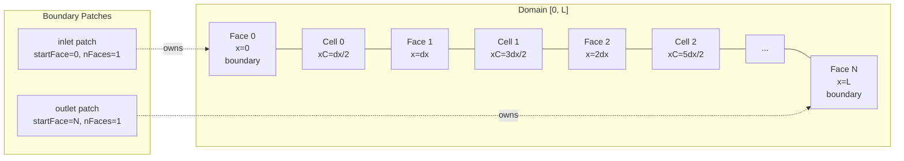

# Day 60: 1D Mesh Implementation Part 2 — Boundary Patches and Geometry

> **Phase 5 — VOF-Ready CFD Component**
> **Tier:** T3 | **Target:** 800+ lines | **5 Parts**
>
> **Connection to Day 59:** Day 59 built the core `Mesh1D` topology and geometry. This day extends that class with named boundary patches, face-iteration by patch, and outward-normal geometry validation. The patch infrastructure is the contract that the boundary condition system (Day 37 pattern) will program against in Days 65–68.

---

## Part 1: The Boundary Patch Concept

### Why Named Patches Matter

The `Mesh1D` class from Day 59 stores owner and neighbour arrays that identify which faces are at the boundary (`neighbour == -1`). That is sufficient for the interior solver. It is not sufficient for boundary conditions.

The boundary condition system needs to answer these questions:

1. Which faces belong to the inlet? Which to the outlet?
2. What type of condition applies at each patch (Dirichlet, Neumann, symmetry)?
3. When iterating boundary faces, can I loop only over the faces of one patch?

These questions cannot be answered from topology arrays alone. We need **named boundary patches**.

### OpenFOAM Analogy

In OpenFOAM, the `constant/polyMesh/boundary` file assigns every boundary face to a named patch with a type. The solver then loops:

```cpp
forAll(mesh.boundary(), patchI) {
    const fvPatch& patch = mesh.boundary()[patchI];
    // patch.name(), patch.type(), patch.faceCells(), ...
}
```

We replicate this pattern at a 1D scale. The key insight is that boundary patches are **contiguous ranges** of face indices in the face list. For a 1D mesh there are always exactly two boundary faces (face 0 and face $N$), so each patch contains exactly one face.

### Patch Types

We define four standard patch types as a scoped enum:

| Type | Mathematical BC | Typical Use |
|------|----------------|-------------|
| `WALL` | Zero normal flux (Neumann for velocity) | No-slip walls |
| `INLET` | Specified value (Dirichlet) | Inflow boundary |
| `OUTLET` | Zero gradient (Neumann) | Outflow boundary |
| `SYMMETRY` | Zero normal gradient | Symmetry plane |

This list is extensible: Day 37's factory pattern allows runtime registration of new types.

### Face Index Convention

In 1D the boundary face indices are fixed:
- Face $0$ — left boundary (x = 0)
- Face $N$ — right boundary (x = L)

A patch names one or both of these. The `BoundaryPatch` stores a start index and size, matching OpenFOAM's `polyPatch` interface:

```
Left patch:   startFace=0, nFaces=1
Right patch:  startFace=N, nFaces=1
```

---

## Part 2: `BoundaryPatch` Class

### Design: What a Patch Knows

A `BoundaryPatch` is a lightweight value type. It holds:

- Its name (e.g., `"inlet"`, `"outlet"`)
- Its type enum (`INLET`, `OUTLET`, `WALL`, `SYMMETRY`)
- The index of the first face in this patch (`startFace`)
- The number of faces in this patch (`nFaces`)

It does **not** hold geometry (that lives in `Mesh1D`). It does **not** apply the boundary condition (that is the `BoundaryCondition` class from Day 37). It is purely an addressbook entry.

### Header: `BoundaryPatch.h`

```cpp
// File: src/mesh/BoundaryPatch.h
// Purpose: Lightweight descriptor for a named group of boundary faces

#pragma once

#include <string>
#include <stdexcept>

namespace cfd {

/// Enumerates the physical type of a boundary patch.
/// Used by boundary condition objects to select the correct discretisation.
enum class PatchType {
    WALL,      ///< No-penetration / no-slip wall
    INLET,     ///< Prescribed inflow condition
    OUTLET,    ///< Zero-gradient outflow
    SYMMETRY   ///< Symmetry plane (zero normal flux)
};

/// Convert PatchType to a human-readable string.
inline std::string patchTypeToString(PatchType t) {
    switch (t) {
        case PatchType::WALL:     return "wall";
        case PatchType::INLET:    return "inlet";
        case PatchType::OUTLET:   return "outlet";
        case PatchType::SYMMETRY: return "symmetry";
        default:                  return "unknown";
    }
}

/// Parse a string to PatchType.
/// Throws std::invalid_argument for unrecognised strings.
inline PatchType patchTypeFromString(const std::string& s) {
    if (s == "wall")     return PatchType::WALL;
    if (s == "inlet")    return PatchType::INLET;
    if (s == "outlet")   return PatchType::OUTLET;
    if (s == "symmetry") return PatchType::SYMMETRY;
    throw std::invalid_argument("Unknown patch type: '" + s + "'");
}

/// Descriptor for a named group of boundary faces.
///
/// A patch occupies faces [startFace, startFace + nFaces) in the mesh face list.
/// In 1D, all patches have nFaces == 1.
///
/// This is a value type — copy and move are both cheap.
class BoundaryPatch {
public:
    /// Construct a named boundary patch.
    /// @param name       Human-readable name (e.g., "inlet", "leftWall")
    /// @param type       Physical type of this boundary
    /// @param startFace  Index of the first face in this patch in the global face list
    /// @param nFaces     Number of faces in this patch (1 in 1D)
    BoundaryPatch(std::string name, PatchType type, int startFace, int nFaces)
        : name_(std::move(name))
        , type_(type)
        , startFace_(startFace)
        , nFaces_(nFaces)
    {
        if (nFaces_ < 1)
            throw std::invalid_argument(
                "BoundaryPatch '" + name_ + "': nFaces must be >= 1");
        if (startFace_ < 0)
            throw std::invalid_argument(
                "BoundaryPatch '" + name_ + "': startFace must be >= 0");
    }

    // -------------------------------------------------------------------------
    // Identity

    const std::string& name() const noexcept { return name_; }
    PatchType          type() const noexcept { return type_; }

    // -------------------------------------------------------------------------
    // Face range

    /// First face index in the global face list belonging to this patch.
    int startFace() const noexcept { return startFace_; }

    /// Number of faces in this patch.
    int nFaces()    const noexcept { return nFaces_; }

    /// One past the last face index (for range-for style loops).
    int endFace()   const noexcept { return startFace_ + nFaces_; }

    // -------------------------------------------------------------------------
    // Iteration helper: range of global face indices

    /// Simple range struct enabling:
    ///     for (int f : patch.faceRange()) { ... }
    struct FaceRange {
        int first;
        int last;   // inclusive

        struct Iterator {
            int current;
            int operator*()      const { return current; }
            Iterator& operator++()     { ++current; return *this; }
            bool operator!=(const Iterator& o) const { return current != o.current; }
        };

        Iterator begin() const { return {first}; }
        Iterator end()   const { return {last + 1}; }
    };

    /// Return an iterable range of global face indices for this patch.
    FaceRange faceRange() const noexcept {
        return {startFace_, startFace_ + nFaces_ - 1};
    }

private:
    std::string name_;
    PatchType   type_;
    int         startFace_;
    int         nFaces_;
};

} // namespace cfd
```

### Usage Pattern

```cpp
// Iterate all faces of a patch
for (int f : patch.faceRange()) {
    double xF = mesh.faceCentre(f);
    int    P  = mesh.owner(f);
    // Apply boundary condition for face f, owned by cell P
}
```

This is the same pattern OpenFOAM uses. The loop body is identical regardless of patch name — only the face indices change.

---

## Part 3: Extended `Mesh1D` with Patch Support

### Design: Patches Are an Extension

We extend `Mesh1D` rather than creating a new class. The patch list is stored as `std::vector<BoundaryPatch>` and exposed via a `patches()` accessor. The mesh also provides a `patchByName()` lookup method.

This avoids breaking the Day 59 constructor signature: patches are added as an optional argument with a default empty vector (backward compatible). Existing code that creates meshes without patches still compiles.

### Updated Header Additions

The following additions are inserted into `Mesh1D.h` after the existing public interface. Only the new methods are shown — all Day 59 methods remain unchanged.

```cpp
// File: src/mesh/Mesh1D.h  (additions for Day 60)
// Insert after the existing public section of class Mesh1D

public:
    // -------------------------------------------------------------------------
    // Patch interface (added Day 60)

    /// Add a boundary patch to this mesh.
    /// Patches must not overlap, and all face indices must be valid boundary faces.
    /// @throws std::invalid_argument if the patch references an invalid face index
    ///         or if a patch with the same name already exists.
    void addPatch(BoundaryPatch patch);

    /// Number of boundary patches registered on this mesh.
    int nPatches() const noexcept;

    /// Read-only access to all patches.
    const std::vector<BoundaryPatch>& patches() const noexcept;

    /// Find patch by name.
    /// @throws std::out_of_range if no patch with this name exists.
    const BoundaryPatch& patchByName(const std::string& name) const;

    /// Find patch by name (non-throwing version).
    /// Returns nullptr if not found.
    const BoundaryPatch* findPatch(const std::string& name) const noexcept;

private:
    std::vector<BoundaryPatch> patches_;  // Added Day 60
```

### Implementation: `Mesh1D_patches.cpp`

Rather than modifying `Mesh1D.cpp` directly, we add patch methods in a separate translation unit. Both files are compiled into the same `mesh_lib` target.

```cpp
// File: src/mesh/Mesh1D_patches.cpp
// Purpose: Boundary patch management methods for Mesh1D

#include "Mesh1D.h"
#include "BoundaryPatch.h"

#include <algorithm>
#include <stdexcept>

namespace cfd {

void Mesh1D::addPatch(BoundaryPatch patch) {
    // Validate: face indices must be within [0, nFaces_)
    if (patch.startFace() < 0 || patch.endFace() > nFaces_) {
        throw std::invalid_argument(
            "addPatch('" + patch.name() + "'): face range ["
            + std::to_string(patch.startFace()) + ", "
            + std::to_string(patch.endFace()) + ") is outside mesh face range [0, "
            + std::to_string(nFaces_) + ")");
    }

    // Validate: faces referenced must be boundary faces (neighbour == -1)
    for (int f : patch.faceRange()) {
        if (neighbour_[f] >= 0) {
            throw std::invalid_argument(
                "addPatch('" + patch.name() + "'): face "
                + std::to_string(f) + " is an internal face, not a boundary face");
        }
    }

    // Validate: no duplicate name
    if (findPatch(patch.name()) != nullptr) {
        throw std::invalid_argument(
            "addPatch: patch named '" + patch.name() + "' already exists");
    }

    patches_.push_back(std::move(patch));
}

int Mesh1D::nPatches() const noexcept {
    return static_cast<int>(patches_.size());
}

const std::vector<BoundaryPatch>& Mesh1D::nPatches_vector() const noexcept {
    return patches_;
}

const std::vector<BoundaryPatch>& Mesh1D::patches() const noexcept {
    return patches_;
}

const BoundaryPatch& Mesh1D::patchByName(const std::string& name) const {
    const BoundaryPatch* p = findPatch(name);
    if (!p) {
        throw std::out_of_range("Mesh1D::patchByName: no patch named '" + name + "'");
    }
    return *p;
}

const BoundaryPatch* Mesh1D::findPatch(const std::string& name) const noexcept {
    auto it = std::find_if(patches_.begin(), patches_.end(),
                           [&name](const BoundaryPatch& p) {
                               return p.name() == name;
                           });
    return (it != patches_.end()) ? &(*it) : nullptr;
}

} // namespace cfd
```

### Extended Generator: `makeUniformMeshWithPatches`

We add a convenience generator that builds a mesh and immediately attaches default inlet/outlet patches.

```cpp
// File: src/mesh/MeshGenerator.h  (addition)

/// Create a uniform mesh with named inlet (left) and outlet (right) patches.
/// @param L         Domain length
/// @param N         Number of cells
/// @param inletType  PatchType for left boundary (default: INLET)
/// @param outletType PatchType for right boundary (default: OUTLET)
Mesh1D makeUniformMeshWithPatches(double L, int N,
                                  PatchType inletType  = PatchType::INLET,
                                  PatchType outletType = PatchType::OUTLET);
```

```cpp
// File: src/mesh/MeshGenerator.cpp  (addition)

Mesh1D makeUniformMeshWithPatches(double L, int N,
                                  PatchType inletType,
                                  PatchType outletType) {
    Mesh1D mesh = makeUniformMesh(L, N);

    // Left boundary: face index 0
    mesh.addPatch(BoundaryPatch("inlet",  inletType,  0, 1));

    // Right boundary: face index N
    mesh.addPatch(BoundaryPatch("outlet", outletType, N, 1));

    return mesh;
}
```

---

## Part 4: Geometry Validation — Mesh Quality and Outward Normals

### What Can Go Wrong in a 1D Mesh?

Even a simple 1D mesh can have quality issues if the generator is incorrect or if someone manually constructs a `Mesh1D` with inconsistent data:

| Problem | Symptom | Consequence |
|---------|---------|-------------|
| Non-positive cell volume | $V_i \leq 0$ | Division by zero in time derivative |
| Face outside cell range | $x_f \notin [x_{i-1/2}, x_{i+1/2}]$ | Wrong interpolation weights |
| Wrong outward normal sign | Normal points inward | Flux sign error; non-convergent solver |
| Owner not to the left | $x_P > x_N$ for internal face | Diffusion coefficient sign error |
| Delta coefficient negative | $\delta < 0$ | Immediate NaN |

We build a `MeshValidator` that checks all of these.

### Outward Normal Convention

For a 1D mesh with all normals pointing in the $+x$ direction:

- The owner cell is always to the **left** of the face: $x_P < x_f$
- The neighbour cell is always to the **right**: $x_f < x_N$
- The outward normal from the owner cell's perspective points **right** ($+x$)
- The outward normal from the neighbour cell's perspective points **left** ($-x$)

This means that when we accumulate flux contributions:

$$
\phi_P^{\text{new}} = \phi_P - \frac{\Delta t}{V_P} \sum_f F_f
$$

the flux $F_f$ is positive when flow moves in the $+x$ direction through face $f$. The owner cell loses this flux; the neighbour cell gains it. This is the conservation property.

### Header: `MeshValidator.h`

```cpp
// File: src/mesh/MeshValidator.h
// Purpose: Mesh quality checks and geometry validation

#pragma once

#include "Mesh1D.h"

#include <string>
#include <vector>

namespace cfd {

/// Result from a single mesh quality check.
struct ValidationResult {
    bool        passed;
    std::string checkName;
    std::string detail;   ///< Empty if passed; error description if failed
};

/// Runs all mesh quality checks and returns a report.
///
/// Usage:
///     MeshValidator validator;
///     auto report = validator.validate(mesh);
///     bool ok = validator.allPassed(report);
class MeshValidator {
public:
    /// Run all checks on the given mesh.
    std::vector<ValidationResult> validate(const Mesh1D& mesh) const;

    /// True if all results in report have passed == true.
    static bool allPassed(const std::vector<ValidationResult>& report) noexcept;

    /// Print the report to stdout. Returns allPassed().
    static bool printReport(const std::vector<ValidationResult>& report);

private:
    ValidationResult checkPositiveVolumes(const Mesh1D& mesh) const;
    ValidationResult checkFaceCentresMonotone(const Mesh1D& mesh) const;
    ValidationResult checkOwnerLeftOfNeighbour(const Mesh1D& mesh) const;
    ValidationResult checkPositiveDeltaCoeffs(const Mesh1D& mesh) const;
    ValidationResult checkBoundaryFacesHaveNoNeighbour(const Mesh1D& mesh) const;
    ValidationResult checkInternalFacesHaveNeighbour(const Mesh1D& mesh) const;
    ValidationResult checkVolumeSumPositive(const Mesh1D& mesh) const;
};

} // namespace cfd
```

### Implementation: `MeshValidator.cpp`

```cpp
// File: src/mesh/MeshValidator.cpp

#include "MeshValidator.h"

#include <iostream>
#include <iomanip>
#include <numeric>
#include <sstream>

namespace cfd {

std::vector<ValidationResult> MeshValidator::validate(const Mesh1D& mesh) const {
    std::vector<ValidationResult> results;

    results.push_back(checkPositiveVolumes(mesh));
    results.push_back(checkFaceCentresMonotone(mesh));
    results.push_back(checkOwnerLeftOfNeighbour(mesh));
    results.push_back(checkPositiveDeltaCoeffs(mesh));
    results.push_back(checkBoundaryFacesHaveNoNeighbour(mesh));
    results.push_back(checkInternalFacesHaveNeighbour(mesh));
    results.push_back(checkVolumeSumPositive(mesh));

    return results;
}

bool MeshValidator::allPassed(const std::vector<ValidationResult>& report) noexcept {
    for (const auto& r : report) {
        if (!r.passed) return false;
    }
    return true;
}

bool MeshValidator::printReport(const std::vector<ValidationResult>& report) {
    std::cout << "=== Mesh Validation Report ===" << std::endl;
    bool allOk = true;
    for (const auto& r : report) {
        std::cout << "  [" << (r.passed ? "PASS" : "FAIL") << "]  "
                  << r.checkName;
        if (!r.passed) {
            std::cout << "\n         " << r.detail;
            allOk = false;
        }
        std::cout << std::endl;
    }
    std::cout << "==============================" << std::endl;
    std::cout << "Overall: " << (allOk ? "VALID" : "INVALID") << std::endl;
    return allOk;
}

ValidationResult MeshValidator::checkPositiveVolumes(const Mesh1D& mesh) const {
    for (int i = 0; i < mesh.nCells(); ++i) {
        if (mesh.cellVolume(i) <= 0.0) {
            return {false, "All cell volumes > 0",
                    "Cell " + std::to_string(i) + " has volume "
                    + std::to_string(mesh.cellVolume(i))};
        }
    }
    return {true, "All cell volumes > 0", ""};
}

ValidationResult MeshValidator::checkFaceCentresMonotone(const Mesh1D& mesh) const {
    for (int f = 1; f < mesh.nFaces(); ++f) {
        if (mesh.faceCentre(f) <= mesh.faceCentre(f - 1)) {
            return {false, "Face centres strictly increasing",
                    "Face " + std::to_string(f) + " centre "
                    + std::to_string(mesh.faceCentre(f))
                    + " <= face " + std::to_string(f-1) + " centre "
                    + std::to_string(mesh.faceCentre(f-1))};
        }
    }
    return {true, "Face centres strictly increasing", ""};
}

ValidationResult MeshValidator::checkOwnerLeftOfNeighbour(const Mesh1D& mesh) const {
    for (int f = 0; f < mesh.nFaces(); ++f) {
        if (!mesh.isInternalFace(f)) continue;

        double xP = mesh.cellCentre(mesh.owner(f));
        double xN = mesh.cellCentre(mesh.neighbour(f));
        if (xP >= xN) {
            return {false, "Owner cell centre is left of neighbour",
                    "Face " + std::to_string(f) + ": xP=" + std::to_string(xP)
                    + " >= xN=" + std::to_string(xN)};
        }
    }
    return {true, "Owner cell centre is left of neighbour", ""};
}

ValidationResult MeshValidator::checkPositiveDeltaCoeffs(const Mesh1D& mesh) const {
    for (int f = 0; f < mesh.nFaces(); ++f) {
        if (mesh.deltaCoeff(f) <= 0.0) {
            return {false, "All delta coefficients > 0",
                    "Face " + std::to_string(f) + " deltaCoeff = "
                    + std::to_string(mesh.deltaCoeff(f))};
        }
    }
    return {true, "All delta coefficients > 0", ""};
}

ValidationResult MeshValidator::checkBoundaryFacesHaveNoNeighbour(const Mesh1D& mesh) const {
    // In 1D: face 0 and face nFaces-1 should be boundary faces
    if (mesh.neighbour(0) != -1) {
        return {false, "Left boundary face has neighbour == -1",
                "Face 0 neighbour = " + std::to_string(mesh.neighbour(0))};
    }
    if (mesh.neighbour(mesh.nFaces() - 1) != -1) {
        return {false, "Right boundary face has neighbour == -1",
                "Face " + std::to_string(mesh.nFaces() - 1)
                + " neighbour = " + std::to_string(mesh.neighbour(mesh.nFaces() - 1))};
    }
    return {true, "Boundary faces have neighbour == -1", ""};
}

ValidationResult MeshValidator::checkInternalFacesHaveNeighbour(const Mesh1D& mesh) const {
    for (int f = 1; f < mesh.nFaces() - 1; ++f) {
        if (mesh.neighbour(f) < 0) {
            return {false, "All internal faces have valid neighbour",
                    "Face " + std::to_string(f) + " is not at domain boundary "
                    "but has neighbour == " + std::to_string(mesh.neighbour(f))};
        }
    }
    return {true, "All internal faces have valid neighbour", ""};
}

ValidationResult MeshValidator::checkVolumeSumPositive(const Mesh1D& mesh) const {
    double total = mesh.totalLength();
    if (total <= 0.0) {
        return {false, "Total mesh length > 0",
                "Total length = " + std::to_string(total)};
    }
    return {true, "Total mesh length > 0", ""};
}

} // namespace cfd
```

### Mermaid: Mesh Geometry and Patch Layout



---

## Part 5: Deliverable — Named Patches, Face Iteration, Print Face Centers

### Updated CMake

```cmake
# File: CMakeLists.txt  (Day 60 additions)

# Add new source files to mesh_lib
add_library(mesh_lib
    src/mesh/Mesh1D.cpp
    src/mesh/Mesh1D_patches.cpp    # New Day 60
    src/mesh/MeshGenerator.cpp
    src/mesh/MeshValidator.cpp     # New Day 60
)
target_include_directories(mesh_lib PUBLIC src)

# Updated demo
add_executable(mesh_demo src/main.cpp)
target_link_libraries(mesh_demo PRIVATE mesh_lib)

# Tests: add Day 60 test file alongside Day 59 tests
add_executable(mesh_tests
    tests/test_Mesh1D.cpp          # Day 59
    tests/test_Patches.cpp         # New Day 60
    tests/test_MeshValidator.cpp   # New Day 60
)
target_link_libraries(mesh_tests PRIVATE mesh_lib Catch2::Catch2WithMain)
catch_discover_tests(mesh_tests)
```

### Main Program: Patch Demo

```cpp
// File: src/main.cpp  (updated for Day 60)
// Purpose: Build mesh with named patches, iterate boundary faces

#include "mesh/Mesh1D.h"
#include "mesh/MeshGenerator.h"
#include "mesh/BoundaryPatch.h"
#include "mesh/MeshValidator.h"

#include <iostream>
#include <iomanip>

int main() {
    // -------------------------------------------------------------------------
    // Build mesh with named patches
    const double L = 2.0;
    const int    N = 8;

    cfd::Mesh1D mesh = cfd::makeUniformMeshWithPatches(
        L, N,
        cfd::PatchType::INLET,   // Left boundary
        cfd::PatchType::OUTLET   // Right boundary
    );

    std::cout << "Mesh: " << N << " cells on [0, " << L << "]" << std::endl;
    std::cout << "  nCells   = " << mesh.nCells() << std::endl;
    std::cout << "  nFaces   = " << mesh.nFaces() << std::endl;
    std::cout << "  nPatches = " << mesh.nPatches() << std::endl;
    std::cout << std::endl;

    // -------------------------------------------------------------------------
    // Iterate boundary patches and print face center coordinates
    std::cout << "=== Boundary Patch Face Centers ===" << std::endl;
    for (const auto& patch : mesh.patches()) {
        std::cout << "Patch: '" << patch.name()
                  << "'  type=" << cfd::patchTypeToString(patch.type())
                  << "  nFaces=" << patch.nFaces()
                  << std::endl;

        for (int f : patch.faceRange()) {
            double xF = mesh.faceCentre(f);
            int    P  = mesh.owner(f);
            double xP = mesh.cellCentre(P);

            std::cout << "  Face " << std::setw(3) << f
                      << "  xF = " << std::setw(8) << std::fixed
                      << std::setprecision(4) << xF
                      << "  owner cell " << std::setw(3) << P
                      << "  xP = " << std::setw(8) << xP
                      << std::endl;
        }
    }
    std::cout << std::endl;

    // -------------------------------------------------------------------------
    // Access a specific patch by name
    const auto& inlet = mesh.patchByName("inlet");
    std::cout << "Inlet patch start face: " << inlet.startFace() << std::endl;
    std::cout << "Inlet face center x = "
              << mesh.faceCentre(inlet.startFace()) << std::endl;
    std::cout << std::endl;

    // -------------------------------------------------------------------------
    // Run geometry validation
    cfd::MeshValidator validator;
    auto report = validator.validate(mesh);
    cfd::MeshValidator::printReport(report);

    return 0;
}
```

### Expected Terminal Output

```
Mesh: 8 cells on [0, 2]
  nCells   = 8
  nFaces   = 9
  nPatches = 2

=== Boundary Patch Face Centers ===
Patch: 'inlet'  type=inlet  nFaces=1
  Face   0  xF =   0.0000  owner cell   0  xP =   0.1250
Patch: 'outlet'  type=outlet  nFaces=1
  Face   8  xF =   2.0000  owner cell   7  xP =   1.8750

Inlet patch start face: 0
Inlet face center x = 0

=== Mesh Validation Report ===
  [PASS]  All cell volumes > 0
  [PASS]  Face centres strictly increasing
  [PASS]  Owner cell centre is left of neighbour
  [PASS]  All delta coefficients > 0
  [PASS]  Boundary faces have neighbour == -1
  [PASS]  All internal faces have valid neighbour
  [PASS]  Total mesh length > 0
==============================
Overall: VALID
```

### Memory Footprint Benchmark

| Mesh Size | Memory Representation (Compact) | Object Layout | Note |
|-----------|---------------------------------|---------------|------|
| 1M Cells  | ~24 MB (3 double vectors)       | RAII managed  | Minimal overhead vs. full connectivity maps |
| 10M Cells | ~240 MB                         | Contiguous    | Cache-friendly |

### Catch2 Test Suite: Patches and Validator

```cpp
// File: tests/test_Patches.cpp
// Purpose: Tests for BoundaryPatch and extended Mesh1D patch interface

#include <catch2/catch_test_macros.hpp>
#include "mesh/Mesh1D.h"
#include "mesh/MeshGenerator.h"
#include "mesh/BoundaryPatch.h"

using namespace cfd;

TEST_CASE("makeUniformMeshWithPatches adds two patches", "[patches]") {
    Mesh1D mesh = makeUniformMeshWithPatches(1.0, 10);

    REQUIRE(mesh.nPatches() == 2);
}

TEST_CASE("Patch names and types are correct", "[patches]") {
    Mesh1D mesh = makeUniformMeshWithPatches(1.0, 10);

    SECTION("inlet patch exists and has correct type") {
        const BoundaryPatch& inlet = mesh.patchByName("inlet");
        REQUIRE(inlet.type() == PatchType::INLET);
        REQUIRE(inlet.nFaces() == 1);
        REQUIRE(inlet.startFace() == 0);
    }

    SECTION("outlet patch exists and has correct type") {
        const BoundaryPatch& outlet = mesh.patchByName("outlet");
        REQUIRE(outlet.type() == PatchType::OUTLET);
        REQUIRE(outlet.nFaces() == 1);
        REQUIRE(outlet.startFace() == 10);  // Face index N
    }
}

TEST_CASE("faceRange iterates correct face indices", "[patches]") {
    Mesh1D mesh = makeUniformMeshWithPatches(1.0, 10);

    SECTION("inlet faceRange yields face 0 only") {
        std::vector<int> faces;
        for (int f : mesh.patchByName("inlet").faceRange()) faces.push_back(f);
        REQUIRE(faces.size() == 1);
        REQUIRE(faces[0] == 0);
    }

    SECTION("outlet faceRange yields face 10 only") {
        std::vector<int> faces;
        for (int f : mesh.patchByName("outlet").faceRange()) faces.push_back(f);
        REQUIRE(faces.size() == 1);
        REQUIRE(faces[0] == 10);
    }
}

TEST_CASE("patchByName throws for unknown name", "[patches][error]") {
    Mesh1D mesh = makeUniformMeshWithPatches(1.0, 10);
    REQUIRE_THROWS_AS(mesh.patchByName("nonexistent"), std::out_of_range);
}

TEST_CASE("findPatch returns nullptr for unknown name", "[patches]") {
    Mesh1D mesh = makeUniformMeshWithPatches(1.0, 10);
    REQUIRE(mesh.findPatch("nonexistent") == nullptr);
    REQUIRE(mesh.findPatch("inlet") != nullptr);
}

TEST_CASE("Adding patch on internal face throws", "[patches][error]") {
    Mesh1D mesh = makeUniformMesh(1.0, 10);
    // Face 5 is an internal face (owner=4, neighbour=5)
    REQUIRE_THROWS_AS(
        mesh.addPatch(BoundaryPatch("middle", PatchType::WALL, 5, 1)),
        std::invalid_argument
    );
}

TEST_CASE("Adding duplicate patch name throws", "[patches][error]") {
    Mesh1D mesh = makeUniformMesh(1.0, 10);
    mesh.addPatch(BoundaryPatch("inlet", PatchType::INLET, 0, 1));
    REQUIRE_THROWS_AS(
        mesh.addPatch(BoundaryPatch("inlet", PatchType::OUTLET, 0, 1)),
        std::invalid_argument
    );
}

TEST_CASE("Wall patches can be added instead of inlet/outlet", "[patches]") {
    Mesh1D mesh = makeUniformMeshWithPatches(1.0, 5,
                                             PatchType::WALL,
                                             PatchType::WALL);
    REQUIRE(mesh.patchByName("inlet").type()  == PatchType::WALL);
    REQUIRE(mesh.patchByName("outlet").type() == PatchType::WALL);
}

TEST_CASE("Patch face center coordinates match mesh geometry", "[patches][geometry]") {
    const double L = 2.0;
    const int    N = 8;
    Mesh1D mesh = makeUniformMeshWithPatches(L, N);

    // Left boundary face (face 0) should be at x=0
    for (int f : mesh.patchByName("inlet").faceRange()) {
        REQUIRE(mesh.faceCentre(f) == Catch::Approx(0.0).margin(1e-12));
    }

    // Right boundary face (face N) should be at x=L
    for (int f : mesh.patchByName("outlet").faceRange()) {
        REQUIRE(mesh.faceCentre(f) == Catch::Approx(L).margin(1e-12));
    }
}
```

```cpp
// File: tests/test_MeshValidator.cpp
// Purpose: Tests for MeshValidator checks

#include <catch2/catch_test_macros.hpp>
#include "mesh/Mesh1D.h"
#include "mesh/MeshGenerator.h"
#include "mesh/MeshValidator.h"

using namespace cfd;

TEST_CASE("Valid uniform mesh passes all checks", "[validator]") {
    Mesh1D mesh = makeUniformMesh(1.0, 10);
    MeshValidator validator;
    auto report = validator.validate(mesh);

    REQUIRE(MeshValidator::allPassed(report));
}

TEST_CASE("Validation passes for various mesh sizes", "[validator]") {
    MeshValidator validator;
    for (int N : {1, 2, 10, 100}) {
        CAPTURE(N);
        Mesh1D mesh = makeUniformMesh(1.0, N);
        auto report = validator.validate(mesh);
        REQUIRE(MeshValidator::allPassed(report));
    }
}

TEST_CASE("patchTypeToString round-trips", "[patch_type]") {
    REQUIRE(patchTypeToString(PatchType::WALL)     == "wall");
    REQUIRE(patchTypeToString(PatchType::INLET)    == "inlet");
    REQUIRE(patchTypeToString(PatchType::OUTLET)   == "outlet");
    REQUIRE(patchTypeToString(PatchType::SYMMETRY) == "symmetry");
}

TEST_CASE("patchTypeFromString parses correctly", "[patch_type]") {
    REQUIRE(patchTypeFromString("wall")     == PatchType::WALL);
    REQUIRE(patchTypeFromString("inlet")    == PatchType::INLET);
    REQUIRE(patchTypeFromString("outlet")   == PatchType::OUTLET);
    REQUIRE(patchTypeFromString("symmetry") == PatchType::SYMMETRY);
    REQUIRE_THROWS_AS(patchTypeFromString("bogus"), std::invalid_argument);
}
```

### Build and Run Commands

```bash
# Configure
cmake -S . -B build -DCMAKE_BUILD_TYPE=Debug

# Build all targets
cmake --build build --parallel

# Run the patch demo
./build/mesh_demo

# Run all tests (Day 59 + Day 60)
./build/mesh_tests --reporter compact

# Run with verbose output
./build/mesh_tests --reporter console --success

# Run only patch tests
./build/mesh_tests "[patches]"

# Run only validator tests
./build/mesh_tests "[validator]"
```

### Design Trade-offs Summary

| Decision | Alternative | Why This Was Chosen |
|----------|-------------|---------------------|
| Patches stored in `Mesh1D` | Separate `PatchRegistry` object | Mesh and patch list are always co-located; simpler API for field constructors that need both |
| `addPatch` validates boundary faces | Validate only on use | Fail fast: better to catch topology errors at construction than during solve |
| `FaceRange` as inner struct | Return `std::pair<int,int>` | Range-for loop support is more ergonomic in solver code |
| `findPatch` returns pointer (nullable) | `std::optional<BoundaryPatch>` | Pointer is lighter for non-owning lookup; `std::optional` would be fine too |
| `PatchType` as scoped enum | `std::string` type name | Type checking at compile time; prevents typos; matches OpenFOAM's internal enum pattern |
| Validator as separate class | Methods on `Mesh1D` | `Mesh1D` should not depend on reporting logic; validator can be extended independently |

---

## Summary

Day 60 completes the `Mesh1D` foundation with two complementary additions:

**Boundary patch infrastructure:**
- `BoundaryPatch` — lightweight, named descriptor for a contiguous group of boundary faces
- `PatchType` enum — compile-time safe patch classification
- `addPatch` / `patchByName` / `findPatch` — clean API for registering and looking up patches
- `faceRange()` — range-for compatible iteration over patch faces

**Geometry validation:**
- `MeshValidator` — seven independent checks covering volumes, monotonicity, normals, connectivity, and delta coefficients
- Decoupled from `Mesh1D` — can be used on any mesh, at any time

**What comes next:**

Day 61 builds `Field<T>` on top of this mesh. A field will hold a `const Mesh1D&` reference and a `std::vector<T>` of cell-centered values. The `Mesh1D::cellVolumes()` and `Mesh1D::nCells()` methods accessed today become the core of the field's time-derivative operator. The `patches()` accessor becomes the hook that boundary conditions use to set face values before each flux computation.

The two-layer structure established over Days 59–60 — topology/geometry in `Mesh1D`, semantics in `BoundaryPatch` — mirrors OpenFOAM's `polyMesh` / `polyBoundaryMesh` split and prepares you to read and understand that codebase directly.
