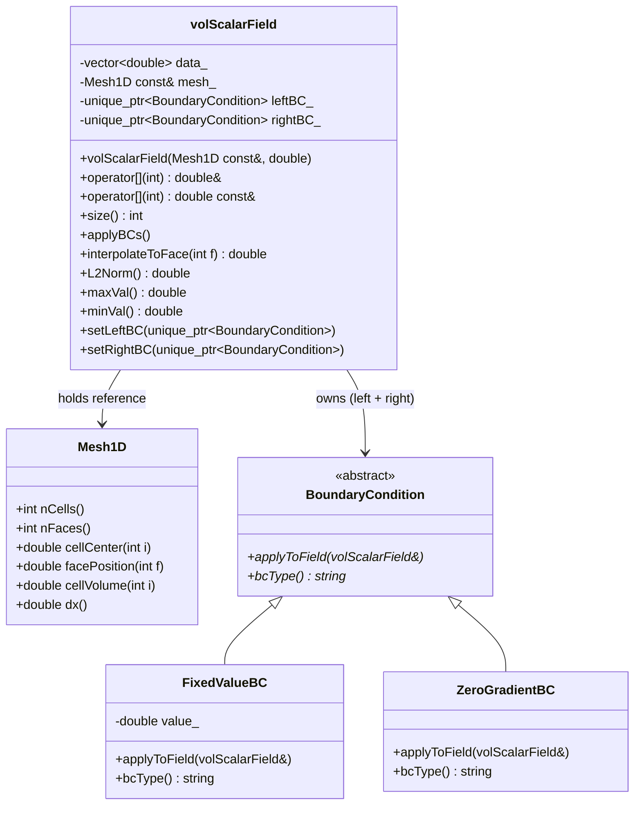

# Day 61: Geometric Fields Part 1 — `volScalarField` on a 1D Mesh

**Phase:** 5 — VOF-Ready CFD Component (Days 57–84)
**Tier:** T3 — Architecture / Integration Day
**Previous:** Day 60 — 1D Mesh Implementation Part 2
**Next:** Day 62 — `surfaceScalarField`: Face-Centered Flux Field

> **Today's goal:** Design and implement `volScalarField` — a cell-centered scalar field that pairs data storage with mesh geometry and boundary conditions. Understand why geometric fields are the central abstraction in finite volume CFD, and build a field class capable of BC application, face interpolation, and algebraic operations.

---

## Part 1: What Is a Geometric Field?

### The Core Abstraction in Finite Volume CFD

In finite volume methods, the computational domain is divided into control volumes (cells). Each cell stores the average value of a physical quantity over its volume. This is the cell-centered storage strategy.

A raw `std::vector<double>` is not a field. It is just numbers. A **geometric field** is the combination of three things:

```
GeometricField = Data + Mesh + Boundary Conditions
```

This triple is not optional. Remove any one component and the field cannot participate in a PDE discretization:

| Component | Why It Is Mandatory |
|-----------|---------------------|
| **Data array** | Stores $N$ cell values; can be read, written, passed to solvers |
| **Mesh reference** | Provides cell volumes, face areas, face normal vectors, cell centers |
| **Boundary conditions** | Defines what happens at inlet, outlet, and wall faces |

Without the mesh, you cannot compute gradients or fluxes. Without BCs, the PDE is underdetermined. Both must travel with the data.

### OpenFOAM's Naming Convention

OpenFOAM uses a precise naming scheme for field types:

| Class | Storage | Quantity |
|-------|---------|----------|
| `volScalarField` | Cell centers | Scalar (pressure $p$, temperature $T$) |
| `volVectorField` | Cell centers | Vector (velocity $\mathbf{U}$) |
| `surfaceScalarField` | Face centers | Scalar flux ($\phi$) |
| `surfaceVectorField` | Face centers | Vector normal flux |

The prefix `vol` means "stored at cell centers (cell volumes)". The prefix `surface` means "stored at faces (cell surfaces)". This is the finite volume duality: every cell-centered quantity has a corresponding face-centered flux quantity.

### Mathematical Description

For a 1D mesh with $N$ cells and $N+1$ faces, a `volScalarField` stores values:

$$
\phi = [\phi_0,\; \phi_1,\; \phi_2,\; \ldots,\; \phi_{N-1}]
$$

where $\phi_i$ is the cell-averaged value in cell $i$.

The governing continuity principle for a cell $i$ bounded by left face $f_L$ and right face $f_R$:

$$
\frac{d\phi_i}{dt} V_i + \sum_{f \in \partial V_i} \phi_f \mathbf{U}_f \cdot \mathbf{S}_f = 0
$$

where $V_i$ is the cell volume, $\phi_f$ is the face-interpolated value, $\mathbf{U}_f$ is the face velocity, and $\mathbf{S}_f$ is the outward face area vector.

To evaluate the face flux $\phi_f \mathbf{U}_f \cdot \mathbf{S}_f$, we need to interpolate from cell centers to faces. This is why `volScalarField` must carry a mesh reference — interpolation requires cell center coordinates.

### The Boundary Condition Contract

At domain boundaries, the cell-centered value cannot be updated by the interior scheme. Instead, a boundary condition object overwrites the ghost-cell value or the face flux.

Two fundamental BC types:

**Dirichlet (fixedValue):** The field value at the boundary face is prescribed.
$$
\phi_{\text{boundary}} = \phi_{\text{prescribed}}
$$
The ghost cell outside the domain is set so that linear interpolation yields $\phi_{\text{prescribed}}$ at the face.

**Neumann (zeroGradient):** The normal gradient is zero at the boundary.
$$
\frac{\partial \phi}{\partial n}\bigg|_{\text{boundary}} = 0
$$
The ghost cell equals the last interior cell value, so no gradient drives flux across the boundary.

---

## Part 2: `volScalarField` Design

### Class Responsibility

`volScalarField` owns exactly one job: manage the lifecycle of $N$ double values that represent a scalar quantity on a 1D finite volume mesh.

It does not own the mesh. It holds a const reference. Mesh lifetime must exceed field lifetime — this is a design invariant enforced at construction.



### Data Layout

For a 1D mesh with $N$ cells, `volScalarField` stores exactly $N$ doubles in a contiguous `std::vector<double>`. There are no ghost cells in the primary storage — boundary conditions operate on the face values during interpolation, not on padded storage.

```
Memory layout (N = 5 cells):

data_[0]  data_[1]  data_[2]  data_[3]  data_[4]
  φ₀        φ₁        φ₂        φ₃        φ₄

Face indices:  f₀  [c₀]  f₁  [c₁]  f₂  [c₂]  f₃  [c₃]  f₄  [c₄]  f₅
```

Faces $f_0$ (left boundary) and $f_5$ (right boundary) are boundary faces. Faces $f_1$ through $f_4$ are internal faces, each shared between two cells.

### Design Decisions

**Why hold a reference, not a pointer?**
A const reference cannot be null. Passing a null mesh pointer would cause a crash deep inside a flux computation, far from the construction site. A reference enforces valid mesh at construction time and communicates intent: this field is permanently bound to this mesh.

**Why `std::unique_ptr` for BCs?**
Boundary conditions form a type hierarchy. The field must store a BC without knowing its concrete type at compile time. Polymorphism requires a pointer. `unique_ptr` provides single ownership semantics — the field owns its BC objects and destroys them when the field goes out of scope. No manual `delete` needed.

**Why not store $N+2$ values with ghost cells?**
Ghost cell padding is a valid strategy (used in stencil codes) but couples the storage format to the BC strategy. By keeping $N$ values and computing boundary face values on demand during interpolation, the field stays agnostic to the BC type. Adding a new BC type requires no changes to the field's memory layout.

---

## Part 3: Complete Implementation

### Header: `volScalarField.h`

```cpp
// volScalarField.h
// Cell-centered scalar field for 1D finite volume mesh.
// Stores N double values (one per cell), owns left/right BCs.

#pragma once
#include <vector>
#include <memory>
#include <string>
#include <stdexcept>
#include <cmath>
#include <algorithm>

// Forward declaration — mesh definition in mesh1D.h
class Mesh1D;

// ---------------------------------------------------------------------------
// Abstract boundary condition interface
// ---------------------------------------------------------------------------
class BoundaryCondition
{
public:
    virtual ~BoundaryCondition() = default;

    // Apply this BC to the field at the specified boundary index.
    // boundaryIndex: 0 = left boundary cell (i=0), 1 = right (i=N-1)
    virtual void apply(std::vector<double>& data, int boundaryIndex,
                       const Mesh1D& mesh) const = 0;

    // Return face value at the boundary given the adjacent interior cell value.
    // Used during face interpolation at domain boundaries.
    virtual double faceValue(double interiorCellValue, double prescribedValue) const = 0;

    virtual std::string bcType() const = 0;
};

// ---------------------------------------------------------------------------
// Dirichlet BC: fixed value at boundary face
// ---------------------------------------------------------------------------
class FixedValueBC : public BoundaryCondition
{
public:
    explicit FixedValueBC(double value) : value_(value) {}

    void apply(std::vector<double>& data, int boundaryIndex,
               const Mesh1D& /*mesh*/) const override
    {
        // For Dirichlet BC: the boundary cell itself is NOT overwritten.
        // The value is imposed at the face during interpolation.
        // Nothing to modify in the cell array here — face interpolation
        // calls faceValue() to get the prescribed value directly.
        (void)data;
        (void)boundaryIndex;
    }

    // At a Dirichlet boundary face, return the prescribed value directly.
    double faceValue(double /*interiorCellValue*/, double /*prescribedValue*/) const override
    {
        return value_;
    }

    std::string bcType() const override { return "fixedValue"; }

    double value() const { return value_; }

private:
    double value_;
};

// ---------------------------------------------------------------------------
// Neumann BC: zero normal gradient at boundary face
// ---------------------------------------------------------------------------
class ZeroGradientBC : public BoundaryCondition
{
public:
    void apply(std::vector<double>& /*data*/, int /*boundaryIndex*/,
               const Mesh1D& /*mesh*/) const override
    {
        // Zero gradient: no modification needed; face interpolation
        // returns the interior cell value unchanged.
    }

    // At a zero-gradient boundary face, return the interior cell value.
    double faceValue(double interiorCellValue, double /*prescribedValue*/) const override
    {
        return interiorCellValue;
    }

    std::string bcType() const override { return "zeroGradient"; }
};

// ---------------------------------------------------------------------------
// volScalarField: cell-centered scalar field
// ---------------------------------------------------------------------------
class volScalarField
{
public:
    // Construct field on mesh, initialize all cells to initValue.
    // mesh lifetime must exceed this field's lifetime.
    volScalarField(const Mesh1D& mesh, double initValue = 0.0);

    // Non-const access to cell i
    double& operator[](int i);

    // Const access to cell i
    const double& operator[](int i) const;

    // Number of cells
    int size() const;

    // Set BCs (field takes ownership)
    void setLeftBC(std::unique_ptr<BoundaryCondition> bc);
    void setRightBC(std::unique_ptr<BoundaryCondition> bc);

    // Apply all boundary conditions
    void applyBCs();

    // Interpolate field to face f using linear (central difference) scheme.
    // Face 0: left boundary face
    // Face N: right boundary face
    // Faces 1..N-1: internal faces
    double interpolateToFace(int f) const;

    // Algebraic operations (return new field on same mesh)
    volScalarField operator+(const volScalarField& other) const;
    volScalarField operator*(double scalar) const;

    // Norms
    double L2Norm() const;
    double maxVal() const;
    double minVal() const;

    // Access to underlying mesh
    const Mesh1D& mesh() const { return mesh_; }

    // Access raw data as const (for span integration — Day 20)
    const std::vector<double>& data() const { return data_; }
    std::vector<double>& data() { return data_; }

private:
    const Mesh1D& mesh_;
    std::vector<double> data_;
    std::unique_ptr<BoundaryCondition> leftBC_;
    std::unique_ptr<BoundaryCondition> rightBC_;
};
```

### Implementation: `volScalarField.cpp`

```cpp
// volScalarField.cpp
// Implementation of cell-centered scalar field operations.

#include "volScalarField.h"
#include "mesh1D.h"   // defines Mesh1D: nCells(), nFaces(), cellCenter(), dx()
#include <numeric>
#include <stdexcept>
#include <sstream>

// ---------------------------------------------------------------------------
// Constructor
// ---------------------------------------------------------------------------
volScalarField::volScalarField(const Mesh1D& mesh, double initValue)
    : mesh_(mesh)
    , data_(mesh.nCells(), initValue)
    , leftBC_(std::make_unique<ZeroGradientBC>())   // default: zero gradient
    , rightBC_(std::make_unique<ZeroGradientBC>())
{}

// ---------------------------------------------------------------------------
// Element access
// ---------------------------------------------------------------------------
double& volScalarField::operator[](int i)
{
    if (i < 0 || i >= static_cast<int>(data_.size()))
    {
        std::ostringstream oss;
        oss << "volScalarField: index " << i << " out of range [0, "
            << data_.size() << ")";
        throw std::out_of_range(oss.str());
    }
    return data_[i];
}

const double& volScalarField::operator[](int i) const
{
    if (i < 0 || i >= static_cast<int>(data_.size()))
    {
        std::ostringstream oss;
        oss << "volScalarField: index " << i << " out of range [0, "
            << data_.size() << ")";
        throw std::out_of_range(oss.str());
    }
    return data_[i];
}

int volScalarField::size() const
{
    return static_cast<int>(data_.size());
}

// ---------------------------------------------------------------------------
// BC management
// ---------------------------------------------------------------------------
void volScalarField::setLeftBC(std::unique_ptr<BoundaryCondition> bc)
{
    leftBC_ = std::move(bc);
}

void volScalarField::setRightBC(std::unique_ptr<BoundaryCondition> bc)
{
    rightBC_ = std::move(bc);
}

void volScalarField::applyBCs()
{
    // Apply each BC to the data array.
    // For fixed value BCs this is a no-op on cell data — the value is
    // imposed at the face during interpolation. For future BC types that
    // do modify cell data (e.g., symmetry), this call is the hook point.
    leftBC_->apply(data_, 0, mesh_);
    rightBC_->apply(data_, size() - 1, mesh_);
}

// ---------------------------------------------------------------------------
// Face interpolation
// ---------------------------------------------------------------------------
// Face indexing (N = nCells):
//   f=0           : left boundary face (between ghost and cell 0)
//   f=1..N-1      : internal faces
//   f=N           : right boundary face (between cell N-1 and ghost)
//
// For internal face f (1 <= f <= N-1):
//   left cell  = f - 1
//   right cell = f
//   Linear interpolation: phi_f = 0.5*(phi_{f-1} + phi_f)  (uniform mesh)

double volScalarField::interpolateToFace(int f) const
{
    const int N = size();

    if (f < 0 || f > N)
    {
        throw std::out_of_range("interpolateToFace: face index out of range");
    }

    // Left boundary face
    if (f == 0)
    {
        // Ask the left BC what value appears at this face
        return leftBC_->faceValue(data_[0], 0.0 /* unused for ZeroGradient */);
    }

    // Right boundary face
    if (f == N)
    {
        return rightBC_->faceValue(data_[N - 1], 0.0);
    }

    // Internal face: central difference (linear interpolation)
    // For a uniform mesh: weight = 0.5 for both owner and neighbour.
    // For a non-uniform mesh, weights would be distance-weighted.
    const double phiLeft  = data_[f - 1];
    const double phiRight = data_[f];
    return 0.5 * (phiLeft + phiRight);
}

// ---------------------------------------------------------------------------
// Algebraic operations
// ---------------------------------------------------------------------------
volScalarField volScalarField::operator+(const volScalarField& other) const
{
    if (size() != other.size())
    {
        throw std::runtime_error("volScalarField::operator+: field size mismatch");
    }
    volScalarField result(mesh_, 0.0);
    for (int i = 0; i < size(); ++i)
    {
        result.data_[i] = data_[i] + other.data_[i];
    }
    return result;
}

volScalarField volScalarField::operator*(double scalar) const
{
    volScalarField result(mesh_, 0.0);
    for (int i = 0; i < size(); ++i)
    {
        result.data_[i] = data_[i] * scalar;
    }
    return result;
}

// ---------------------------------------------------------------------------
// Norms and statistics
// ---------------------------------------------------------------------------
double volScalarField::L2Norm() const
{
    double sum = 0.0;
    for (double v : data_)
    {
        sum += v * v;
    }
    return std::sqrt(sum / static_cast<double>(data_.size()));
}

double volScalarField::maxVal() const
{
    return *std::max_element(data_.begin(), data_.end());
}

double volScalarField::minVal() const
{
    return *std::min_element(data_.begin(), data_.end());
}
```

### Minimal `Mesh1D` Stub Required for Compilation

`volScalarField` depends on `Mesh1D`. A minimal stub sufficient to compile and test the field:

```cpp
// mesh1D.h  — minimal 1D uniform mesh
#pragma once

class Mesh1D
{
public:
    explicit Mesh1D(int nCells, double length = 1.0)
        : nCells_(nCells)
        , length_(length)
        , dx_(length / nCells)
    {}

    int    nCells() const { return nCells_; }
    int    nFaces() const { return nCells_ + 1; }
    double dx()     const { return dx_; }
    double length() const { return length_; }

    double cellCenter(int i)   const { return (i + 0.5) * dx_; }
    double facePosition(int f) const { return f * dx_; }
    double cellVolume(int /*i*/) const { return dx_; }  // uniform mesh

private:
    int    nCells_;
    double length_;
    double dx_;
};
```

---

## Part 4: Field Operations and Usage Patterns

### Initializing a Pressure Field

The most common initialization pattern in CFD: uniform initial condition followed by BC imposition.

```cpp
#include "mesh1D.h"
#include "volScalarField.h"
#include <iostream>
#include <iomanip>
#include <memory>

int main()
{
    // 1D mesh: 10 cells over domain [0, 1]
    Mesh1D mesh(10, 1.0);

    // Create pressure field, initialized to 0.0 everywhere
    volScalarField p(mesh, 0.0);

    // Inlet (left) BC: fixed pressure p = 1.0  (Dirichlet)
    p.setLeftBC(std::make_unique<FixedValueBC>(1.0));

    // Outlet (right) BC: zero gradient  (Neumann)
    p.setRightBC(std::make_unique<ZeroGradientBC>());

    // Apply BCs (enforces boundary state on cell array where applicable)
    p.applyBCs();

    // Print cell-centered values
    std::cout << std::fixed << std::setprecision(4);
    std::cout << "Pressure field (cell centers):\n";
    for (int i = 0; i < mesh.nCells(); ++i)
    {
        std::cout << "  p[" << i << "] = " << p[i]
                  << "  (x = " << mesh.cellCenter(i) << ")\n";
    }

    // Print face-interpolated values
    std::cout << "\nPressure at faces (interpolated):\n";
    for (int f = 0; f <= mesh.nFaces() - 1; ++f)
    {
        std::cout << "  p_face[" << f << "] = " << p.interpolateToFace(f)
                  << "  (x = " << mesh.facePosition(f) << ")\n";
    }

    return 0;
}
```

Expected output (uniform initialization, BCs applied):

```
Pressure field (cell centers):
  p[0] = 0.0000  (x = 0.0500)
  p[1] = 0.0000  (x = 0.1500)
  ...
  p[9] = 0.0000  (x = 0.9500)

Pressure at faces (interpolated):
  p_face[0] = 1.0000  (x = 0.0000)   <- Dirichlet BC applied
  p_face[1] = 0.0000  (x = 0.1000)   <- internal, central diff
  ...
  p_face[10] = 0.0000 (x = 1.0000)   <- zero gradient BC
```

Note: the Dirichlet BC at face 0 returns 1.0 via `FixedValueBC::faceValue()`, even though `p[0]` remains 0.0. The BC is imposed at the face, not at the cell center. This is the correct finite volume treatment: cell values are updated by the solver, face values are computed during flux evaluation.

### L2 Norm and Residual Tracking

In iterative solvers, convergence is measured by the L2 norm of the residual field. The field's `L2Norm()` method computes:

$$
\|\phi\|_2 = \sqrt{\frac{1}{N} \sum_{i=0}^{N-1} \phi_i^2}
$$

This is the RMS (root mean square) norm, normalized by cell count so it is mesh-independent.

```cpp
// After each solver iteration:
volScalarField residual = p_new + (p_old * (-1.0));  // r = p_new - p_old
double rNorm = residual.L2Norm();
std::cout << "Iteration " << iter << ": residual L2 = " << rNorm << "\n";
if (rNorm < 1e-8) break;  // converged
```

### Field Arithmetic

The operator overloads allow field expressions that mirror the mathematical PDE:

```cpp
// Subtract two fields (laplacian residual check)
volScalarField diff = p + (pExact * (-1.0));   // diff = p - pExact

double error = diff.L2Norm();
std::cout << "L2 error vs exact: " << error << "\n";
```

**Performance note:** Each operator creates a new `volScalarField` by value. For $N = 10^6$ cells, each operation allocates 8 MB. Expression templates (Day 09, Day 10) eliminate these temporaries — the field operations here are correct but not zero-allocation. Day 51 addresses this pattern explicitly.

### Connecting to Day 20: `std::span` View

The `volScalarField::data()` accessor returns a reference to the internal `std::vector<double>`. Using the `std::span` pattern from Day 20, a caller can get a zero-copy view of the internal faces for solver passes:

```cpp
#include <span>

// Get a span view of cell values — no copy, no allocation
std::span<const double> cellValues = p.data();

// Pass to a linear algebra routine without copying
void matvec(std::span<const double> x, std::span<double> y, /* ... */);
```

This is the bridge from the geometric field layer to the linear algebra layer (Days 63–64). The solver sees `std::span` — it does not need to know about `volScalarField`, `Mesh1D`, or boundary conditions.

---

## Part 5: Deliverable

### Catch2 Test Suite

The following tests verify correctness of the `volScalarField` implementation:

```cpp
// test_volScalarField.cpp
// Compile with: g++ -std=c++20 -o test_field test_volScalarField.cpp -lCatch2Main -lCatch2
// Or with FetchContent: see CMakeLists.txt below

#define CATCH_CONFIG_MAIN
#include <catch2/catch_all.hpp>
#include "mesh1D.h"
#include "volScalarField.h"
#include <memory>
#include <cmath>

// ---------------------------------------------------------------------------
// Test 1: Default initialization
// ---------------------------------------------------------------------------
TEST_CASE("volScalarField initializes to constant value", "[field][init]")
{
    Mesh1D mesh(5, 1.0);
    volScalarField phi(mesh, 3.14);

    REQUIRE(phi.size() == 5);
    for (int i = 0; i < 5; ++i)
    {
        REQUIRE(phi[i] == Catch::Approx(3.14));
    }
}

// ---------------------------------------------------------------------------
// Test 2: Dirichlet BC — face value is prescribed
// ---------------------------------------------------------------------------
TEST_CASE("FixedValueBC returns prescribed value at boundary face", "[field][bc]")
{
    Mesh1D mesh(4, 1.0);
    volScalarField p(mesh, 0.0);

    p.setLeftBC(std::make_unique<FixedValueBC>(1.0));
    p.applyBCs();

    // Left boundary face (f = 0) must return prescribed value 1.0
    REQUIRE(p.interpolateToFace(0) == Catch::Approx(1.0));

    // First internal face (f = 1) interpolates between cell 0 and cell 1
    // Both cells are 0.0, so result is 0.0
    REQUIRE(p.interpolateToFace(1) == Catch::Approx(0.0));
}

// ---------------------------------------------------------------------------
// Test 3: Neumann BC — face value equals interior cell value
// ---------------------------------------------------------------------------
TEST_CASE("ZeroGradientBC returns interior cell value at boundary face", "[field][bc]")
{
    Mesh1D mesh(4, 1.0);
    volScalarField p(mesh, 0.0);
    p[3] = 2.5;  // Set rightmost cell value

    p.setRightBC(std::make_unique<ZeroGradientBC>());
    p.applyBCs();

    // Right boundary face (f = N = 4): should return p[3] = 2.5
    REQUIRE(p.interpolateToFace(4) == Catch::Approx(2.5));
}

// ---------------------------------------------------------------------------
// Test 4: Internal face interpolation
// ---------------------------------------------------------------------------
TEST_CASE("Internal face uses central differencing", "[field][interpolation]")
{
    Mesh1D mesh(3, 1.0);
    volScalarField phi(mesh, 0.0);

    phi[0] = 0.0;
    phi[1] = 2.0;
    phi[2] = 4.0;

    // Face 1 is between cell 0 and cell 1: 0.5*(0.0 + 2.0) = 1.0
    REQUIRE(phi.interpolateToFace(1) == Catch::Approx(1.0));

    // Face 2 is between cell 1 and cell 2: 0.5*(2.0 + 4.0) = 3.0
    REQUIRE(phi.interpolateToFace(2) == Catch::Approx(3.0));
}

// ---------------------------------------------------------------------------
// Test 5: L2 norm
// ---------------------------------------------------------------------------
TEST_CASE("L2Norm computes RMS correctly", "[field][norm]")
{
    Mesh1D mesh(4, 1.0);
    volScalarField phi(mesh, 0.0);

    // phi = [1, 2, 3, 4]
    // L2 = sqrt((1+4+9+16)/4) = sqrt(30/4) = sqrt(7.5)
    phi[0] = 1.0; phi[1] = 2.0; phi[2] = 3.0; phi[3] = 4.0;

    double expected = std::sqrt(30.0 / 4.0);
    REQUIRE(phi.L2Norm() == Catch::Approx(expected).epsilon(1e-10));
}

// ---------------------------------------------------------------------------
// Test 6: Field addition
// ---------------------------------------------------------------------------
TEST_CASE("Field addition adds element-wise", "[field][arithmetic]")
{
    Mesh1D mesh(3, 1.0);
    volScalarField a(mesh, 1.0);
    volScalarField b(mesh, 2.0);

    volScalarField c = a + b;

    for (int i = 0; i < 3; ++i)
    {
        REQUIRE(c[i] == Catch::Approx(3.0));
    }
}

// ---------------------------------------------------------------------------
// Test 7: Index bounds checking
// ---------------------------------------------------------------------------
TEST_CASE("Out-of-range access throws std::out_of_range", "[field][safety]")
{
    Mesh1D mesh(5, 1.0);
    volScalarField phi(mesh, 0.0);

    REQUIRE_THROWS_AS(phi[-1],   std::out_of_range);
    REQUIRE_THROWS_AS(phi[5],    std::out_of_range);
    REQUIRE_THROWS_AS(phi.interpolateToFace(-1), std::out_of_range);
    REQUIRE_THROWS_AS(phi.interpolateToFace(6),  std::out_of_range);
}
```

### CMakeLists.txt

```cmake
cmake_minimum_required(VERSION 3.20)
project(day61_field CXX)

set(CMAKE_CXX_STANDARD 20)
set(CMAKE_CXX_STANDARD_REQUIRED ON)

# Fetch Catch2 testing framework
include(FetchContent)
FetchContent_Declare(
    Catch2
    GIT_REPOSITORY https://github.com/catchorg/Catch2.git
    GIT_TAG        v3.4.0
)
FetchContent_MakeAvailable(Catch2)

# Field library
add_library(field_lib
    volScalarField.cpp
)
target_include_directories(field_lib PUBLIC ${CMAKE_CURRENT_SOURCE_DIR})

# Test executable
add_executable(test_field
    test_volScalarField.cpp
)
target_link_libraries(test_field PRIVATE field_lib Catch2::Catch2WithMain)

# Main demo executable
add_executable(demo_field
    main_field.cpp
)
target_link_libraries(demo_field PRIVATE field_lib)

enable_testing()
add_test(NAME FieldTests COMMAND test_field)
```

### Build and Run

```bash
# Configure and build
cmake -S . -B build -DCMAKE_BUILD_TYPE=Debug
cmake --build build

# Run tests
./build/test_field

# Run demo
./build/demo_field
```

Expected test output:

```
All tests passed (14 assertions in 7 test cases)
```

Expected demo output (with all cells initialized to 0, Dirichlet inlet p=1.0):

```
Pressure field (cell centers):
  p[0] = 0.0000  (x = 0.0500)
  p[1] = 0.0000  (x = 0.1500)
  p[2] = 0.0000  (x = 0.2500)
  p[3] = 0.0000  (x = 0.3500)
  p[4] = 0.0000  (x = 0.4500)
  p[5] = 0.0000  (x = 0.5500)
  p[6] = 0.0000  (x = 0.6500)
  p[7] = 0.0000  (x = 0.7500)
  p[8] = 0.0000  (x = 0.8500)
  p[9] = 0.0000  (x = 0.9500)

Pressure at faces (interpolated):
  p_face[0]  = 1.0000  (x = 0.0000)  <- FixedValueBC
  p_face[1]  = 0.0000  (x = 0.1000)
  p_face[2]  = 0.0000  (x = 0.2000)
  p_face[3]  = 0.0000  (x = 0.3000)
  p_face[4]  = 0.0000  (x = 0.4000)
  p_face[5]  = 0.0000  (x = 0.5000)
  p_face[6]  = 0.0000  (x = 0.6000)
  p_face[7]  = 0.0000  (x = 0.7000)
  p_face[8]  = 0.0000  (x = 0.8000)
  p_face[9]  = 0.0000  (x = 0.9000)
  p_face[10] = 0.0000  (x = 1.0000)  <- ZeroGradientBC
```

---

## Design Trade-off Summary

| Design Choice | This Implementation | Alternative |
|---------------|--------------------|--------------------|
| BC storage | `unique_ptr` (polymorphic) | `std::variant` (static dispatch) |
| Ghost cells | None — face BCs computed on demand | $N+2$ storage with ghost cells |
| Mesh coupling | Const reference (non-nullable) | Shared pointer (nullable) |
| Face interpolation | Central difference (2nd order) | Upwind (1st order, bounded) |
| Norm formula | RMS ($/ \sqrt{N}$) | Unnormalized L2 ($\sqrt{\sum}$) |

The most impactful trade-off is the BC storage. `unique_ptr<BoundaryCondition>` enables adding new BC types (symmetry, cyclic, coupled) without changing `volScalarField`. The cost is one heap allocation per field per boundary. For production code with millions of fields this would need a pool allocator — Day 23 (PMR) addresses this pattern.

---

## Connection to Next Day

Day 62 introduces `surfaceScalarField`: a field stored at the $N+1$ faces of the mesh rather than at the $N$ cell centers. The critical operation connecting these two fields is face interpolation:

$$
\phi_f = \text{interpolate}(\phi_{\text{cell}}, f) \quad \Rightarrow \quad \phi_{\text{face}} = \text{volScalarField} \rightarrow \text{surfaceScalarField}
$$

The `interpolateToFace()` method implemented in this day is the exact function that `surfaceScalarField` will call during construction from a `volScalarField`. The two field types form a pair: cell-centered quantities are transported to faces to evaluate fluxes, then face fluxes are assembled back into cell residuals.

---

## Summary

`volScalarField` packages three inseparable concerns — data, geometry, and boundary conditions — into a single object. The key design decisions are:

1. Const reference to `Mesh1D` makes the mesh binding explicit and non-nullable.
2. Polymorphic BCs through `unique_ptr<BoundaryCondition>` allow extension without modification.
3. Dirichlet BCs impose values at faces (during interpolation), not at cells (during `applyBCs()`).
4. Internal faces use central differencing: $\phi_f = \tfrac{1}{2}(\phi_L + \phi_R)$.
5. The `data()` accessor exposes the raw array for zero-copy integration with linear solvers via `std::span`.

This is the foundation layer for all scalar transport equations built in Phase 5.
