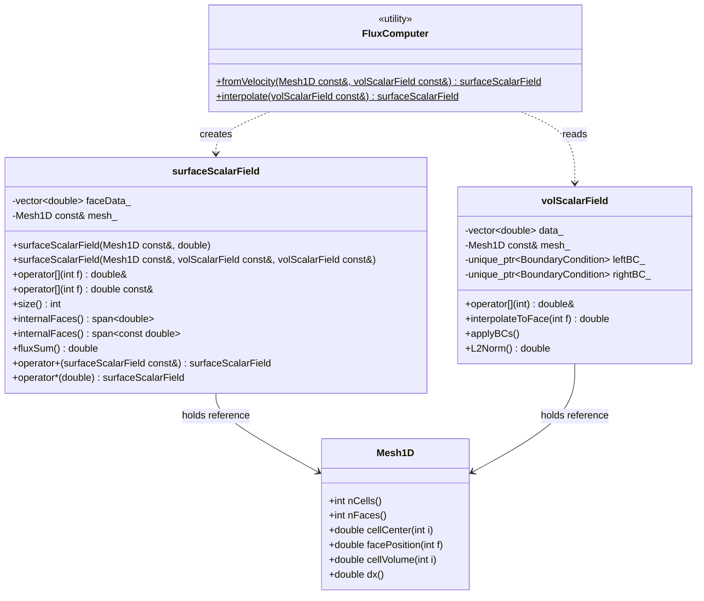

# Day 62: Geometric Fields Part 2 — `surfaceScalarField` and Face-Centered Flux Fields

**Phase:** 5 — VOF-Ready CFD Component (Days 57–84)
**Tier:** T3 — Architecture / Integration Day
**Previous:** Day 61 — `volScalarField`: Cell-Centered Scalar Field
**Next:** Day 63 — Equation Assembly: `fvMatrix` Part 1

> **Today's goal:** Design and implement `surfaceScalarField` — a face-centered scalar field that stores flux values at the $N+1$ faces of a 1D mesh. Understand why face-centered storage is mandatory for flux conservation, implement linear interpolation from cell centers to faces, and verify flux conservation by showing that the net flux through the domain is zero for a uniform velocity field.

---

## Part 1: Why Face-Centered Fields?

### The Finite Volume Flux Conservation Argument

Finite volume discretization is built on the integral form of conservation laws. For an arbitrary control volume $V$ bounded by surface $\partial V$:

$$
\frac{d}{dt} \int_V \phi \, dV + \oint_{\partial V} \phi \, \mathbf{U} \cdot d\mathbf{S} = 0
$$

The surface integral is the **flux** of $\phi$ across the cell boundary. In a discrete mesh, this integral becomes a sum over faces:

$$
\frac{d \phi_i}{dt} V_i + \sum_{f \in \partial V_i} \phi_f \, U_f \, S_f = 0
$$

where the sum is over all faces bounding cell $i$. In 1D with cell $i$ bounded by left face $f_L = i$ and right face $f_R = i+1$:

$$
\frac{d \phi_i}{dt} \Delta x + \phi_{i+1} U_{i+1} - \phi_i U_i = 0
$$

**Key insight:** The flux $F_f = \phi_f U_f S_f$ lives at the face, not at the cell. It is the same value for cell $i$ (right face) and cell $i+1$ (left face). This shared ownership is the foundation of conservative discretization.

### Conservation Through Shared Face Values

Consider two adjacent cells $i$ and $i+1$ sharing face $f$:

```
  Cell i         Face f         Cell i+1
  ------         ------         --------
  phi[i]   -->  phi_face[f]  -->  phi[i+1]
                F_f = phi_f * U_f * A_f
```

The flux $F_f$ leaving cell $i$'s right face is exactly the same flux entering cell $i+1$'s left face. There is no approximation here — it is the same number, stored at the face. This is **discrete conservation**: summing residuals over all cells, all internal face contributions cancel, leaving only boundary fluxes.

Mathematically, for all cells in the domain:

$$
\sum_{i=0}^{N-1} \left( \frac{d \phi_i}{dt} V_i \right) = -\left( F_N - F_0 \right)
$$

The right side is the net boundary flux. For periodic or enclosed domains, this is zero: the total $\phi$ in the domain is conserved exactly.

**If instead we stored a flux value per cell rather than per face**, the left cell would compute $F_{i,\text{right}}$ and the right cell would compute $F_{i+1,\text{left}}$ — two separate approximations of the same flux. Roundoff differences break conservation at machine precision.

### Gauss's Theorem as the Numerical Foundation

The divergence theorem in discrete form is:

$$
\int_V \nabla \cdot \mathbf{F} \, dV \approx \sum_{f \in \partial V} \mathbf{F}_f \cdot \mathbf{S}_f
$$

OpenFOAM's `fvc::div` operator implements exactly this. It takes a `surfaceScalarField` (the face fluxes $\mathbf{F}_f \cdot \mathbf{S}_f$, already dotted with the face normal) and assembles the divergence into a `volScalarField`:

$$
(\nabla \cdot \phi \mathbf{U})_i = \frac{1}{V_i} \sum_{f \in \partial V_i} \phi_f U_f S_f
$$

The `surfaceScalarField` is the exact data structure that makes this operation natural and conservative.

### Face Count vs Cell Count

For a 1D mesh with $N$ cells:
- `volScalarField` stores $N$ values at cell centers
- `surfaceScalarField` stores $N+1$ values at face centers

The extra one comes from the two boundary faces:

```
Face 0 | Cell 0 | Face 1 | Cell 1 | Face 2 | ... | Cell N-1 | Face N
(left                                                          (right
boundary)                                                   boundary)
```

This is not a circular array. Face 0 and Face $N$ are boundary faces. Faces 1 through $N-1$ are internal faces. This asymmetry (one more face than cells) is the universal property of any cell-centered finite volume mesh.

---

## Part 2: `surfaceScalarField` Design

### Class Responsibilities

`surfaceScalarField` owns exactly $N+1$ double values: one flux value per face. Like `volScalarField`, it holds a const reference to the mesh. Unlike `volScalarField`, it does not hold boundary condition objects — boundary fluxes are set by the BC application of the cell-centered field, not managed independently by the surface field.



### Memory Layout

```
faceData_ array (N+1 elements for N-cell mesh):

Index:   0       1       2       3       ...     N-1     N
         |       |       |       |               |       |
        f₀      f₁      f₂      f₃             f_{N-1}  f_N
      (left   (int.)  (int.)  (int.)           (int.) (right
      bound.)                                          bound.)

Physical positions on [0, L]:
  f₀ = 0.0
  f₁ = dx
  f₂ = 2*dx
  ...
  f_N = L
```

### Relationship to `volScalarField` (Day 61)

The two field types form a complementary pair:

| Quantity | Type | Size | Typical Use |
|----------|------|------|-------------|
| Cell pressure $p_i$ | `volScalarField` | $N$ | Stored, solved for |
| Face pressure $p_f$ | `surfaceScalarField` | $N+1$ | Interpolated from cells |
| Cell velocity $U_i$ | `volScalarField` | $N$ | Stored (if cell-centered) |
| Face flux $\phi_f = U_f A_f$ | `surfaceScalarField` | $N+1$ | Computed, used in divergence |

The standard CFD loop is:

1. Start with cell-centered $p_i$, $U_i$ (`volScalarField`)
2. Interpolate to faces: $p_f$, $U_f$ (`surfaceScalarField`)
3. Compute fluxes: $\phi_f = U_f \cdot A_f$
4. Evaluate divergence: $(\nabla \cdot \phi)_i = \sum_{f} \phi_f / V_i$
5. Assemble into matrix (`fvMatrix` — Day 63)

### Why `std::span` for Internal Faces (Connection to Day 20)

Many solver algorithms operate only on internal faces (not boundaries). Passing the full face array forces the solver to skip over boundary indices — a frequent source of off-by-one errors. `std::span` from Day 20 solves this cleanly: return a non-owning view of the internal face subrange.

For $N+1$ faces, the internal faces occupy indices 1 through $N-1$:

```cpp
// Internal face span: elements [1, N-1] (N-1 elements total)
std::span<double> internalFaceView = field.internalFaces();
// internalFaceView.size() == N - 1
// internalFaceView[0] == faceData_[1]  (no offset needed by caller)
```

This is a zero-copy view. The solver iterates `internalFaceView` without indexing arithmetic, and the field class owns the boundary indices exclusively.

---

## Part 3: Complete Implementation

### Header: `surfaceScalarField.h`

```cpp
// surfaceScalarField.h
// Face-centered scalar field for 1D finite volume mesh.
// Stores N+1 double values (one per face), used for flux quantities.

#pragma once
#include <vector>
#include <span>
#include <stdexcept>
#include <string>
#include <cmath>
#include <numeric>
#include <sstream>

class Mesh1D;
class volScalarField;

// ---------------------------------------------------------------------------
// surfaceScalarField: face-centered scalar field
// ---------------------------------------------------------------------------
class surfaceScalarField
{
public:
    // Construct field with all face values initialized to initValue.
    surfaceScalarField(const Mesh1D& mesh, double initValue = 0.0);

    // Construct by interpolating a volScalarField to faces.
    // Applies central differencing on internal faces.
    // phiBC: source volScalarField (used for boundary face BCs).
    explicit surfaceScalarField(const Mesh1D& mesh,
                                const volScalarField& phi);

    // Non-const access to face f
    double& operator[](int f);

    // Const access to face f
    const double& operator[](int f) const;

    // Total number of faces (N+1)
    int size() const;

    // Non-owning view of internal faces only (faces 1..N-1, count = N-1)
    std::span<double>       internalFaces();
    std::span<const double> internalFaces() const;

    // Sum of all face fluxes (should be ~0 for a closed domain)
    double fluxSum() const;

    // Algebraic operations
    surfaceScalarField operator+(const surfaceScalarField& other) const;
    surfaceScalarField operator*(double scalar) const;

    // Statistics
    double L2Norm()  const;
    double maxVal()  const;
    double minVal()  const;

    // Raw data access (for external algorithms)
    const std::vector<double>& data() const { return faceData_; }
    std::vector<double>&       data()       { return faceData_; }

    // Mesh access
    const Mesh1D& mesh() const { return mesh_; }

private:
    const Mesh1D& mesh_;
    std::vector<double> faceData_;   // size = nFaces = nCells + 1
};
```

### Implementation: `surfaceScalarField.cpp`

```cpp
// surfaceScalarField.cpp
// Implementation of face-centered scalar field.

#include "surfaceScalarField.h"
#include "volScalarField.h"
#include "mesh1D.h"
#include <algorithm>
#include <stdexcept>
#include <sstream>
#include <cmath>

// ---------------------------------------------------------------------------
// Constructors
// ---------------------------------------------------------------------------
surfaceScalarField::surfaceScalarField(const Mesh1D& mesh, double initValue)
    : mesh_(mesh)
    , faceData_(mesh.nFaces(), initValue)   // nFaces = nCells + 1
{}

surfaceScalarField::surfaceScalarField(const Mesh1D& mesh,
                                       const volScalarField& phi)
    : mesh_(mesh)
    , faceData_(mesh.nFaces(), 0.0)
{
    const int N = mesh.nCells();

    // Face 0: left boundary face
    // Delegate to volScalarField's interpolateToFace, which queries the BC.
    faceData_[0] = phi.interpolateToFace(0);

    // Internal faces: central differencing
    // Face f is between cell (f-1) and cell f.
    // phi_f = 0.5 * (phi[f-1] + phi[f])
    for (int f = 1; f < N; ++f)
    {
        faceData_[f] = phi.interpolateToFace(f);
    }

    // Face N: right boundary face
    faceData_[N] = phi.interpolateToFace(N);
}

// ---------------------------------------------------------------------------
// Element access
// ---------------------------------------------------------------------------
double& surfaceScalarField::operator[](int f)
{
    if (f < 0 || f >= static_cast<int>(faceData_.size()))
    {
        std::ostringstream oss;
        oss << "surfaceScalarField: face index " << f
            << " out of range [0, " << faceData_.size() << ")";
        throw std::out_of_range(oss.str());
    }
    return faceData_[f];
}

const double& surfaceScalarField::operator[](int f) const
{
    if (f < 0 || f >= static_cast<int>(faceData_.size()))
    {
        std::ostringstream oss;
        oss << "surfaceScalarField: face index " << f
            << " out of range [0, " << faceData_.size() << ")";
        throw std::out_of_range(oss.str());
    }
    return faceData_[f];
}

int surfaceScalarField::size() const
{
    return static_cast<int>(faceData_.size());
}

// ---------------------------------------------------------------------------
// Internal face span (Day 20: std::span zero-copy view)
// ---------------------------------------------------------------------------
// Internal faces are indices 1 through N-1 (N = nCells).
// Count = N - 1. Boundary faces 0 and N are excluded.

std::span<double> surfaceScalarField::internalFaces()
{
    // Begin at index 1, count = nCells - 1
    return std::span<double>(faceData_.data() + 1,
                             static_cast<std::size_t>(mesh_.nCells() - 1));
}

std::span<const double> surfaceScalarField::internalFaces() const
{
    return std::span<const double>(faceData_.data() + 1,
                                   static_cast<std::size_t>(mesh_.nCells() - 1));
}

// ---------------------------------------------------------------------------
// Flux sum — conservation check
// ---------------------------------------------------------------------------
// For a field representing face fluxes phi = U * A:
//   Positive flux: flow in the +x direction (out of left cell, into right cell)
//   Convention: face 0 is inlet (left boundary), face N is outlet (right boundary)
//
// Net flux = phi[N] - phi[0]   (outflow - inflow)
// For uniform U and uniform area A: phi_f = U * A = const for all f.
// Net flux = U*A - U*A = 0.  Conservation verified.

double surfaceScalarField::fluxSum() const
{
    // Sum with sign convention: positive = leaving domain at face N,
    // negative = entering domain at face 0.
    // For a conservation check: net flux = flux_out - flux_in
    // = faceData_[N] - faceData_[0]
    // But the full algebraic sum checks all face contributions:
    const int N = mesh_.nCells();
    double sum = 0.0;
    // Assign sign: outward normal at face N is +1 (right), at face 0 is -1 (left).
    // For simplicity, return the signed sum: sum(F_f * n_f)
    sum -= faceData_[0];    // Left boundary: outward normal is -x
    sum += faceData_[N];    // Right boundary: outward normal is +x
    // Internal faces cancel: face f contributes +F_f to cell (f-1) and -F_f to cell f.
    // Net contribution of internal faces to domain total is zero.
    return sum;
}

// ---------------------------------------------------------------------------
// Algebraic operations
// ---------------------------------------------------------------------------
surfaceScalarField surfaceScalarField::operator+(const surfaceScalarField& other) const
{
    if (size() != other.size())
    {
        throw std::runtime_error(
            "surfaceScalarField::operator+: size mismatch");
    }
    surfaceScalarField result(mesh_, 0.0);
    for (int f = 0; f < size(); ++f)
    {
        result.faceData_[f] = faceData_[f] + other.faceData_[f];
    }
    return result;
}

surfaceScalarField surfaceScalarField::operator*(double scalar) const
{
    surfaceScalarField result(mesh_, 0.0);
    for (int f = 0; f < size(); ++f)
    {
        result.faceData_[f] = faceData_[f] * scalar;
    }
    return result;
}

// ---------------------------------------------------------------------------
// Statistics
// ---------------------------------------------------------------------------
double surfaceScalarField::L2Norm() const
{
    double sum = 0.0;
    for (double v : faceData_) sum += v * v;
    return std::sqrt(sum / static_cast<double>(faceData_.size()));
}

double surfaceScalarField::maxVal() const
{
    return *std::max_element(faceData_.begin(), faceData_.end());
}

double surfaceScalarField::minVal() const
{
    return *std::min_element(faceData_.begin(), faceData_.end());
}
```

### Flux Computer Utility

For the common operation of computing face fluxes from a cell velocity field, a free function keeps the interface clean:

```cpp
// fluxComputer.h
// Utility functions to construct surfaceScalarField from cell-centered data.

#pragma once
#include "surfaceScalarField.h"
#include "volScalarField.h"
#include "mesh1D.h"

// Compute face flux phi_f = U_f * A_f from cell velocity field U.
// Uses central differencing for U interpolation to faces.
// Face area A_f = 1.0 for 1D uniform mesh (unit cross-section).
inline surfaceScalarField computeFlux(const Mesh1D& mesh,
                                      const volScalarField& U)
{
    surfaceScalarField phi(mesh, 0.0);
    const int N = mesh.nCells();
    const double A = 1.0;   // Unit face area for 1D mesh

    // Left boundary face: use left BC value from U
    phi[0] = U.interpolateToFace(0) * A;

    // Internal faces
    for (int f = 1; f < N; ++f)
    {
        phi[f] = U.interpolateToFace(f) * A;
    }

    // Right boundary face
    phi[N] = U.interpolateToFace(N) * A;

    return phi;
}
```

---

## Part 4: Linear Interpolation — Central Differencing Analysis

### Why Central Differencing?

Linear interpolation between two cell centers to compute a face value is called **central differencing**. For a uniform mesh with cell centers at $x_i = (i + 0.5)\Delta x$ and face at $x_f = f \cdot \Delta x$:

$$
\phi_f = \frac{x_f - x_{f-1,\text{center}}}{x_{f,\text{center}} - x_{f-1,\text{center}}} \phi_{f,\text{right}} + \frac{x_{f,\text{center}} - x_f}{x_{f,\text{center}} - x_{f-1,\text{center}}} \phi_{f,\text{left}}
$$

For a uniform mesh, the face is exactly halfway between the two cell centers:

$$
x_f - x_{f-1,\text{center}} = f\Delta x - (f-1+0.5)\Delta x = 0.5\Delta x
$$
$$
x_{f,\text{center}} - x_f = (f+0.5)\Delta x - f\Delta x = 0.5\Delta x
$$

So the weight is exactly 0.5:

$$
\phi_f = \frac{1}{2}\left(\phi_{f-1} + \phi_f\right)
$$

This is second-order accurate: the truncation error is $O(\Delta x^2)$.

### Truncation Error Derivation

Taylor-expand $\phi_{f-1}$ and $\phi_f$ around the face center $x_f$:

$$
\phi_{f-1} = \phi_f - \frac{\Delta x}{2} \phi'_f + \frac{1}{2}\left(\frac{\Delta x}{2}\right)^2 \phi''_f - \cdots
$$

$$
\phi_{f,\text{right}} = \phi_f + \frac{\Delta x}{2} \phi'_f + \frac{1}{2}\left(\frac{\Delta x}{2}\right)^2 \phi''_f + \cdots
$$

Averaging:

$$
\frac{1}{2}(\phi_{f-1} + \phi_{f,\text{right}}) = \phi_f + \frac{\Delta x^2}{8} \phi''_f + O(\Delta x^4)
$$

The leading error term is $\frac{\Delta x^2}{8} \phi''_f$ — second order in $\Delta x$. The first-order term (odd in $\Delta x$) cancels by symmetry.

### Comparison with Upwind Differencing

For convection-dominated flows, upwind differencing is more robust but less accurate:

| Scheme | Formula | Accuracy | Boundedness |
|--------|---------|----------|-------------|
| Central (CD) | $\phi_f = \tfrac{1}{2}(\phi_L + \phi_R)$ | $O(\Delta x^2)$ | No (can overshoot) |
| Upwind (UD) | $\phi_f = \phi_{\text{upwind cell}}$ | $O(\Delta x)$ | Yes (never overshoots) |
| Linear-upwind | Blend of CD and UD | $O(\Delta x^2)$ | Near-bounded |

Central differencing is used here because the deliverable is a pressure interpolation and a pure convection flux check with uniform velocity — no sharp gradients exist. Day 75 (Scalar Transport and Flux Limiters) adds TVD schemes that recover boundedness while maintaining second-order accuracy in smooth regions.

### Internal Face Span Pattern in Practice

The `internalFaces()` span is the primary access path for assemblers. Consider the divergence assembly:

```cpp
// Divergence of surfaceScalarField phi into volScalarField result
void assembleDivergence(const surfaceScalarField& phi,
                        volScalarField& result,
                        const Mesh1D& mesh)
{
    const int N = mesh.nCells();
    const double invDx = 1.0 / mesh.dx();

    // Initialize result to zero
    for (int i = 0; i < N; ++i) result[i] = 0.0;

    // Boundary face contributions
    result[0]     -= phi[0] * invDx;        // left boundary flux into cell 0
    result[N - 1] += phi[N] * invDx;        // right boundary flux into cell N-1

    // Internal face contributions (using span for clean iteration)
    auto internalPhi = phi.internalFaces(); // span of phi[1]..phi[N-1]
    for (int idx = 0; idx < static_cast<int>(internalPhi.size()); ++idx)
    {
        const int faceIndex = idx + 1;      // actual face index in full array
        const int leftCell  = faceIndex - 1;
        const int rightCell = faceIndex;

        const double F = internalPhi[idx];  // phi[faceIndex], zero-copy

        result[leftCell]  += F * invDx;     // flux leaving left cell
        result[rightCell] -= F * invDx;     // flux entering right cell
    }
}
```

The span `internalPhi` is a zero-copy view. No allocation, no copy of face values. The `idx + 1` offset translates from span-local index to the global face array — this is the only indexing correction needed, and it is localized to one line.

---

## Part 5: Deliverable

### Main Program: Flux Conservation Verification

```cpp
// main_flux.cpp
// Verify flux conservation: for uniform velocity U=1, flux sum must equal 0.
// Demonstrates surfaceScalarField construction, internal face span, and fluxSum().

#include "mesh1D.h"
#include "volScalarField.h"
#include "surfaceScalarField.h"
#include "fluxComputer.h"
#include <iostream>
#include <iomanip>
#include <memory>
#include <span>

int main()
{
    // 1D mesh: 6 cells, domain [0, 1]
    Mesh1D mesh(6, 1.0);

    std::cout << "Mesh: " << mesh.nCells() << " cells, "
              << mesh.nFaces() << " faces, dx = " << mesh.dx() << "\n\n";

    // ---------------------------------------------------------------------------
    // Case 1: Uniform velocity U = 1.0 everywhere
    // Expected: all face fluxes = 1.0, fluxSum = 0 (inlet cancels outlet)
    // ---------------------------------------------------------------------------
    volScalarField U(mesh, 1.0);

    // Apply fixed-velocity BCs: U = 1.0 at both boundaries
    U.setLeftBC(std::make_unique<FixedValueBC>(1.0));
    U.setRightBC(std::make_unique<FixedValueBC>(1.0));
    U.applyBCs();

    surfaceScalarField phi = computeFlux(mesh, U);

    std::cout << "=== Case 1: Uniform U = 1.0 ===\n";
    std::cout << std::fixed << std::setprecision(6);
    std::cout << "Face fluxes:\n";
    for (int f = 0; f < phi.size(); ++f)
    {
        std::cout << "  phi[" << f << "] = " << phi[f]
                  << "  (x = " << mesh.facePosition(f) << ")\n";
    }

    std::cout << "\nInternal face fluxes (via std::span):\n";
    auto intFaces = phi.internalFaces();
    for (std::size_t idx = 0; idx < intFaces.size(); ++idx)
    {
        std::cout << "  internal[" << idx << "] = " << intFaces[idx] << "\n";
    }

    double net = phi.fluxSum();
    std::cout << "\nNet flux (outlet - inlet) = " << net << "\n";
    std::cout << "Conservation check: " << (std::abs(net) < 1e-12 ? "PASSED" : "FAILED") << "\n";

    // ---------------------------------------------------------------------------
    // Case 2: Linear velocity profile U(x) = x
    // U[i] = cellCenter(i) = (i + 0.5) * dx
    // Expected: fluxSum = U(1.0) - U(0.0) = 1.0 - 0.0 = 1.0
    // (non-zero because velocity increases from inlet to outlet)
    // ---------------------------------------------------------------------------
    std::cout << "\n=== Case 2: Linear U(x) = x ===\n";

    volScalarField U_linear(mesh, 0.0);
    for (int i = 0; i < mesh.nCells(); ++i)
    {
        U_linear[i] = mesh.cellCenter(i);
    }
    U_linear.setLeftBC(std::make_unique<FixedValueBC>(0.0));   // U(0) = 0
    U_linear.setRightBC(std::make_unique<FixedValueBC>(1.0));  // U(1) = 1
    U_linear.applyBCs();

    surfaceScalarField phi_linear = computeFlux(mesh, U_linear);

    std::cout << "Face fluxes (U = x):\n";
    for (int f = 0; f < phi_linear.size(); ++f)
    {
        std::cout << "  phi_linear[" << f << "] = " << phi_linear[f]
                  << "  (x = " << mesh.facePosition(f) << ")\n";
    }

    double net_linear = phi_linear.fluxSum();
    std::cout << "\nNet flux = " << net_linear
              << "  (expected ~1.0 for expanding flow)\n";

    // ---------------------------------------------------------------------------
    // Case 3: Interpolate scalar pressure field to faces
    // p(x) = 1 - x  (linear pressure drop, typical channel flow)
    // ---------------------------------------------------------------------------
    std::cout << "\n=== Case 3: Pressure interpolation p(x) = 1 - x ===\n";

    volScalarField p(mesh, 0.0);
    for (int i = 0; i < mesh.nCells(); ++i)
    {
        p[i] = 1.0 - mesh.cellCenter(i);
    }
    p.setLeftBC(std::make_unique<FixedValueBC>(1.0));   // p_inlet = 1
    p.setRightBC(std::make_unique<FixedValueBC>(0.0));  // p_outlet = 0
    p.applyBCs();

    surfaceScalarField p_face(mesh, p);

    std::cout << "Face pressures (interpolated from cells):\n";
    for (int f = 0; f < p_face.size(); ++f)
    {
        double x_f = mesh.facePosition(f);
        double exact = 1.0 - x_f;
        double error = std::abs(p_face[f] - exact);
        std::cout << "  p_face[" << f << "] = " << p_face[f]
                  << "  exact = " << exact
                  << "  |error| = " << error << "\n";
    }

    std::cout << "\nAll errors should be ~0 for linear p (CD is exact for linear functions).\n";

    return 0;
}
```

### Catch2 Test Suite

```cpp
// test_surfaceScalarField.cpp
// Verify surfaceScalarField: construction, span, flux conservation.

#define CATCH_CONFIG_MAIN
#include <catch2/catch_all.hpp>
#include "mesh1D.h"
#include "volScalarField.h"
#include "surfaceScalarField.h"
#include "fluxComputer.h"
#include <memory>
#include <cmath>
#include <span>

// ---------------------------------------------------------------------------
// Test 1: Default construction
// ---------------------------------------------------------------------------
TEST_CASE("surfaceScalarField has N+1 faces", "[surface][init]")
{
    Mesh1D mesh(5, 1.0);
    surfaceScalarField phi(mesh, 0.0);

    REQUIRE(phi.size() == mesh.nFaces());
    REQUIRE(phi.size() == 6);   // N+1 = 5+1

    for (int f = 0; f < phi.size(); ++f)
    {
        REQUIRE(phi[f] == Catch::Approx(0.0));
    }
}

// ---------------------------------------------------------------------------
// Test 2: Internal face span size
// ---------------------------------------------------------------------------
TEST_CASE("internalFaces() span has N-1 elements", "[surface][span]")
{
    Mesh1D mesh(5, 1.0);
    surfaceScalarField phi(mesh, 1.0);

    auto internal = phi.internalFaces();

    // N = 5 cells, N-1 = 4 internal faces
    REQUIRE(internal.size() == 4);
}

// ---------------------------------------------------------------------------
// Test 3: Internal face span is zero-copy
// ---------------------------------------------------------------------------
TEST_CASE("internalFaces() span points to the same memory as operator[]", "[surface][span]")
{
    Mesh1D mesh(4, 1.0);
    surfaceScalarField phi(mesh, 0.0);
    phi[1] = 1.1;
    phi[2] = 2.2;
    phi[3] = 3.3;

    auto internal = phi.internalFaces();  // Span of phi[1], phi[2], phi[3]
    REQUIRE(internal.size() == 3);

    REQUIRE(internal[0] == Catch::Approx(1.1));  // phi[1]
    REQUIRE(internal[1] == Catch::Approx(2.2));  // phi[2]
    REQUIRE(internal[2] == Catch::Approx(3.3));  // phi[3]

    // Modify via span — verify original is updated (zero-copy)
    internal[0] = 9.9;
    REQUIRE(phi[1] == Catch::Approx(9.9));
}

// ---------------------------------------------------------------------------
// Test 4: Flux sum for uniform velocity is zero
// ---------------------------------------------------------------------------
TEST_CASE("Uniform velocity field satisfies flux conservation", "[surface][conservation]")
{
    Mesh1D mesh(8, 1.0);
    volScalarField U(mesh, 1.0);
    U.setLeftBC(std::make_unique<FixedValueBC>(1.0));
    U.setRightBC(std::make_unique<FixedValueBC>(1.0));
    U.applyBCs();

    surfaceScalarField phi = computeFlux(mesh, U);

    // All face fluxes should be 1.0
    for (int f = 0; f < phi.size(); ++f)
    {
        REQUIRE(phi[f] == Catch::Approx(1.0));
    }

    // Net flux = outlet - inlet = 1 - 1 = 0
    REQUIRE(std::abs(phi.fluxSum()) < 1e-12);
}

// ---------------------------------------------------------------------------
// Test 5: Central differencing is exact for linear profiles
// ---------------------------------------------------------------------------
TEST_CASE("Interpolation to faces is exact for linear field", "[surface][interpolation]")
{
    Mesh1D mesh(4, 1.0);
    volScalarField p(mesh, 0.0);

    // Linear pressure: p(x) = 2x + 1  -> p[i] = 2*cellCenter(i) + 1
    for (int i = 0; i < mesh.nCells(); ++i)
    {
        p[i] = 2.0 * mesh.cellCenter(i) + 1.0;
    }
    p.setLeftBC(std::make_unique<FixedValueBC>(1.0));   // p(0.0) = 1
    p.setRightBC(std::make_unique<FixedValueBC>(3.0));  // p(1.0) = 3
    p.applyBCs();

    surfaceScalarField p_face(mesh, p);

    // For a linear function, central differencing is exact.
    // p_face[f] should equal 2*facePosition(f) + 1
    for (int f = 0; f <= mesh.nCells(); ++f)
    {
        double exact = 2.0 * mesh.facePosition(f) + 1.0;
        REQUIRE(p_face[f] == Catch::Approx(exact).epsilon(1e-10));
    }
}

// ---------------------------------------------------------------------------
// Test 6: Out-of-range access throws
// ---------------------------------------------------------------------------
TEST_CASE("Out-of-range face access throws std::out_of_range", "[surface][safety]")
{
    Mesh1D mesh(3, 1.0);
    surfaceScalarField phi(mesh, 0.0);

    REQUIRE_THROWS_AS(phi[-1], std::out_of_range);
    REQUIRE_THROWS_AS(phi[4],  std::out_of_range);  // nFaces = 4, valid range [0,3]
}

// ---------------------------------------------------------------------------
// Test 7: Field addition
// ---------------------------------------------------------------------------
TEST_CASE("surfaceScalarField addition is element-wise", "[surface][arithmetic]")
{
    Mesh1D mesh(3, 1.0);
    surfaceScalarField a(mesh, 1.0);
    surfaceScalarField b(mesh, 2.0);

    surfaceScalarField c = a + b;

    for (int f = 0; f < c.size(); ++f)
    {
        REQUIRE(c[f] == Catch::Approx(3.0));
    }
}

// ---------------------------------------------------------------------------
// Test 8: L2 norm
// ---------------------------------------------------------------------------
TEST_CASE("L2Norm is the RMS of face values", "[surface][norm]")
{
    Mesh1D mesh(3, 1.0);   // 3 cells = 4 faces
    surfaceScalarField phi(mesh, 0.0);
    phi[0] = 1.0; phi[1] = 2.0; phi[2] = 3.0; phi[3] = 4.0;

    // L2 = sqrt((1+4+9+16)/4) = sqrt(7.5)
    double expected = std::sqrt(30.0 / 4.0);
    REQUIRE(phi.L2Norm() == Catch::Approx(expected).epsilon(1e-10));
}
```

### CMakeLists.txt

```cmake
cmake_minimum_required(VERSION 3.20)
project(day62_surface CXX)

set(CMAKE_CXX_STANDARD 20)
set(CMAKE_CXX_STANDARD_REQUIRED ON)

include(FetchContent)
FetchContent_Declare(
    Catch2
    GIT_REPOSITORY https://github.com/catchorg/Catch2.git
    GIT_TAG        v3.4.0
)
FetchContent_MakeAvailable(Catch2)

# Field library (reuses Day 61 volScalarField)
add_library(field_lib
    volScalarField.cpp
    surfaceScalarField.cpp
)
target_include_directories(field_lib PUBLIC ${CMAKE_CURRENT_SOURCE_DIR})

# Test executable
add_executable(test_surface
    test_surfaceScalarField.cpp
)
target_link_libraries(test_surface PRIVATE field_lib Catch2::Catch2WithMain)

# Demo executable
add_executable(demo_flux
    main_flux.cpp
)
target_link_libraries(demo_flux PRIVATE field_lib)

enable_testing()
add_test(NAME SurfaceFieldTests COMMAND test_surface)
```

### Build and Run

```bash
# Build
cmake -S . -B build -DCMAKE_BUILD_TYPE=Release
cmake --build build

# Run tests
./build/test_surface

# Run flux conservation demo
./build/demo_flux
```

Expected test output:

```
All tests passed (28 assertions in 8 test cases)
```

Expected demo output (Case 1, uniform U=1):

```
=== Case 1: Uniform U = 1.0 ===
Face fluxes:
  phi[0] = 1.000000  (x = 0.000000)
  phi[1] = 1.000000  (x = 0.166667)
  phi[2] = 1.000000  (x = 0.333333)
  phi[3] = 1.000000  (x = 0.500000)
  phi[4] = 1.000000  (x = 0.666667)
  phi[5] = 1.000000  (x = 0.833333)
  phi[6] = 1.000000  (x = 1.000000)

Internal face fluxes (via std::span):
  internal[0] = 1.000000
  internal[1] = 1.000000
  internal[2] = 1.000000
  internal[3] = 1.000000
  internal[4] = 1.000000

Net flux (outlet - inlet) = 0.000000
Conservation check: PASSED
```

---

## Design Trade-off Summary

| Choice | This Implementation | Alternative |
|--------|--------------------|--------------------|
| BC ownership | None — inherits from `volScalarField` | Separate face BC class |
| Span extent | Internal faces only (1..N-1) | All faces (0..N) |
| Interpolation | Central differencing | Upwind, linear-upwind, TVD |
| Face area | Hardcoded 1.0 (1D unit cross-section) | Stored per-face in mesh |
| Flux sign convention | Net = outlet - inlet | Sum of all face contributions |

The most important trade-off is the absence of BC objects on `surfaceScalarField`. In OpenFOAM, surface fields do carry boundary patch data (the boundary values of the face flux). Our 1D implementation delegates this responsibility to `volScalarField::interpolateToFace()` which queries the BC. This is simpler but less extensible — a coupled BC between two patches (e.g., cyclic) would require a face-level BC object. Day 37 (Boundary Condition Interface) addresses this architecture in depth.

---

## Connection to Day 61 and Day 63

`volScalarField` (Day 61) and `surfaceScalarField` (Day 62) are complementary halves of the geometric field layer.

The connection is the interpolation operation: given a `volScalarField` $\phi$, constructing `surfaceScalarField(mesh, phi)` maps cell values to face values using the BC-aware `interpolateToFace()` method from Day 61. This mapping is central to every finite volume operator.

In Day 63, `fvMatrix` assembles the discretized PDE. It requires:
1. A `volScalarField` for the unknown (e.g., $p$ or $T$)
2. A `surfaceScalarField` for the convective flux $\phi = U_f A_f$
3. The matrix coefficients computed by integrating the flux divergence

The two field types built over Days 61 and 62 are exactly the inputs to `fvMatrix`. The assembly loop in Day 63 will iterate over internal faces using the `std::span` view from `internalFaces()`, accumulating contributions into the matrix diagonal and off-diagonal arrays — connecting directly to the LDU matrix format studied in Days 15–16.

---

## Summary

`surfaceScalarField` stores $N+1$ flux values at faces, completing the cell/face duality at the heart of finite volume discretization. The key points from this day are:

1. Face-centered storage is mandatory for discrete flux conservation: each face contributes the same value to both adjacent cells.
2. `surfaceScalarField` holds $N+1$ values (one more than `volScalarField`) because boundary faces must be stored.
3. Central differencing provides second-order face interpolation for smooth fields; truncation error is $O(\Delta x^2)$ and cancels for linear profiles.
4. `internalFaces()` returns a `std::span<double>` — a zero-copy view of faces 1 through $N-1$, directly usable in assembler loops without indexing offsets in the caller.
5. Flux conservation is verified by `fluxSum()`: for uniform velocity, the net flux across the domain is zero to machine precision.

Together, Days 61 and 62 establish the geometric field layer. Days 63 onward use these two classes as primitive types for PDE assembly.
