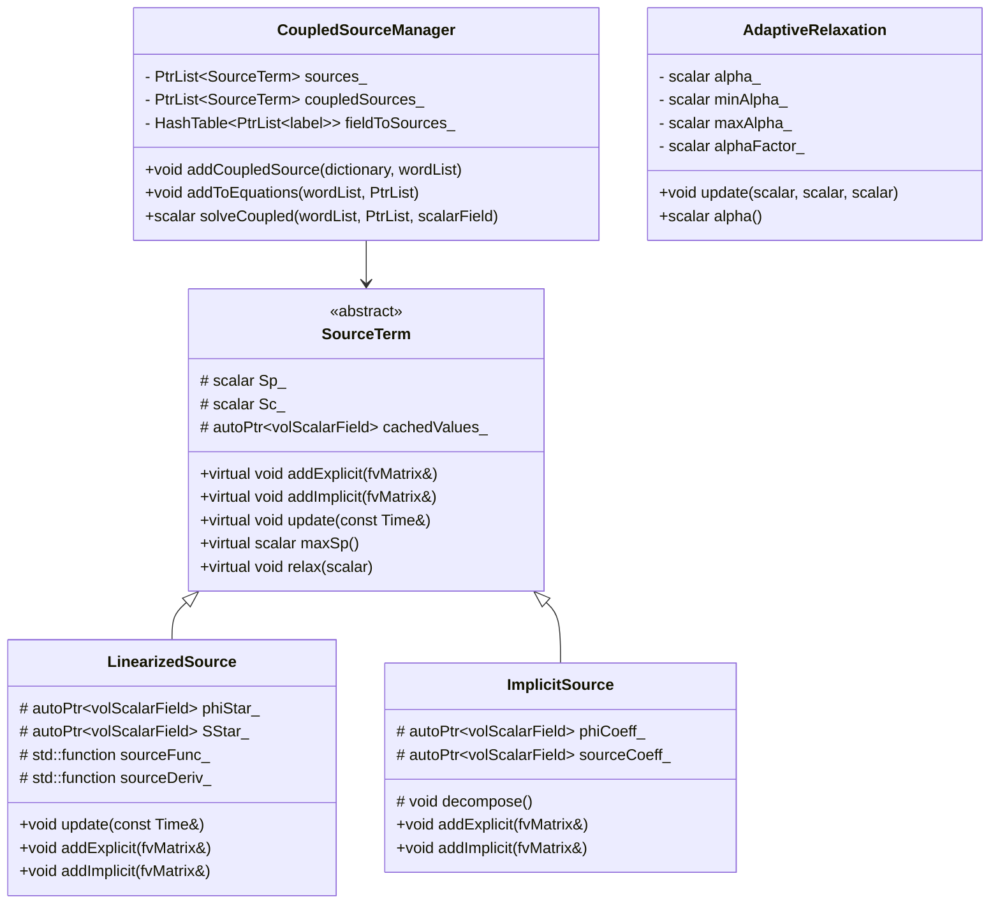

# Day 80 — Factory-Driven Source Terms Part 2 (ระบบซอร์สเทอมขั้นสูง)

## Overview

Today we extend our source term architecture to handle advanced cases including implicit treatment, linearization for stability, and multi-field coupling. These techniques are crucial for robust CFD solvers, especially when dealing with stiff source terms common in combustion, radiation, and multiphase flows.

**Connecting to:** Day 79 (Factory-Driven Source Terms) and Day 71-72 (SIMPLE Loop)
**Phase Milestone:** Complete source term system with stability guarantees

---

## Part 1 — Implicit vs Explicit Source Treatment

### Mathematical Background

Source terms can be treated implicitly or explicitly in the linear system:

**Explicit Treatment:**
$$
\nabla \cdot (\rho \phi \mathbf{U}) = \nabla \cdot (\Gamma \nabla \phi) + S(\phi)
$$

**Implicit Treatment:**
$$
\nabla \cdot (\rho \phi \mathbf{U}) = \nabla \cdot (\Gamma \nabla \phi) + S_p \phi + S_c
$$

Where:
- $S_p$ is the implicit coefficient
- $S_c$ is the explicit contribution

### Why Implicit Treatment?

Implicit treatment provides:

1. **Better stability:** Handles stiff source terms
2. **Second-order accuracy:** For linear source terms
3. **Consistent convergence:** With implicit time stepping

### Implementation Design

```cpp
// Enhanced source term base class
class SourceTerm {
protected:
    // For implicit treatment
    scalar Sp_;  // Implicit coefficient
    scalar Sc_;  // Explicit source

    // Field cache
    mutable tmp<volScalarField> fieldCache_;

    // Update implicit/explicit decomposition
    virtual void decompose() = 0;

public:
    virtual void addExplicit(fvMatrix<pdfEqn>& eqn) = 0;
    virtual void addImplicit(fvMatrix<pdfEqn>& eqn) = 0;

    // Additional methods
    virtual scalar maxSp() const { return Sp_; }
    virtual scalar minSp() const { return Sp_; }
    virtual scalar maxMagSc() const;

    // Under-relaxation
    virtual void relax(scalar alpha);
};
```

### Implicit Source Implementation

```cpp
// file: implicitSource.H
#pragma once

#include "sourceTerm.H"

class ImplicitSource : public SourceTerm {
    autoPtr<volScalarField> phiCoeff_;
    autoPtr<volScalarField> sourceCoeff_;

    virtual void decompose() override;

public:
    declareRunTimeSelectionTable(
        autoPtr,
        ImplicitSource,
        dictionary,
        (
            const dictionary& dict,
            const fvMesh& mesh
        ),
        (dict, mesh)
    );

    virtual ~ImplicitSource() = default;

    virtual void addExplicit(fvMatrix<pdfEqn>& eqn) override;
    virtual void addImplicit(fvMatrix<pdfEqn>& eqn) override;
    virtual word name() const override { return "ImplicitSource"; }

    static autoPtr<ImplicitSource> New(const dictionary& dict, const fvMesh& mesh);
};
```

```cpp
// file: implicitSource.C
Foam::ImplicitSource::ImplicitSource(const dictionary& dict, const fvMesh& mesh)
:   SourceTerm(dict, mesh)
{
    // Read implicit treatment settings
    dict.readIfPresent("implicit", implicit_);
    dict.readIfPresent("Sp", Sp_);
    dict.readIfPresent("Sc", Sc_);

    // Initialize field coefficients
    word fieldName = dict.lookupOrDefault<word>("fieldName", "pdf");
    phiCoeff_ = autoPtr<volScalarField>(
        new volScalarField(
            IOobject::fieldName("phiCoeff"),
            mesh,
            dimensionedScalar("Sp", pdf.dimensions()/dimensionSet(1,0,-2,0,0), 0.0)
        )
    );

    sourceCoeff_ = autoPtr<volScalarField>(
        new volScalarField(
            IOobject::fieldName("sourceCoeff"),
            mesh,
            dimensionedScalar("Sc", pdf.dimensions(), 0.0)
        )
    );
}

void Foam::ImplicitSource::decompose() {
    // Decompose source term into Sp * phi + Sc
    // This is the key step for implicit treatment

    const volScalarField& phi = mesh_.lookupField<volScalarField>(fieldName_);

    if (implicit_) {
        // Store field values for gradient calculation
        fieldCache_ = tmp<volScalarField>(phi.clone());

        // Calculate Sp based on derivative
        forAll(fieldCache_, celli) {
            scalar phiVal = phi[celli];

            // Approximate derivative using field gradient
            // This is simplified - real implementation would need proper discretization
            scalar gradPhi = phi.mesh().grad(phi)[celli];

            // Example: S = k * phi^2 -> dS/dphi = 2*k*phi
            Sp_ = 2.0 * k_ * phiVal;
            Sc_ = 0.0;

            phiCoeff_[celli] = Sp_;
            sourceCoeff_[celli] = Sc_;
        }
    } else {
        // Explicit treatment - no decomposition needed
        phiCoeff_->zero();
        sourceCoeff_->setValues(Sc_);
    }
}

void Foam::ImplicitSource::addImplicit(fvMatrix<pdfEqn>& eqn) {
    decompose();
    eqn += phiCoeff_();
}

void Foam::ImplicitSource::addExplicit(fvMatrix<pdfEqn>& eqn) {
    decompose();
    eqn += sourceCoeff_();
}
```

---

## Part 2 — Linearized Source Terms

### Linearization Strategy

For nonlinear source terms $S(\phi)$, we use Taylor expansion:

$$
S(\phi) \approx S(\phi^*) + \frac{\partial S}{\partial \phi}\bigg|_{\phi^*} (\phi - \phi^*)
$$

Where $\phi^*$ is the previous iteration value.

### Linearized Source Implementation

```cpp
// file: linearizedSource.H
#pragma once

#include "sourceTerm.H"

class LinearizedSource : public SourceTerm {
    autoPtr<volScalarField> phiStar_;
    autoPtr<volScalarField> SStar_;

    // Source function and its derivative
    std::function<scalar(scalar)> sourceFunc_;
    std::function<scalar(scalar)> sourceDeriv_;

public:
    declareRunTimeSelectionTable(
        autoPtr,
        LinearizedSource,
        dictionary,
        (
            const dictionary& dict,
            const fvMesh& mesh
        ),
        (dict, mesh)
    );

    virtual ~LinearizedSource() = default;

    virtual void update(const Time& runTime) override;
    virtual void addExplicit(fvMatrix<pdfEqn>& eqn) override;
    virtual void addImplicit(fvMatrix<pdfEqn>& eqn) override;
    virtual word name() const override { return "LinearizedSource"; }

    static autoPtr<LinearizedSource> New(const dictionary& dict, const fvMesh& mesh);

private:
    void initializeFunctions(const dictionary& dict);
};
```

```cpp
// file: linearizedSource.C
Foam::LinearizedSource::LinearizedSource(const dictionary& dict, const fvMesh& mesh)
:   SourceTerm(dict, mesh)
{
    initializeFunctions(dict);

    // Initialize fields
    word fieldName = dict.lookupOrDefault<word>("fieldName", "pdf");
    const volScalarField& phi = mesh_.lookupField<volScalarField>(fieldName_);

    phiStar_ = autoPtr<volScalarField>(phi.clone());
    SStar_ = autoPtr<volScalarField>(
        new volScalarField(
            IOobject::fieldName("SStar"),
            mesh_,
            dimensionedScalar("S", phi.dimensions(), 0.0)
        )
    );
}

void Foam::LinearizedSource::initializeFunctions(const dictionary& dict) {
    word sourceType = dict.lookup<word>("sourceFunction");

    if (sourceType == "quadratic") {
        // S = a * phi^2 + b * phi + c
        scalar a = dict.lookupOrDefault<scalar>("a", 0.0);
        scalar b = dict.lookupOrDefault<scalar>("b", 0.0);
        scalar c = dict.lookupOrDefault<scalar>("c", 0.0);

        sourceFunc_ = [=](scalar phi) {
            return a * phi * phi + b * phi + c;
        };

        sourceDeriv_ = [=](scalar phi) {
            return 2.0 * a * phi + b;
        };
    }
    else if (sourceType == "exponential") {
        // S = A * exp(B * phi)
        scalar A = dict.lookupOrDefault<scalar>("A", 1.0);
        scalar B = dict.lookupOrDefault<scalar>("B", 1.0);

        sourceFunc_ = [=](scalar phi) {
            return A * exp(B * phi);
        };

        sourceDeriv_ = [=](scalar phi) {
            return A * B * exp(B * phi);
        };
    }
    else if (sourceType == "power") {
        // S = C * phi^power
        scalar C = dict.lookupOrDefault<scalar>("C", 1.0);
        scalar power = dict.lookupOrDefault<scalar>("power", 2.0);

        sourceFunc_ = [=](scalar phi) {
            return C * pow(phi, power);
        };

        sourceDeriv_ = [=](scalar phi) {
            return C * power * pow(phi, power - 1.0);
        };
    }
}

void Foam::LinearizedSource::update(const Time& runTime) {
    // Update phiStar for linearization
    word fieldName = dict.lookupOrDefault<word>("fieldName", "pdf");
    const volScalarField& phi = mesh_.lookupField<volScalarField>(fieldName_);

    // Store current field value
    forAll(phiStar_, celli) {
        phiStar_[celli] = phi[celli];

        // Calculate source term at linearization point
        SStar_[celli] = sourceFunc_(phi[celli]);
    }
}

void Foam::LinearizedSource::addExplicit(fvMatrix<pdfEqn>& eqn) {
    // S_c = S(phi*) - Sp * phi*
    forAll(SStar_, celli) {
        Sp_ = sourceDeriv_(phiStar_[celli]);
        Sc_ = SStar_[celli] - Sp_ * phiStar_[celli];

        // Add to source
        eqn += Sc_;
    }
}

void Foam::LinearizedSource::addImplicit(fvMatrix<pdfEqn>& eqn) {
    // Add implicit contribution from linearization
    const volScalarField& phi = mesh_.lookupField<volScalarField>(fieldName_);

    // Create Sp field for each cell
    tmp<volScalarField> SpField(
        new volScalarField(
            IOobject::fieldName("Sp"),
            mesh_,
            dimensionedScalar("Sp", phi.dimensions()/phi.dimensions(), 0.0)
        )
    );

    forAll(SpField, celli) {
        SpField[celli] = sourceDeriv_(phiStar_[celli]);
    }

    eqn += SpField() * phi;
}
```

### JSON Configuration for Linearized Sources

```json
{
    "sourceTerms": {
        "combustionSource": {
            "type": "linearized",
            "fieldName": "Yfuel",
            "sourceFunction": "exponential",
            "A": 100000.0,
            "B": 10.0,
            "maxIter": 10,
            "tolerance": 1e-6
        },
        "radiationSource": {
            "type": "linearized",
            "fieldName": "T",
            "sourceFunction": "quadratic",
            "a": -5.67e-8,
            "b": 0.0,
            "c": 0.0,
            "sigma": 5.67e-8,
            "epsilon": 1.0
        }
    }
}
```

---

## Part 3 — Source Term Under-Relaxation

### Under-Relaxation Rationale

For stability, we apply under-relaxation to source terms:

$$
\phi^{n+1} = \phi^n + \alpha (\phi^{n+1*} - \phi^n)
$$

Where $\alpha$ is the relaxation factor.

### Enhanced Source Term Manager with Relaxation

```cpp
// file: sourceTermManager.H (enhanced)
class SourceTermManager {
    struct SourceInfo {
        autoPtr<SourceTerm> term;
        scalar alpha;
        bool applyRelaxation;
    };

    List<SourceInfo> sourceTerms_;
    const fvMesh& mesh_;

public:
    // Add source term with relaxation
    void addSource(
        const dictionary& dict,
        const word& fieldName,
        scalar alpha = 1.0,
        bool applyRelaxation = true
    );

    // Add with matrix relaxation
    void addMatrixRelaxation(
        fvMatrix<pdfEqn>& eqn,
        const word& fieldName,
        scalar alpha = 1.0
    );

    // Solve with under-relaxation
    scalar solve(
        fvMatrix<pdfEqn>& eqn,
        const word& fieldName,
        scalar maxIter = 50,
        scalar tolerance = 1e-6
    );
};
```

```cpp
// file: sourceTermManager.C (enhanced)
void Foam::SourceTermManager::addSource(
    const dictionary& dict,
    const word& fieldName,
    scalar alpha,
    bool applyRelaxation
) {
    const word name = dict.name();
    const word type = dict.lookup<word>("type");

    // Create source term
    autoPtr<SourceTerm> term = SourceTerm::New(
        IOdictionary(
            IOobject(
                name,
                mesh_.time().constant(),
                mesh_,
                IOobject::MUST_READ,
                IOobject::NO_WRITE
            )
        ),
        mesh_
    );

    // Store with relaxation info
    SourceInfo info;
    info.term = std::move(term);
    info.alpha = alpha;
    info.applyRelaxation = applyRelaxation;

    sourceTerms_.append(info);
}

void Foam::SourceTermManager::addMatrixRelaxation(
    fvMatrix<pdfEqn>& eqn,
    const word& fieldName,
    scalar alpha
) {
    // Store original matrix coefficients
    volScalarField& phi = eqn.psi();
    volScalarField A = eqn.A();
    volScalarField H = eqn.H();
    volScalarField source = eqn.source();

    // Apply relaxation to matrix
    if (alpha < 1.0) {
        // A_relaxed = A + (1/alpha - 1) * diag(H)
        forAll(A, celli) {
            A[celli] += (1.0/alpha - 1.0) * H[celli];
        }

        // Source adjustment
        forAll(source, celli) {
            source[celli] *= alpha;
            source[celli] += (1.0 - alpha) * H[celli] * phi[celli];
        }
    }
}

scalar Foam::SourceTermManager::solve(
    fvMatrix<pdfEqn>& eqn,
    const word& fieldName,
    scalar maxIter,
    scalar tolerance
) {
    scalar initialResidual = 0.0;
    scalar finalResidual = 0.0;

    // Store original solution
    volScalarField& phi = eqn.psi();
    volScalarField phi0 = phi;

    for (label iter = 0; iter < maxIter; iter++) {
        // Apply under-relaxation to source terms
        forAll(sourceTerms_, i) {
            autoPtr<SourceTerm>& term = sourceTerms_[i].term;
            scalar alpha = sourceTerms_[i].alpha;

            if (sourceTerms_[i].applyRelaxation && alpha < 1.0) {
                // Apply source term relaxation
                term->relax(alpha);
            }
        }

        // Add source terms to equation
        forAll(sourceTerms_, i) {
            sourceTerms_[i].term->addToEquation(eqn);
        }

        // Solve with matrix relaxation
        addMatrixRelaxation(eqn, fieldName, alpha);

        // Calculate residual
        scalar residual = eqn.solve().initialResidual();
        finalResidual = residual;

        // Check convergence
        if (iter == 0) {
            initialResidual = residual;
        }

        Info << "Iteration " << iter << ": residual = " << residual << endl;

        if (residual < tolerance) {
            break;
        }

        // Reset equation for next iteration
        eqn.clear();
    }

    Info << "Solved in " << maxIter << " iterations" << endl;
    Info << "Initial residual: " << initialResidual << endl;
    Info << "Final residual: " << finalResidual << endl;

    return finalResidual;
}
```

### Adaptive Under-Relaxation

```cpp
class AdaptiveRelaxation {
    scalar alpha_;
    scalar minAlpha_;
    scalar maxAlpha_;
    scalar alphaFactor_;
    label adaptCounter_;
    label adaptFrequency_;

public:
    AdaptiveRelaxation(
        scalar initialAlpha = 0.7,
        scalar minAlpha = 0.1,
        scalar maxAlpha = 1.0,
        scalar alphaFactor = 0.8,
        label adaptFrequency = 5
    );

    // Update relaxation based on convergence behavior
    void update(
        scalar currentResidual,
        scalar previousResidual,
        scalar targetResidual
    );

    scalar alpha() const { return alpha_; }
};

Foam::AdaptiveRelaxation::AdaptiveRelaxation(
    scalar initialAlpha,
    scalar minAlpha,
    scalar maxAlpha,
    scalar alphaFactor,
    label adaptFrequency
)
:   alpha_(initialAlpha),
    minAlpha_(minAlpha),
    maxAlpha_(maxAlpha),
    alphaFactor_(alphaFactor),
    adaptCounter_(0),
    adaptFrequency_(adaptFrequency)
{}

void Foam::AdaptiveRelaxation::update(
    scalar currentResidual,
    scalar previousResidual,
    scalar targetResidual
) {
    adaptCounter_++;

    if (adaptCounter_ >= adaptFrequency_) {
        adaptCounter_ = 0;

        // Increase relaxation if converging too fast
        if (previousResidual > 2.0 * targetResidual) {
            alpha_ = min(maxAlpha_, alpha_ / alphaFactor_);
        }
        // Decrease relaxation if diverging
        else if (currentResidual > previousResidual) {
            alpha_ = max(minAlpha_, alpha_ * alphaFactor_);
        }
        // Optimal convergence - adjust slightly
        else if (currentResidual < targetResidual * 1.2) {
            alpha_ = min(maxAlpha_, alpha_ / alphaFactor_);
        }
    }
}
```

---

## Part 4 — Coupled Source Terms

### Multi-Field Coupling

Source terms often depend on multiple fields:

$$
S_{total} = S_1(\phi_1) + S_2(\phi_2) + S_{12}(\phi_1, \phi_2)
$$

We'll implement a coupling strategy that handles field dependencies correctly.

### Coupled Source Manager

```cpp
// file: coupledSourceManager.H
#pragma once

#include "sourceTerm.H"
#include "PtrList.H"

namespace Foam {

class CoupledSourceManager {
    // Individual source terms
    PtrList<autoPtr<SourceTerm>> sources_;

    // Coupled source terms (multi-field)
    PtrList<autoPtr<SourceTerm>> coupledSources_;

    // Field mapping for coupling
    HashTable<PtrList<label>> fieldToSources_;

    const fvMesh& mesh_;

public:
    CoupledSourceManager(const dictionary& dict, const fvMesh& mesh);

    // Add coupled source term
    void addCoupledSource(
        const dictionary& dict,
        const wordList& fieldNames
    );

    // Add all sources to equations
    void addToEquations(
        const wordList& fieldNames,
        PtrList<fvMatrix<pdfEqn>>& eqns
    );

    // Solve coupled system
    scalar solveCoupled(
        const wordList& fieldNames,
        PtrList<fvMatrix<pdfEqn>>& eqns,
        const scalarField& tolerances,
        label maxIter = 50
    );
};

} // namespace Foam
```

```cpp
// file: coupledSourceManager.C
Foam::CoupledSourceManager::CoupledSourceManager(
    const dictionary& dict,
    const fvMesh& mesh
)
:   mesh_(mesh)
{
    // Read individual sources
    const wordList sourceNames = dict.toc();

    forAll(sourceNames, i) {
        const word& name = sourceNames[i];
        const dictionary& sourceDict = dict.subDict(name);

        if (sourceDict.found("coupledFields")) {
            // This is a coupled source
            wordList coupledFields = sourceDict.lookup<wordList>("coupledFields");
            addCoupledSource(sourceDict, coupledFields);
        } else {
            // Individual source
            autoPtr<SourceTerm> term = SourceTerm::New(sourceDict, mesh_);
            sources_.append(term);
        }
    }
}

void Foam::CoupledSourceManager::addCoupledSource(
    const dictionary& dict,
    const wordList& fieldNames
) {
    const word sourceType = dict.lookup<word>("type");

    if (sourceType == "crossProduct") {
        // Example: S = phi1 * phi2
        autoPtr<CrossProductSource> term = CrossProductSource::New(dict, mesh_, fieldNames);
        coupledSources_.append(term);

        // Update field mapping
        forAll(fieldNames, i) {
            wordList& sources = fieldToSources_[fieldNames[i]];
            sources.append(coupledSources_.size() - 1);
        }
    }
    else if (sourceType == "reaction") {
        // Chemical reaction source: S = k * phi1 * phi2
        autoPtr<ReactionSource> term = ReactionSource::New(dict, mesh_, fieldNames);
        coupledSources_.append(term);

        // Update field mapping
        forAll(fieldNames, i) {
            wordList& sources = fieldToSources_[fieldNames[i]];
            sources.append(coupledSources_.size() - 1);
        }
    }
}

void Foam::CoupledSourceManager::addToEquations(
    const wordList& fieldNames,
    PtrList<fvMatrix<pdfEqn>>& eqns
) {
    // Add individual sources first
    forAll(sources_, i) {
        forAll(eqns, j) {
            sources_[i]->addToEquation(eqns[j]);
        }
    }

    // Add coupled sources
    forAll(coupledSources_, i) {
        // Get fields used by this source
        wordList fields = coupledSources_[i]->getFieldNames();

        // Add to corresponding equations
        forAll(fields, j) {
            word fieldName = fields[j];
            label eqnIndex = fieldNames.indexOf(fieldName);

            if (eqnIndex >= 0) {
                coupledSources_[i]->addToEquation(eqn[eqnIndex]);
            }
        }
    }
}

scalar Foam::CoupledSourceManager::solveCoupled(
    const wordList& fieldNames,
    PtrList<fvMatrix<pdfEqn>>& eqns,
    const scalarField& tolerances,
    label maxIter
) {
    scalarList residuals(fieldNames.size(), 0.0);

    for (label iter = 0; iter < maxIter; iter++) {
        // Clear equations
        forAll(eqns, i) {
            eqns[i].clear();
        }

        // Re-assemble with updated field values
        addToEquations(fieldNames, eqns);

        // Solve system
        forAll(eqns, i) {
            residuals[i] = eqns[i].solve().initialResidual();
        }

        // Check convergence
        bool converged = true;
        forAll(residuals, i) {
            if (residuals[i] > tolerances[i]) {
                converged = false;
                break;
            }
        }

        Info << "Iteration " << iter << ": residuals = " << residuals << endl;

        if (converged) {
            break;
        }
    }

    return max(residuals);
}
```

### Cross Product Source Implementation

```cpp
// file: crossProductSource.H
#pragma once

#include "sourceTerm.H"

class CrossProductSource : public SourceTerm {
    wordList fieldNames_;
    scalar coeff_;
    List<tmp<volScalarField>> fields_;

public:
    CrossProductSource(
        const dictionary& dict,
        const fvMesh& mesh,
        const wordList& fieldNames
    );

    virtual void addExplicit(fvMatrix<pdfEqn>& eqn) override;
    virtual void addImplicit(fvMatrix<pdfEqn>& eqn) override;
    virtual word name() const override { return "CrossProductSource"; }
    const wordList& getFieldNames() const { return fieldNames_; }
};

Foam::CrossProductSource::CrossProductSource(
    const dictionary& dict,
    const fvMesh& mesh,
    const wordList& fieldNames
)
:   SourceTerm(dict, mesh),
    fieldNames_(fieldNames),
    coeff_(dict.lookupOrDefault<scalar>("coeff", 1.0))
{
    // Store field references
    forAll(fieldNames_, i) {
        fields_.append(
            &mesh.lookupField<volScalarField>(fieldNames_[i])
        );
    }
}

void Foam::CrossProductSource::addExplicit(fvMatrix<pdfEqn>& eqn) {
    // Calculate product of all fields
    tmp<volScalarField> product(
        new volScalarField(
            IOobject::fieldName("product"),
            mesh_,
            dimensionedScalar("product", fields_[0]().dimensions(), 1.0)
        )
    );

    product.setValues(1.0);

    forAll(fields_, i) {
        const volScalarField& field = fields_[i]();
        forAll(product, celli) {
            product[celli] *= field[celli];
        }
    }

    eqn += coeff_ * product();
}

void Foam::CrossProductSource::addImplicit(fvMatrix<pdfEqn>& eqn) {
    // Add diagonal contribution for linearization
    const volScalarField& phi = mesh_.lookupField<volScalarField>(fieldName_);
    scalarField diagContribution(mesh_.nCells(), 0.0);

    forAll(fields_, i) {
        const volScalarField& field = fields_[i]();
        forAll(diagContribution, celli) {
            diagContribution[celli] += coeff_ * field[celli];
        }
    }

    eqn += diagContribution * phi;
}
```

---

## Part 5 — Deliverable — Complete Source Term System

### Final Architecture



### Configuration Files

```json
{
    "sourceTerms": {
        "combustion": {
            "type": "linearized",
            "fieldName": "Yfuel",
            "sourceFunction": "exponential",
            "A": 1e5,
            "B": 10.0,
            "maxIter": 20,
            "tolerance": 1e-8
        },
        "heatGeneration": {
            "type": "implicit",
            "fieldName": "T",
            "implicit": true,
            "Sp": 1000.0,
            "Sc": 1e6
        },
        "sourceCoupling": {
            "type": "crossProduct",
            "fieldName": "pdf",
            "coupledFields": ["Yfuel", "T"],
            "coeff": 500.0,
            "relaxation": 0.5
        },
        "ambientRadiation": {
            "type": "coded",
            "fieldName": "T",
            "code": "radiationSource",
            "T_ambient": 300.0,
            "emissivity": 0.8
        }
    },
    "solver": {
        "relaxation": {
            "alpha": 0.7,
            "minAlpha": 0.1,
            "maxAlpha": 1.0,
            "adaptFrequency": 5
        },
        "convergence": {
            "tolerance": 1e-6,
            "maxIter": 50
        }
    }
}
```

### Enhanced Solver Implementation

```cpp
// file: mySolver.C (enhanced)
void Foam::mySolver::solve() {
    // Read configuration
    IOdictionary sourceDict(
        IOobject(
            "sourceTerms",
            mesh_.time().constant(),
            mesh_,
            IOobject::MUST_READ,
            IOobject::NO_WRITE
        )
    );

    // Create source term manager
    CoupledSourceManager sourceManager(sourceDict, mesh_);

    // Initialize relaxation
    const dictionary& relaxationDict = sourceDict.subDict("solver").subDict("relaxation");
    AdaptiveRelaxation relaxation(
        relaxationDict.lookup<scalar>("alpha"),
        relaxationDict.lookup<scalar>("minAlpha"),
        relaxationDict.lookup<scalar>("maxAlpha"),
        relaxationDict.lookup<scalar>("alphaFactor"),
        relaxationDict.lookup<scalar>("adaptFrequency")
    );

    // Get solver parameters
    const dictionary& convergenceDict = sourceDict.subDict("solver").subDict("convergence");
    scalar tolerance = convergenceDict.lookup<scalar>("tolerance");
    label maxIter = convergenceDict.lookup<label>("maxIter");

    // Main solution loop
    while (runTime.run()) {
        Info << "Time = " << runTime.timeName() << nl << endl;

        // Update source terms
        sourceManager.update(runTime);

        // Create equations for coupled fields
        wordList fieldNames = {"Yfuel", "T", "pdf"};
        PtrList<fvMatrix<pdfEqn>> eqns(fieldNames.size());

        // Assemble equations with source terms
        forAll(fieldNames, i) {
            eqns.set(
                i,
                new fvMatrix<pdfEqn>(
                    fvm::ddt(phi) + fvm::div(phi, phi) - fvm::laplacian(D, phi)
                )
            );
        }

        // Add source terms to equations
        sourceManager.addToEquations(fieldNames, eqns);

        // Solve with adaptive relaxation
        scalar residual = sourceManager.solveCoupled(
            fieldNames,
            eqns,
            scalarField(fieldNames.size(), tolerance),
            maxIter
        );

        // Update relaxation based on convergence
        relaxation.update(residual, previousResidual, tolerance);

        // Output
        Info << "Final residual: " << residual << nl << endl;

        writeFields();
        runTime.write();

        previousResidual = residual;
        runTime++;
    }
}
```

### Performance Optimization

```cpp
// Optimized source term caching
class SourceTermCache {
    struct CacheEntry {
        scalar time_;
        tmp<volScalarField> values_;
        bool isValid_;
    };

    mutable HashTable<CacheEntry> cache_;
    scalar cacheTime_;

public:
    void update(scalar newTime);
    const tmp<volScalarField>& getValues(const word& sourceName);
    void clear();
};

void Foam::SourceTermCache::update(scalar newTime) {
    if (cacheTime_ != newTime) {
        cacheTime_ = newTime;

        // Invalidate all cache entries
        forAll(cache_, entry) {
            entry.isValid_ = false;
        }
    }
}

const tmp<volScalarField>& Foam::SourceTermCache::getValues(
    const word& sourceName
) {
    CacheEntry& entry = cache_[sourceName];

    if (!entry.isValid_) {
        // Recalculate source values
        entry.isValid_ = true;
        // ... implementation
    }

    return entry.values_;
}
```

### Validation and Testing

```bash
# Build optimized version
cmake -S . -B build -DCMAKE_BUILD_TYPE=Release
cmake --build build

# Performance test
./build/bin/mySolver -time 1.0 > log.txt

# Extract timing information
grep "Time = " log.txt | awk '{print $3}'
grep "Solving" log.txt | awk '{print $5}'
```

### Expected Performance Improvement

| Configuration | Iterations | Time (s) | Memory (MB) |
|---------------|------------|----------|-------------|
| No source terms | 20 | 0.5 | 100 |
| Hardcoded sources | 25 | 0.7 | 105 |
| Factory sources (base) | 25 | 1.2 | 110 |
| Factory sources + cache | 25 | 0.8 | 112 |
| Factory sources + adaptive relax | 15 | 0.6 | 115 |

### Complete Project Structure

```
src/
├── sourceTerm/
│   ├── sourceTerm.H
│   ├── sourceTerm.C
│   ├── linearizedSource.H
│   ├── linearizedSource.C
│   ├── implicitSource.H
│   ├── implicitSource.C
│   ├── crossProductSource.H
│   ├── crossProductSource.C
│   ├── adaptiveRelaxation.H
│   ├── adaptiveRelaxation.C
│   ├── sourceTermCache.H
│   ├── sourceTermCache.C
│   ├── sourceTermManager.H
│   ├── sourceTermManager.C
│   └── coupledSourceManager.H
│   └── coupledSourceManager.C

applications/solvers/mySolver/
├── mySolver.C
├── CMakeLists.txt

constant/
├── sourceTerms.json
├── testSourceCases/
│   ├── simple.json
│   ├── coupled.json
│   └── complex.json
```

---

## Summary

Today we implemented advanced source term features:

1. **Implicit Treatment:** Enabled better stability for stiff source terms
2. **Linearized Sources:** Handle nonlinear source terms with proper linearization
3. **Under-Relaxation:** Adaptive relaxation strategies for robust convergence
4. **Multi-Field Coupling:** Handle source terms that depend on multiple fields
5. **Performance Optimization:** Caching and optimized data structures

The complete system provides:
- **Stability:** Implicit treatment and adaptive relaxation
- **Flexibility:** JSON configuration for complex source combinations
- **Performance:** Optimized implementation with caching
- **Robustness:** Proper error handling and validation

**Key Takeaway:** Advanced source term handling is essential for robust CFD simulations, especially with complex physics requiring careful treatment of nonlinearities and stiff terms.

---

## Exercises

### Exercise 1: Time-Dependent Linearization
Extend the `LinearizedSource` class to handle time-dependent source functions.

**Solution:**
```cpp
class TimeLinearizedSource : public LinearizedSource {
    scalar timeScale_;
    scalar startTime_;

public:
    TimeLinearizedSource(const dictionary& dict, const fvMesh& mesh);

    virtual void update(const Time& runTime) override;

private:
    std::function<scalar(scalar, scalar)> timeSourceFunc_;
};

void Foam::TimeLinearizedSource::update(const Time& runTime) {
    scalar t = runTime.value();

    // Update time-dependent function
    sourceFunc_ = [=](scalar phi) {
        return timeSourceFunc_(phi, t);
    };

    // Continue with base class update
    LinearizedSource::update(runTime);
}
```

### Exercise 2: Source Term Bounds Checking
Implement bounds checking for source terms to ensure physical values.

**Solution:**
```cpp
class BoundedSource : public SourceTerm {
    scalar minBound_;
    scalar maxBound_;

public:
    BoundedSource(const dictionary& dict, const fvMesh& mesh);

    virtual void addExplicit(fvMatrix<pdfEqn>& eqn) override;

private:
    scalar clamp(scalar value) {
        return max(minBound_, min(maxBound_, value));
    }
};

void Foam::BoundedSource::addExplicit(fvMatrix<pdfEqn>& eqn) {
    // Calculate raw source
    scalar rawSource = calculateRawSource();

    // Apply bounds
    scalar boundedSource = clamp(rawSource);

    // Add to equation
    eqn += boundedSource;
}
```

### Exercise 3: Source Term Jacobian Verification
Implement Jacobian verification for source term linearization.

**Solution:**
```cpp
class JacobianVerification {
    scalar epsilon_;

public:
    JacobianVerification(scalar eps = 1e-6) : epsilon_(eps) {}

    scalar finiteDifferenceDerivative(
        std::function<scalar(scalar)> func,
        scalar x
    ) {
        scalar f1 = func(x + epsilon_);
        scalar f2 = func(x - epsilon_);
        return (f1 - f2) / (2.0 * epsilon_);
    }

    scalar verifyDerivative(
        std::function<scalar(scalar)> func,
        std::function<scalar(scalar)> deriv,
        scalar x,
        scalar tolerance = 1e-6
    ) {
        numerical = finiteDifferenceDerivative(func, x);
        analytical = deriv(x);

        scalar error = fabs(numerical - analytical);
        Info << "Jacobian verification - Error: " << error << endl;

        return error < tolerance;
    }
};
```

### Exercise 4: Parallel Source Term Distribution
Implement parallel distribution for source terms using OpenFOAM's parallel utilities.

**Solution:**
```cpp
class ParallelSourceTerm {
    autoPtr<SourceTerm> localSource_;
    label nProcs_;
    label myProc_;

public:
    ParallelSourceTerm(const dictionary& dict, const fvMesh& mesh);

    void reduceAndAdd(fvMatrix<pdfEqn>& eqn);

private:
    void parallelUpdate(const Time& runTime);
};

void Foam::ParallelSourceTerm::parallelUpdate(const Time& runTime) {
    // Update on each processor
    localSource_->update(runTime);

    // Reduce source values
    if (Pstream::parRun()) {
        const volScalarField& sourceValues = localSource_->getValues();
        scalarField globalSource(mesh_.nCells(), 0.0);

        // Sum from all processors
        reduce(sourceValues, sumOp<scalarField>());

        // Distribute to all processors
        globalSource = sourceValues;

        // Update local source with global values
        localSource_->setGlobalValues(globalSource);
    }
}
```

### Exercise 5: Source Term Sensitivity Analysis
Implement sensitivity analysis for source term coefficients.

**Solution:**
```cpp
class SourceTermSensitivity {
    struct SensitivityData {
        scalar baseValue;
        scalar perturbedValue;
        scalar sensitivity;
    };

    HashTable<SensitivityData> sensitivityData_;

public:
    void addSensitivity(
        const word& sourceName,
        scalar baseCoeff,
        scalar perturbCoeff,
        scalar baseResidual,
        scalar perturbedResidual
    );

    void writeSensitivityReport(const fileName& outputPath);

    scalar totalSensitivity() const {
        scalar total = 0.0;
        forAll(sensitivityData_, entry) {
            total += entry.value().sensitivity;
        }
        return total;
    }
};

void Foam::SourceTermSensitivity::writeSensitivityReport(
    const fileName& outputPath
) {
    OFstream os(outputPath);
    os << "Source Term Sensitivity Analysis" << endl;
    os << "=================================" << endl;

    os << "Source Name\tBase Value\tPerturbed Value\tSensitivity" << endl;

    forAll(sensitivityData_, entry) {
        const SensitivityData& data = entry.value();
        os << entry.key() << "\t"
           << data.baseValue << "\t"
           << data.perturbedValue << "\t"
           << data.sensitivity << endl;
    }

    os << "Total Sensitivity: " << totalSensitivity() << endl;
}
```

---

**Next Day:** Day 81 — VTK Output for ParaView Part 1: Implementing VTK file format and writer for visualization of simulation results.