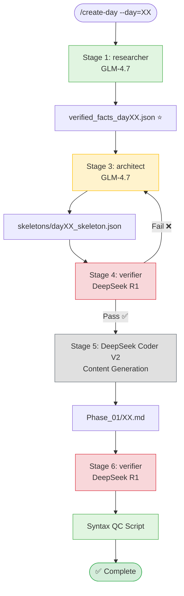
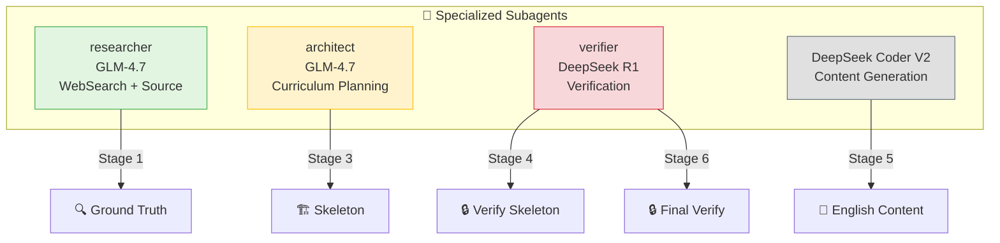
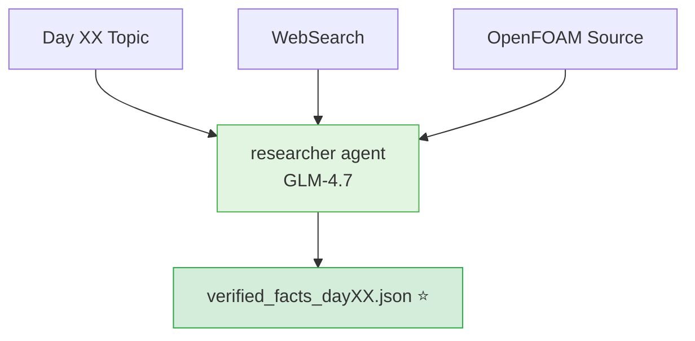
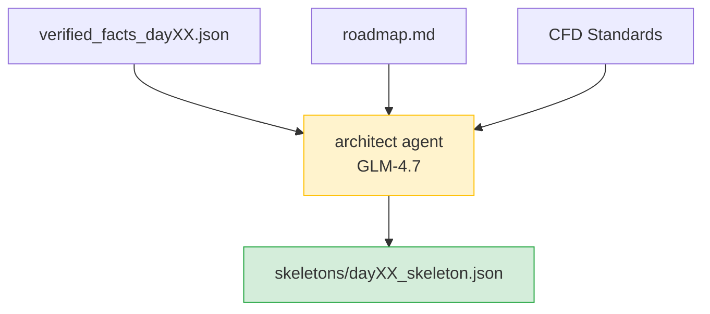
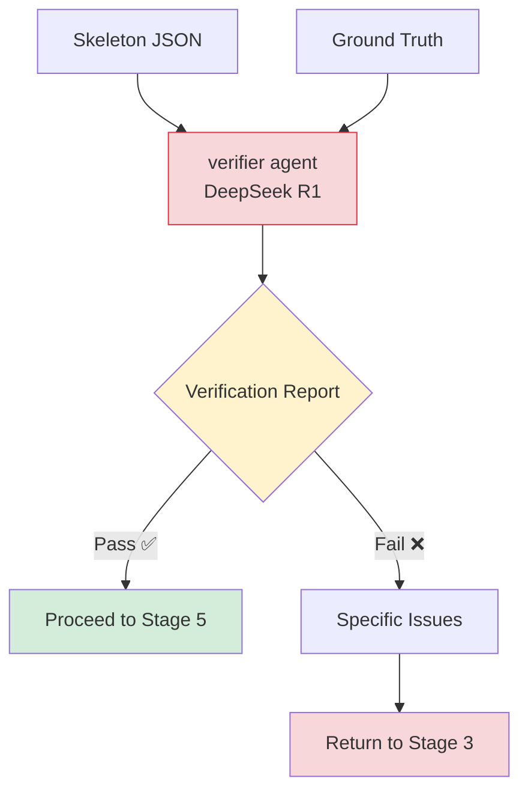
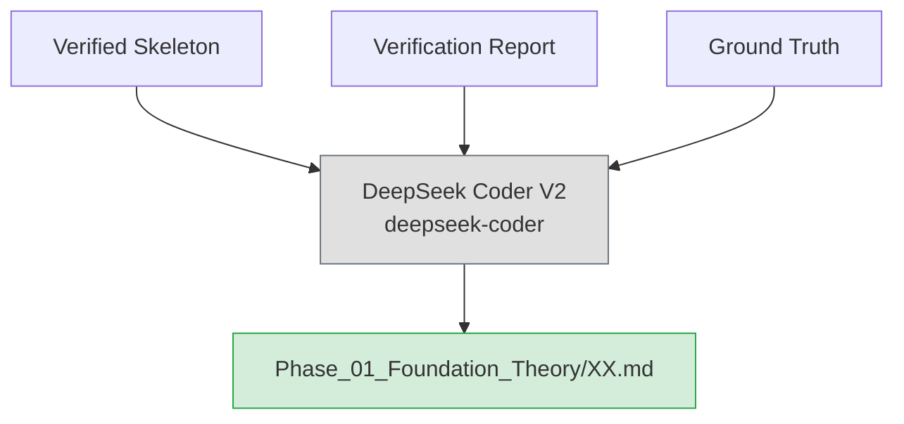
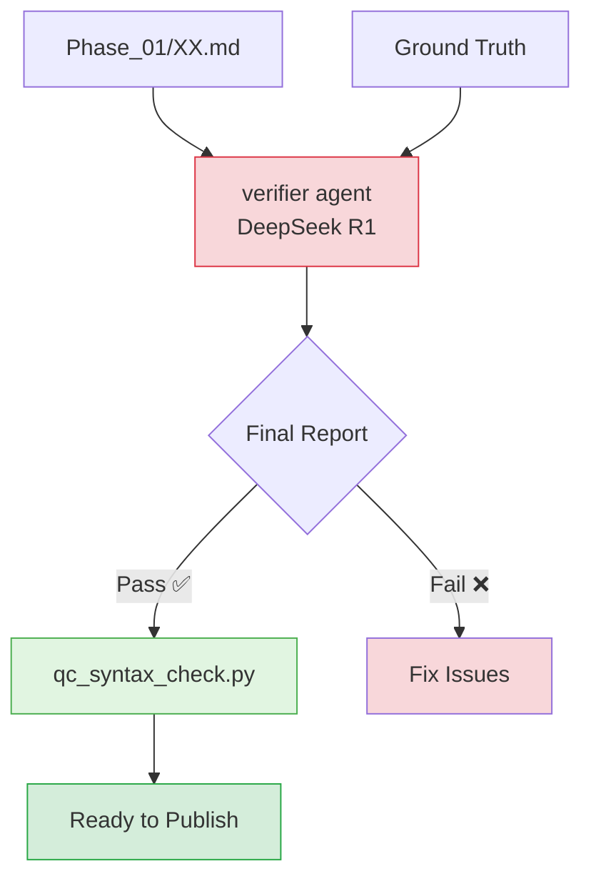
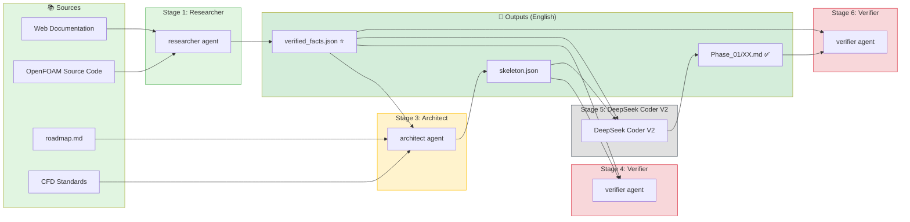
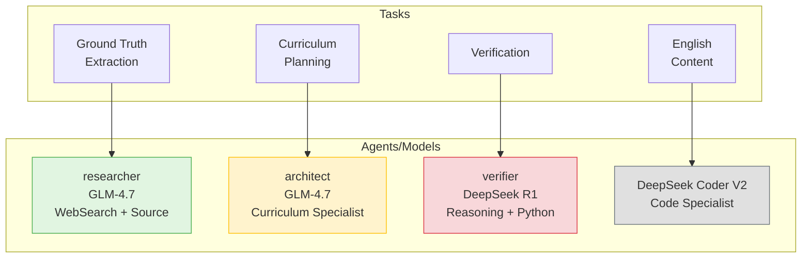

# `/create-day` Workflow Visualization

> **Last Updated:** 2026-01-25
> **Content:** English-only
> **Workflow:** Source-First with specialized subagents (researcher → architect → verifier → DeepSeek Coder V2 → verifier)

---

## Overview

The `/create-day` command generates daily CFD learning content (**English-only**) using a **6-stage Source-First pipeline** with **specialized subagents**.

```
User Input: /create-day --day=XX
            ↓
    ┌─────────────────────────────────────────────────────────┐
    │      6-Stage Pipeline for English-Only Content          │
    │   researcher → architect → verifier → DeepSeek Coder → ... │
    └─────────────────────────────────────────────────────────┘
            ↓
    Output: Phase_01_Foundation_Theory/XX.md ✅
```

---

## Complete Pipeline Flow



---

## All Agents Summary



| Agent | Model | Purpose | Key Tools |
|-------|-------|---------|-----------|
| `researcher` | GLM-4.7 | WebSearch + Source extraction | WebSearch, Read, Grep, Glob |
| `architect` | GLM-4.7 | CFD curriculum planning (English-only) | roadmap.md, CFD standards |
| `verifier` | DeepSeek R1 | Technical verification | Python, Interleaved Thinking |
| DeepSeek Coder V2 | deepseek-coder | English content generation | Specialized coding knowledge |

---

## Stage-by-Stage Breakdown

### Stage 1: Extract Ground Truth (`researcher` Agent)



**What happens:**
- `researcher` agent uses WebSearch for latest documentation
- Extracts class hierarchies from source code
- Extracts formulas with exact operators (`|r|` not `r`)
- Marks facts: ⭐ verified, ⚠️ from docs

**Command:**
```
Task:
  subagent_type: researcher
  prompt: |
    Research Day 05: Spatial Discretization Schemes
    1. WebSearch: "OpenFOAM upwind scheme documentation 2024"
    2. Extract hierarchies from: openfoam_temp/src/finiteVolume
    3. Extract formulas with exact operators
    Output: /tmp/verified_facts_day05.json
```

**Output:** `/tmp/verified_facts_dayXX.json` ⭐

---

### Stage 2: Structure Facts (Automated)


**What happens:**
- Validate JSON structure
- Ensure all required fields present

---

### Stage 3: Generate Skeleton (`architect` Agent)



**What happens:**
- `architect` reads roadmap.md for Day XX
- Creates **English-only** structure
- Enforces CFD standards
- Uses verified facts as constraints

**Why `architect`:**
- ✅ Reads roadmap.md automatically
- ✅ Knows CFD curriculum structure
- ✅ Enforces CFD standards
- ✅ English-only format

**Command:**
```
Task:
  subagent_type: architect
  prompt: |
    Plan Day 05: Spatial Discretization Schemes
    GROUND TRUTH: /tmp/verified_facts_day05.json
    Create ENGLISH-ONLY skeleton, roadmap-aligned
    Output: daily_learning/skeletons/day05_skeleton.json
```

**Output:** `skeletons/dayXX_skeleton.json`

---

### Stage 4: Verify Skeleton (`verifier` Agent)



**What happens:**
- `verifier` uses DeepSeek R1 with Interleaved Thinking
- Compares skeleton claims to ground truth
- Checks class hierarchies, formulas, hallucinations
- Generates PASS/FAIL report

**What `verifier` checks:**

| Check | Example |
|-------|---------|
| Class Hierarchy | `upwind → limitedSurfaceInterpolationScheme → surfaceInterpolationScheme` |
| Formula Operators | `(r + \|r\|) / (1 + \|r\|)` NOT `(r + 1) / (1 + r)` |
| Hallucinations | Classes not in ground truth = ❌ |
| Source References | File paths and line numbers present |

**Command:**
```
Task:
  subagent_type: verifier
  prompt: |
    Verify skeleton for Day 05
    SKELETON: daily_learning/skeletons/day05_skeleton.json
    GROUND TRUTH: /tmp/verified_facts_day05.json
    Check: class hierarchy, formulas, hallucinations
    Use Interleaved Thinking
    Output: Verification report
```

**Output:** Verification report (PASS → Stage 5, FAIL → fix skeleton)

---

### Stage 5: Expand Content (DeepSeek Coder V2)



**What happens:**
- DeepSeek V3 generates full English content
- English-only (no Thai translation)
- Theory ≥500 lines, code snippets, exercises

**Why DeepSeek Coder V2:**
- ✅ Specialized for C++ and Engineering
- ✅ Strong technical writing
- ✅ Better formatting for code blocks

**Content Requirements:**

| Section | Minimum |
|---------|---------|
| Theory | ≥500 lines with derivations |
| Code Analysis | 3-5 snippets with file paths |
| Implementation | ≥300 lines C++ code |
| Exercises | 4-6 concept checks |

**Command:**
```
Task:
  subagent_type: general-purpose
  model: deepseek-coder
  prompt: |
    Expand Day 05: Spatial Discretization Schemes - ENGLISH ONLY
    VERIFIED SKELETON: {skeleton content}
    CRITICAL: Theory ≥500 lines, code with file paths, exercises
    Write comprehensive technical content
    Output: Phase_01_Foundation_Theory/05.md
```

**Output:** `Phase_01_Foundation_Theory/XX.md`

---

### Stage 6: Final Verification (`verifier` Agent)



**What happens:**
- `verifier` checks final content against ground truth
- Mermaid diagrams, formulas, code snippets
- Then syntax QC runs automatically

**Command:**
```
Task:
  subagent_type: verifier
  prompt: |
    Final verification for Day 05
    CONTENT: Phase_01_Foundation_Theory/05.md
    GROUND TRUTH: /tmp/verified_facts_day05.json
    Check: Mermaid, formulas, code
    Output: Final verification report
```

**Then:**
```bash
python3 .claude/scripts/qc_syntax_check.py \
  --file=Phase_01_Foundation_Theory/05.md
```

**Output:** ✅ Content ready for publishing

---

## Timeline View

```
┌─────────────────────────────────────────────────────────────────────────────┐
│                    /create-day --day=XX (ENGLISH-ONLY)                      │
├─────────────────────────────────────────────────────────────────────────────┤
│                                                                             │
│  👤 STAGE 1: researcher (GLM-4.7)                                          │
│  ┌─────────────────────────────────────────────────────────────────────┐   │
│  │ → WebSearch for latest documentation                                │   │
│  │ → Extract class hierarchies from source                            │   │
│  │ → Extract formulas with exact operators                            │   │
│  │ → Output: verified_facts_dayXX.json ⭐                             │   │
│  └─────────────────────────────────────────────────────────────────────┘   │
│                              ↓                                              │
│  ⚡ STAGE 2: Automated JSON Validation                                     │
│  ┌─────────────────────────────────────────────────────────────────────┐   │
│  │ → Validate JSON structure                                          │   │
│  └─────────────────────────────────────────────────────────────────────┘   │
│                              ↓                                              │
│  👤 STAGE 3: architect (GLM-4.7)                                         │
│  ┌─────────────────────────────────────────────────────────────────────┐   │
│  │ → Read roadmap.md for Day XX                                        │   │
│  │ → Create ENGLISH-ONLY structure                                     │   │
│  │ → Enforce CFD standards                                             │   │
│  │ → Output: skeletons/dayXX_skeleton.json                             │   │
│  └─────────────────────────────────────────────────────────────────────┘   │
│                              ↓                                              │
│  👤 STAGE 4: verifier (DeepSeek R1)                                       │
│  ┌─────────────────────────────────────────────────────────────────────┐   │
│  │ → Verify class hierarchy matches ground truth                      │   │
│  │ → Verify formulas (check operators!)                               │   │
│  │ → Check for hallucinations                                         │   │
│  │ → Output: PASS/FAIL report                                         │   │
│  └─────────────────────────────────────────────────────────────────────┘   │
│                              ↓                                              │
│  👤 STAGE 5: DeepSeek V3 (deepseek-chat)                                  │
│  ┌─────────────────────────────────────────────────────────────────────┐   │
│  │ → Expand skeleton to full ENGLISH content                          │   │
│  │ → Theory ≥500 lines, code snippets, exercises                      │   │
│  │ → Output: Phase_01_Foundation_Theory/XX.md                         │   │
│  └─────────────────────────────────────────────────────────────────────┘   │
│                              ↓                                              │
│  👤 STAGE 6: verifier (DeepSeek R1)                                       │
│  ┌─────────────────────────────────────────────────────────────────────┐   │
│  │ → Verify Mermaid diagrams                                          │   │
│  │ → Verify formulas in LaTeX                                         │   │
│  │ → Verify code snippets                                             │   │
│  │ → Output: Final verification report                                │   │
│  └─────────────────────────────────────────────────────────────────────┘   │
│                              ↓                                              │
│  ⚡ AUTOMATED: Syntax QC                                                   │
│  ┌─────────────────────────────────────────────────────────────────────┐   │
│  │ → Check code blocks balanced                                       │   │
│  │ → Check no nested LaTeX                                            │   │
│  │ → Check headers valid                                              │   │
│  └─────────────────────────────────────────────────────────────────────┘   │
│                                                                             │
│  ✅ COMPLETE (ENGLISH-ONLY)                                                 │
│                                                                             │
└─────────────────────────────────────────────────────────────────────────────┘
```

---

## Data Flow Diagram



---

## Agent Specialization Guide



| Task | Wrong Agent | Right Agent/Model | Why? |
|------|-------------|-------------------|------|
| Ground truth | `architect` | `researcher` | Has WebSearch |
| Curriculum | `researcher` | `architect` | Knows roadmap |
| Verification | DeepSeek V3 | `verifier` | DeepSeek R1 reasoning |
| English Content | `verifier` | DeepSeek Coder V2 | Coding specialization |

---

## Quick Reference

| Stage | Agent/Model | Type | Input | Output |
|-------|-------------|------|-------|--------|
| 1 | `researcher` | Manual | Topic | `verified_facts_dayXX.json` ⭐ |
| 2 | - | Auto | JSON | Validated JSON |
| 3 | `architect` | Manual | Facts + roadmap | `skeletons/dayXX_skeleton.json` |
| 4 | `verifier` | Manual | Skeleton + facts | Verification report |
| 5 | DeepSeek Coder V2 | Manual | Verified skeleton | `Phase_01/XX.md` (EN) |
| 6 | `verifier` + QC | Manual | Content + facts | ✅ Ready to publish |

---

## Command Summary

```bash
# Stage 1: researcher
Task: subagent_type=researcher, prompt="Research Day XX..."

# Stage 3: architect
Task: subagent_type=architect, prompt="Plan Day XX..."

# Stage 4: verifier
Task: subagent_type=verifier, prompt="Verify skeleton Day XX..."

# Stage 5: DeepSeek Coder V2
Task: subagent_type=general-purpose, model=deepseek-coder, prompt="Expand Day XX..."

# Stage 6: verifier
Task: subagent_type=verifier, prompt="Final verify Day XX..."

# Then: Syntax QC
python3 .claude/scripts/qc_syntax_check.py --file=Phase_01_Foundation_Theory/XX.md
```

---

## Key Principles


**Source-First Principle:**
- Ground Truth from Source + WebSearch > AI Analysis
- Each agent specialized for its task
- Verification gates at Stages 4 and 6
- English-only content (no translation needed)

**English-Only Content:**
- ✅ All content in English
- ✅ No Thai translation required
- ✅ Headers in English only
- ✅ Technical terms in English

---

**See also:** `.claude/skills/create-day.md`, `.claude/rules/source-first.md`
