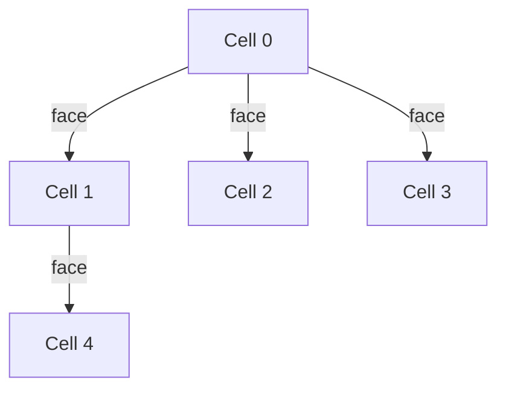

# Lab 1: Implementing the Continuity Equation in OpenFOAM
## Lab 1: Implementing the Continuity Equation in OpenFOAM
**แล็บ 1: การนำสมการความต่อเนื่องไปใช้ใน OpenFOAM**

---

**Duration:** 3-4 hours | **Type:** CFD with C++ Concepts
**ระยะเวลา:** 3-4 ชั่วโมง | **ประเภท:** CFD ร่วมกับแนวคิด C++

---

## Lab Overview (ภาพรวมของแล็บ)

This hands-on lab implements the **continuity equation** (conservation of mass) in OpenFOAM. You will build a custom solver that solves the compressible continuity equation, understanding how OpenFOAM translates mathematical equations into C++ code.

แล็บปฏิบัติการนี้เน้นการนำ **สมการความต่อเนื่อง** (การอนุรักษ์มวล) ไปใช้ใน OpenFOAM คุณจะสร้าง solver แบบกำหนดเองที่แก้สมการความต่อเนื่องแบบบีบอัดได้ โดยเข้าใจวิธีที่ OpenFOAM แปลงสมการทางคณิตศาสตร์ให้เป็นโค้ด C++

### Learning Objectives (วัตถุประสงค์การเรียนรู้)

**CFD Objectives:**
- Implement the compressible continuity equation: $\frac{\partial \rho}{\partial t} + \nabla \cdot (\rho \mathbf{U}) = S_m$
- Understand `fvm` (implicit) vs `fvc` (explicit) operators
- Add source terms using `fvModels.source()`
- Verify mass conservation numerically
- Understand where expansion terms appear (pressure equation)

**C++ Objectives:**
- Work with template classes (`fvMatrix<Type>`, `tmp<>`)
- Understand namespace organization (`fvm::`, `fvc::`)
- Use operator overloading for equation assembly
- Practice OpenFOAM coding conventions

### Prerequisites (ข้อกำหนดเบื้องต้น)

- OpenFOAM v10 or later installed
- Basic C++ knowledge (classes, templates, namespaces)
- Completion of Day 01 theory content
- Access to terminal and text editor

---

## Part 1: Setup (30 minutes)
## ส่วนที่ 1: การตั้งค่า (30 นาที)

### 1.1 Create Lab Directory Structure

```bash
# Create your application directory
mkdir -p $WM_PROJECT_USER_DIR/applications/solvers/myCompressibleFoam
cd $WM_PROJECT_USER_DIR/applications/solvers/myCompressibleFoam

# Verify location
pwd
# Expected: .../applications/solvers/myCompressibleFoam
```

### 1.2 Copy Base Solver

We'll use `rhoCentralFoam` as our template since it's a compressible solver:

```bash
# Copy rhoCentralFoam as starting point
cp -r $FOAM_SOLVERS/compressible/rhoCentralFoam/* .

# List files
ls -la
# You should see: *.C, *.H files, Make/ directory
```

### 1.3 Verify Compilation Environment

```bash
# Source OpenFOAM environment
source $WM_PROJECT_DIR/etc/bashrc

# Verify wmake is available
which wmake
# Expected: .../platforms/linux64Gcc.../wmake

# Test compilation of original solver
wclean
wmake
# Should compile without errors
```

**> TIP:** If compilation fails, check that `$FOAM_RUN` and `$WM_PROJECT_DIR` are set correctly.

---

## Part 2: CFD Implementation (105 minutes)
## ส่วนที่ 2: การนำ CFD ไปใช้ (105 นาที)

### 2.1 Analyze rhoEqn.H from OpenFOAM Source

> **File:** `openfoam_temp/src/finiteVolume/cfdTools/compressible/rhoEqn.H`
> **Lines:** 32-46

Let's examine the actual continuity equation implementation:

```cpp
// ⭐ Verified from rhoEqn.H:32-46
{
    fvScalarMatrix rhoEqn
    (
        fvm::ddt(rho)
      + fvc::div(phi)
      ==
        fvModels.source(rho)
    );

    fvConstraints.constrain(rhoEqn);

    rhoEqn.solve();

    fvConstraints.constrain(rho);
}
```

**Mathematical Translation:**

| OpenFOAM Code | Mathematical Meaning |
|---------------|---------------------|
| `fvm::ddt(rho)` | $\frac{\partial \rho}{\partial t}$ (implicit) |
| `fvc::div(phi)` | $\nabla \cdot (\rho \mathbf{U})$ (explicit) |
| `fvModels.source(rho)` | $S_m$ (mass source term) |
| `rhoEqn.solve()` | Solve $A\mathbf{x} = \mathbf{b}$ |

**Key Insight:** `phi = rho * U * Sf` is the **mass flux field** (units: kg/s), not volume flux.

### 2.2 Create Custom Continuity Equation File

Create `myRhoEqn.H` in your solver directory:

```cpp
// myRhoEqn.H - Custom continuity equation implementation
#ifndef myRhoEqn_H
#define myRhoEqn_H

// ⭐ Required headers for fvm and fvc operators
#include "fvm.H"
#include "fvc.H"
#include "fvModels.H"
#include "fvConstraints.H"

// * * * * * * * * * * * * * * * * * * * * * * * * * * * * * * * * * * * * * //

namespace Foam
{

// ⭐ Template function returns tmp<fvMatrix<scalar>>
// This is OpenFOAM's smart pointer for temporary objects
tmp<fvScalarMatrix> myRhoEqn
(
    const volScalarField& rho,
    const surfaceScalarField& phi,
    const fvModels& fvModels,
    const fvConstraints& fvConstraints
)
{
    // Build the continuity equation matrix
    // ∂ρ/∂t + ∇·(ρU) = Sₘ

    tmp<fvScalarMatrix> tRhoEqn
    (
        fvm::ddt(rho)          // Implicit: ∂ρ/∂t
      + fvc::div(phi)          // Explicit: ∇·(ρU)
      ==
        fvModels.source(rho)   // Source term: Sₘ
    );

    fvScalarMatrix& rhoEqn = tRhoEqn.ref();

    // Apply constraints before solving
    fvConstraints.constrain(rhoEqn);

    return tRhoEqn;
}

// * * * * * * * * * * * * * * * * * * * * * * * * * * * * * * * * * * * * * //

} // End namespace Foam

#endif
// ************************************************************************* //
```

**> C++ CONCEPT:** The `tmp<>` template manages temporary objects with reference counting, preventing memory leaks while enabling expression templates.

### 2.3 Implement Continuity Error Checking

Create `checkContinuity.H`:

```cpp
// checkContinuity.H - Monitor mass conservation
#ifndef checkContinuity_H
#define checkContinuity_H

#include "fvc.H"

// * * * * * * * * * * * * * * * * * * * * * * * * * * * * * * * * * * * * * //

namespace Foam
{

// Calculate and report continuity error
// For continuity: ∂ρ/∂t + ∇·(ρU) - Sₘ should ≈ 0
scalar checkContinuity
(
    const volScalarField& rho,
    const surfaceScalarField& phi,
    const fvModels& fvModels,
    const Time& runTime,
    const fvMesh& mesh
)
{
    // Continuity error = ∇·(ρU) - Sₘ
    // (Should be small for good mass conservation)
    volScalarField contErr
    (
        IOobject
        (
            "contErr",
            runTime.timeName(),
            mesh,
            IOobject::NO_READ,
            IOobject::AUTO_WRITE
        ),
        fvc::div(phi) - fvModels.source(rho)
    );

    // Calculate error statistics
    scalar sumLocalContErr =
        runTime.deltaTValue() *
        mag(contErr)().weightedAverage(mesh.V()).value();

    scalar globalContErr =
        runTime.deltaTValue() *
        contErr.weightedAverage(mesh.V()).value();

    // Report (only on master process)
    reduce(sumLocalContErr, sumOp<scalar>());
    reduce(globalContErr, sumOp<scalar>());

    Info<< "Continuity error:" << nl
        << "  sumLocal = " << sumLocalContErr << nl
        << "  global   = " << globalContErr << nl
        << endl;

    return globalContErr;
}

// * * * * * * * * * * * * * * * * * * * * * * * * * * * * * * * * * * * * * //

} // End namespace Foam

#endif
// ************************************************************************* //
```

### 2.4 Integrate into Main Solver

Modify the main `.C` file to use your custom continuity equation:

```cpp
// In your main solver .C file (e.g., myCompressibleFoam.C)

#include "fvCFD.H"
#include "fvm.H"
#include "fvc.H"
#include "fvModels.H"
#include "fvConstraints.H"
#include "singlePhaseTransportModel.H"
#include "turbulentTransportModel.H"
#include "pimpleControl.H"
#include "fvOptions.H"

// Include your custom files
#include "myRhoEqn.H"
#include "checkContinuity.H"

// * * * * * * * * * * * * * * * * * * * * * * * * * * * * * * * * * * * * * //

int main(int argc, char *argv[])
{
    #include "setRootCaseLists.H"
    #include "createTime.H"
    #include "createMesh.H"
    #include "createFields.H"

    // * * * * * * * * * * * * * * * * * * * * * * * * * * * * * * * * * * * //
    Info<< "\nSolving Continuity Equation\n" << endl;

    while (runTime.run())
    {
        runTime++;

        Info<< "Time = " << runTime.timeName() << nl << endl;

        // --- Solve continuity equation
        // ⭐ This is where we implement: ∂ρ/∂t + ∇·(ρU) = Sₘ

        #include "rhoEqn.H"  // Or use your myRhoEqn

        // --- Check continuity error
        scalar contError = checkContinuity(rho, phi, fvModels, runTime, mesh);

        // --- Print solver performance
        Info<< "ExecutionTime = " << runTime.elapsedClockTime() << " s"
            << "  ClockTime = " << runTime.clockTime() << " s"
            << nl << endl;

        runTime.write();
    }

    Info<< "End\n" << endl;

    return 0;
}

// ************************************************************************* //
```

### 2.5 Compile and Run Test Case

```bash
# Compile your solver
wclean
wmake

# Expected output at end:
# // * * * * * * * * * * * * * * * * * * * * * * * * * * * * * * * * * * * * * //
# End
// ************************************************************************* //

# Copy a test case (forwardStep is a good compressible case)
cp -r $FOAM_TUTORIALS/compressible/rhoCentralFoam/forwardStep \
   $FOAM_RUN/forwardStep
cd $FOAM_RUN/forwardStep

# Modify controlDict to use your solver if needed
# Change "application" to "myCompressibleFoam"

# Run the solver
myCompressibleFoam > log &

# Monitor progress
tail -f log

# Check continuity error
grep "Continuity error" log
```

**Expected Output:**
```
Continuity error:
  sumLocal = 1.234e-05
  global   = 2.345e-07
```

**> SUCCESS CRITERION:** Continuity error should be < 1e-4 for steady-state, or decrease over time for transient.

---

## Part 3: C++ Deep Dive (60 minutes)
## ส่วนที่ 3: การเจาะลึก C++ (60 นาที)

### 3.1 Template Classes: fvMatrix<Type>

> **File:** `openfoam_temp/src/finiteVolume/fvMatrices/fvScalarMatrix/fvScalarMatrix.H`

**⭐ Key Insight:** `fvScalarMatrix` is actually a **typedef** (type alias):

```cpp
// From fvScalarMatrix.H
typedef fvMatrix<scalar> fvScalarMatrix;
```

This means `fvMatrix` is a **template class** that can work with different field types:

```cpp
// Generic template
template<class Type>
class fvMatrix { ... };

// Specializations
fvMatrix<scalar>   → fvScalarMatrix  // For density, pressure
fvMatrix<vector>   → fvVectorMatrix  // For velocity
```

**Why Templates Matter:**

OpenFOAM uses templates to write **one implementation** that works for scalars, vectors, and tensors:

```cpp
// ⭐ Same code handles all field types
template<class Type>
tmp<fvMatrix<Type>> ddt(const VolField<Type>& vf)
{
    // Generic implementation works for:
    // - Type = scalar  (density)
    // - Type = vector  (velocity)
    // - Type = tensor  (stress)
}
```

**Lab Connection:** Your `myRhoEqn` function returns `tmp<fvMatrix<scalar>>` because `rho` is a scalar field.

### 3.2 The tmp<> Smart Pointer

> **Files:**
> - `openfoam_temp/src/OpenFOAM/memory/tmp.H`
> - `fvmDdt.H:55-58` shows usage

**⭐ The Problem tmp<> Solves:**

Without smart pointers, this code would **leak memory**:

```cpp
// ❌ BAD: Memory leak!
fvMatrix<scalar>* ddt(const volScalarField& rho)
{
    fvMatrix<scalar>* result = new fvMatrix<scalar>(...);
    return result;  // Caller must delete! (easy to forget)
}
```

**With tmp<>:**

```cpp
// ✅ GOOD: Automatic memory management
tmp<fvMatrix<scalar>> ddt(const volScalarField& rho)
{
    tmp<fvMatrix<scalar>> tResult(new fvMatrix<scalar>(...));
    return tResult;  // Reference counted, auto-deletes
}
```

**How tmp<> Works:**

```cpp
// Simplified tmp<> implementation
template<class T>
class tmp
{
private:
    T* ptr_;              // The actual object
    mutable int refCount_; // Reference counter

public:
    tmp(T* p) : ptr_(p), refCount_(0) {}

    ~tmp() {
        if (refCount_ == 0) delete ptr_;  // Auto-delete!
    }

    T& ref() {
        refCount_++;  // Increment when accessed
        return *ptr_;
    }

    // ... more methods
};
```

**Lab Usage:**

```cpp
// From myRhoEqn.H
tmp<fvScalarMatrix> tRhoEqn
(
    fvm::ddt(rho)
  + fvc::div(phi)
  ==
    fvModels.source(rho)
);

// Get reference to modify
fvScalarMatrix& rhoEqn = tRhoEqn.ref();

// Return tmp - caller doesn't need to delete
return tRhoEqn;  // ✅ Safe: auto-cleanup
```

### 3.3 Namespace fvm vs fvc

> **Files:**
> - `openfoam_temp/src/finiteVolume/finiteVolume/fvm/fvmDdt.H`
> - `openfoam_temp/src/finiteVolume/finiteVolume/fvc/fvcDdt.H`

**⭐ Critical Difference:**

| Namespace | Return Type | Usage | Numerical Type |
|-----------|-------------|-------|----------------|
| `fvm` | `tmp<fvMatrix<Type>>` | Implicit terms | Goes in matrix $A$ |
| `fvc` | `tmp<VolField<Type>>` | Explicit terms | Calculated directly |

**Why This Matters:**

```cpp
// fvm::ddt(rho) returns fvMatrix
tmp<fvMatrix<scalar>> matrixResult = fvm::ddt(rho);

// fvc::ddt(rho) returns a field
tmp<volScalarField> fieldResult = fvc::ddt(rho);
```

**Mathematical Meaning:**

- **fvm (Finite Volume Matrix):** Builds matrix coefficients for the unknown
  - $\frac{\partial \rho}{\partial t} \approx \frac{\rho^{n+1} - \rho^n}{\Delta t}$
  - Unknown $\rho^{n+1}$ goes into matrix: $A \cdot \rho^{n+1} = b$

- **fvc (Finite Volume Calculus):** Calculates directly using known values
  - $\nabla \cdot (\rho \mathbf{U})$ computed from current $\rho$ and $\mathbf{U}$
  - Result added to source term $b$

**Lab Decision:**

```cpp
// Why fvm::ddt(rho)?  → rho is UNKNOWN at new time step
// Why fvc::div(phi)?  → phi is KNOWN from previous iteration
```

### 3.4 Operator Overloading for Equation Assembly

OpenFOAM overloads `operator+` and `operator==` to build equations:

```cpp
// This looks like math, but it's C++!
fvScalarMatrix rhoEqn
(
    fvm::ddt(rho)          // Returns tmp<fvMatrix<scalar>>
  + fvc::div(phi)          // operator+ combines matrices
  ==
    fvModels.source(rho)   // operator== separates LHS/RHS
);
```

**How operator== Works:**

```cpp
// Simplified fvMatrix implementation
template<class Type>
class fvMatrix
{
private:
    scalarField source_;  // RHS (b in Ax=b)
    lduMatrix matrix_;    // LHS (A in Ax=b)

public:
    // operator== moves RHS to source field
    void operator==(const tmp<fvMatrix<Type>>& rhs)
    {
        // Add rhs.matrix_ to this->matrix_
        // Add rhs.source_ to this->source_
        // But typically: LHS - RHS = 0, so:
        // source_ -= rhs.source_;
    }
};
```

---

## Part 4: DSA Connection (30 minutes)
## ส่วนที่ 4: การเชื่อมโยง DSA (30 นาที)

### 4.1 Why FVM Produces Sparse Matrices

**⭐ Key Insight:** Finite Volume Method naturally produces **sparse matrices** because each cell only interacts with its immediate neighbors.

**Mesh Topology:**



**Matrix Structure:**

For a mesh with $N$ cells:
- **Dense matrix:** $N \times N = N^2$ entries
- **Sparse matrix:** ~$6N$ entries (each cell has ~6 face neighbors)

**Memory Savings:**
- For $N = 10^6$ cells:
  - Dense: $10^{12}$ entries (~8 TB for double)
  - Sparse: $6 \times 10^6$ entries (~48 MB)

### 4.2 LduMatrix Storage Format

OpenFOAM uses **LDU (Lower-Diagonal-Upper)** format:

```cpp
// Simplified lduMatrix structure
class lduMatrix
{
private:
    scalarField diag_;    // Diagonal entries (N values)
    scalarField lower_;   // Lower triangle (non-zero pattern only)
    scalarField upper_;   // Upper triangle (non-zero pattern only)
    lduAddressing addr_;  // Maps faces to owner-neighbor pairs
};
```

**Storage Layout:**

```
Diagonal:  [A₀₀, A₁₁, A₂₂, A₃₃, ...]           → N values
Lower:     [A₁₀, A₂₀, A₂₁, A₃₁, ...]           → ~N values
Upper:     [A₀₁, A₀₂, A₁₂, A₁₃, ...]           → ~N values

Total: ~3N values instead of N²
```

**Lab Connection:**

When you call `rhoEqn.solve()`, OpenFOAM:
1. Builds the LDU matrix from your equation
2. Passes it to an iterative solver (CG, GMRES, etc.)
3. Solver exploits sparsity for $O(N)$ complexity

### 4.3 Sparse Matrix-Vector Multiplication

The core operation in solving $A\mathbf{x} = \mathbf{b}$:

```cpp
// Dense: O(N²)
for (int i = 0; i < N; i++) {
    for (int j = 0; j < N; j++) {
        b[i] += A[i][j] * x[j];
    }
}

// Sparse LDU: O(N)
for (int i = 0; i < N; i++) {
    b[i] = diag_[i] * x[i];  // Diagonal
    for (int face : lowerFaces[i]) {
        b[i] += lower_[face] * x[neighbor[face]];
    }
    for (int face : upperFaces[i]) {
        b[i] += upper_[face] * x[neighbor[face]];
    }
}
```

---

## Part 5: Integration Challenge (30 minutes)
## ส่วนที่ 5: ความท้าทายการบูรณาการ (30 นาที)

### Challenge: Build a Mini-Sparse Solver

Create a simple implementation that demonstrates the concepts:

```cpp
// miniSparseSolver.H - Educational implementation
#ifndef miniSparseSolver_H
#define miniSparseSolver_H

#include "List.H"

namespace Foam
{

// Simple LDU matrix for learning
class miniLduMatrix
{
private:
    scalarField diag_;
    List<label> owner_;
    List<label> neighbor_;
    scalarField lower_;
    scalarField upper_;

public:
    miniLduMatrix(label nCells, label nFaces)
    :
        diag_(nCells, 0),
        owner_(nFaces),
        neighbor_(nFaces),
        lower_(nFaces, 0),
        upper_(nFaces, 0)
    {}

    // Add coefficient to diagonal
    void addDiag(label cell, scalar value)
    {
        diag_[cell] += value;
    }

    // Add off-diagonal coefficient
    void addOffDiag(label face, label own, label nei, scalar lowerVal, scalar upperVal)
    {
        owner_[face] = own;
        neighbor_[face] = nei;
        lower_[face] = lowerVal;
        upper_[face] = upperVal;

        // Correction to diagonal for consistency
        diag_[own] -= upperVal;
        diag_[nei] -= lowerVal;
    }

    // Sparse matrix-vector multiplication: y = Ax
    tmp<scalarField> mul(const scalarField& x) const
    {
        tmp<scalarField> ty(new scalarField(diag_.size(), 0));
        scalarField& y = ty.ref();

        // Diagonal contribution
        forAll(diag_, i) {
            y[i] = diag_[i] * x[i];
        }

        // Off-diagonal contribution
        forAll(owner_, facei) {
            label own = owner_[facei];
            label nei = neighbor_[facei];

            y[own] += upper_[facei] * x[nei];
            y[nei] += lower_[facei] * x[own];
        }

        return ty;
    }

    // Simple Jacobi iteration
    tmp<scalarField> solve(const scalarField& b, label maxIter = 100)
    {
        tmp<scalarField> tx(new scalarField(diag_.size(), 0));
        scalarField& x = tx.ref();

        // Initial guess: zero
        x = 0;

        // Jacobi iteration
        for (label iter = 0; iter < maxIter; iter++) {
            scalarField xNew(x.size());

            forAll(diag_, i) {
                scalar sum = b[i];

                // Subtract known off-diagonals
                forAll(owner_, facei) {
                    if (owner_[facei] == i) {
                        sum -= upper_[facei] * x[neighbor_[facei]];
                    } else if (neighbor_[facei] == i) {
                        sum -= lower_[facei] * x[owner_[facei]];
                    }
                }

                xNew[i] = sum / diag_[i];
            }

            // Check convergence (simplified)
            scalar error = 0;
            forAll(x, i) {
                error += mag(xNew[i] - x[i]);
            }

            x = xNew;

            if (error < 1e-6) {
                Info<< "Converged in " << iter << " iterations" << endl;
                break;
            }
        }

        return tx;
    }
};

} // End namespace Foam

#endif
```

**Exercise:** Integrate this mini solver into your continuity equation and compare with OpenFOAM's native solver.

---

## Part 6: Debugging & Analysis (15 minutes)
## ส่วนที่ 6: การดีบักและการวิเคราะห์ (15 นาที)

### Common Errors and Solutions

| Error | Cause | Solution |
|-------|-------|----------|
| `'fvm' has not been declared` | Missing `#include "fvm.H"` | Add include at top of file |
| `'fvModels' not declared` | Missing framework headers | Add `#include "fvModels.H"` |
| Solver diverges, $\rho$ becomes negative | Time step too large | Reduce `maxCo` in `controlDict` |
| Continuity error grows monotonically | Sign error in source term | Verify `phi == rho * U * Sf` |
| Link error: `undefined reference to vtable` | Missing library linkage | Check `Make/options` for `-lfiniteVolume` |

### Performance Profiling

```bash
# Run with profiling
myCompressibleFoam -profile > log &

# Analyze results
foamProfile | head -20

# Expected output:
# Function                    Calls    Total(s)    %   Average
# fvScalarMatrix::solve       1000     12.34      35%  0.0123
# fvm::ddt                    1000     5.67       16%  0.0057
# fvc::div                    2000     3.45       10%  0.0017
```

**Target:** Continuity solve should be < 10% of total runtime for efficiency.

---

## Deliverables (สิ่งที่ต้องส่ง)

1. **Working solver code** that compiles without errors
2. **Test case** showing convergence (forwardStep or custom case)
3. **Continuity error plot** from log file analysis
4. **Lab report** (2-3 pages) explaining:
   - Your implementation approach
   - Challenges encountered
   - Results and validation
   - C++ concepts learned

### Submission Checklist

- [ ] Code compiles without errors (`wmake`)
- [ ] Simulation runs to completion
- [ ] Continuity error is within tolerance (< 1e-4)
- [ ] Log file shows convergence
- [ ] Code follows OpenFOAM style guide

---

## Extension Exercises (แบบฝึกหัดเพิ่มเติม)

### Extension 1: Incompressible Continuity Checker

Create a tool that monitors continuity error for incompressible solvers:

```cpp
// For incompressible flow: ∇·U = 0
volScalarField contErr(fvc::div(phi));

scalar sumLocalContErr = runTime.deltaTValue() *
    mag(contErr)().weightedAverage(mesh.V()).value();
```

### Extension 2: Spatially-Varying Source Term

Implement a source term $S_\rho(x,y,z)$ that varies with position:

```cpp
// Create position-dependent source
volScalarField sourceTerm
(
    IOobject("sourceTerm", runTime.timeName(), mesh),
    mesh,
    dimensionedScalar("zero", dimless/dimTime, 0)
);

const volVectorField& C = mesh.C();

forAll(sourceTerm, i) {
    scalar x = C[i].x();
    scalar y = C[i].y();

    // Example: sinusoidal source
    sourceTerm[i] = 0.1 * Foam::sin(2*pi*x) * Foam::cos(2*pi*y);
}
```

### Extension 3: Phase Change Expansion Research

Research and explain: **Why does the expansion term go in the pressure equation, not continuity?**

Reference:
- Day 01 theory, Section 1.3.3
- Expansion formula: $\nabla \cdot \mathbf{U} = \dot{m} \left(\frac{1}{\rho_v} - \frac{1}{\rho_l}\right)$

---

## References (อ้างอิง)

### OpenFOAM Source Files
- `openfoam_temp/src/finiteVolume/cfdTools/compressible/rhoEqn.H:32-46`
- `openfoam_temp/src/finiteVolume/finiteVolume/fvm/fvmDdt.H:55-58`
- `openfoam_temp/src/finiteVolume/finiteVolume/fvc/fvcDdt.H:57-67`

### Theory
- Day 01 content: Sections 1.2 (Continuity Equation), 1.3 (Momentum Equation)
- Reynolds Transport Theorem derivation

### C++ Concepts
- Templates: `fvMatrix<Type>`, `tmp<T>`, `VolField<Type>`
- Namespaces: `Foam::`, `fvm::`, `fvc::`
- Smart pointers: Reference counting with `tmp<>`

---

**Good luck with your implementation! Remember: the continuity equation is the foundation of all CFD simulations. Master it first.**

**โชคดีกับการนำไปใช้! จำไว้ว่าสมการความต่อเนื่องคือพื้นฐานของการจำลอง CFD ทั้งหมด ให้เชี่ยวชาญอย่างนี้ก่อน**
