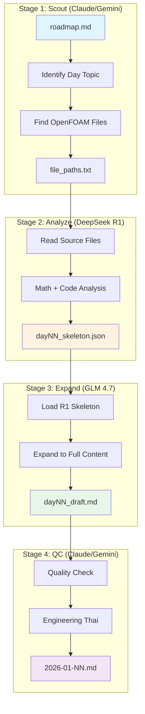

# Hybrid Content Generation Pipeline

## Overview



## Stage Details

### Stage 1: Scout (Claude/Gemini)
**Model:** Claude or Gemini (Orchestrator)
**Input:** `roadmap.md`, `phase_1_context.md`
**Output:** List of OpenFOAM source files to analyze

**Tasks:**
1. อ่าน roadmap เพื่อหา topic ของวัน
2. ค้นหา OpenFOAM source files ที่เกี่ยวข้อง
3. เตรียม context จาก previous day (context chaining)

**Commands:**
```bash
# Scout uses find_by_name tool to locate files
find openfoam_src -name "*fvMatrix*" -o -name "*volField*"
```

---

### Stage 2: Analyze (DeepSeek R1)
**Model:** DeepSeek R1 (deepseek-reasoner)
**Input:** OpenFOAM source files, `phase_1_context.md`, `deepseek_r1_template.md`
**Output:** `dayNN_skeleton.json`

**Prompt Structure:**
```
คุณคือ CFD Expert ที่กำลังวิเคราะห์ OpenFOAM source code

**Day {N}: {Topic}**

**Context:**
{phase_1_context.md content}

**Previous Day Summary:**
{previous day key points}

**Files to Analyze:**
{file contents}

**Your Task:**
สร้าง JSON skeleton ตาม template ที่กำหนด ประกอบด้วย:
1. learning_objectives: 4-6 items
2. theory_sections: equations + explanations
3. openfoam_analysis: class structure + key methods
4. implementation_skeleton: classes + algorithm steps
5. concept_checks: questions + answer_key_points
6. pitfalls: symptom + cause + fix

**Output Format:**
JSON only - ไม่ต้องมี explanation อื่น
```

**Aider Command:**
```bash
export DEEPSEEK_API_KEY="..." && aider --model r1 --yes-always \
  --read daily_learning/phase_1_context.md \
  --read daily_learning/templates/deepseek_r1_template.md \
  openfoam_src/src/finiteVolume/fvMatrices/fvMatrix/fvMatrix.H \
  openfoam_src/src/finiteVolume/fields/volFields/volFields.H \
  --message "Analyze for Day 01: Governing Equations. Create daily_learning/day01_skeleton.json"
```

---

### Stage 3: Expand (GLM 4.7)
**Model:** GLM 4.7 (ChatGLM)
**Input:** `dayNN_skeleton.json`, `glm_expand_template.md`
**Output:** `dayNN_draft.md` (Full "hardcore" content)

**Prompt Structure:**
```
คุณคือ CFD Professor ที่กำลังเขียน "Hardcore" learning material

**Input:**
- JSON skeleton จาก DeepSeek R1 (แนบด้านล่าง)
- Content template จาก glm_expand_template.md

**Requirements:**
1. ความยาวรวม ≥ 1500 บรรทัด
2. Theory: สมการครบ + คำอธิบายละเอียด
3. OpenFOAM: 3-5 code snippets พร้อม explanation
4. Class Design: Mermaid diagram + specifications
5. Implementation: C++ code ≥ 300 lines
6. Unit Tests: 5-8 tests
7. Concept Checks: 4-6 questions + detailed answers
8. Callouts: WARNING, TIP, INFO, IMPORTANT
9. Bilingual: Thai + English headers

**JSON Skeleton:**
{skeleton.json content}

**Output:**
Complete Markdown file - ทุก section ตาม template
```

**API Call (Python):**
```python
import zhipuai

client = zhipuai.ZhipuAI(api_key="...")

with open("daily_learning/day01_skeleton.json") as f:
    skeleton = f.read()

with open("daily_learning/templates/glm_expand_template.md") as f:
    template = f.read()

response = client.chat.completions.create(
    model="glm-4-plus",
    messages=[
        {"role": "system", "content": template},
        {"role": "user", "content": f"Expand this skeleton:\n\n{skeleton}"}
    ],
    max_tokens=8000
)

with open("daily_learning/day01_draft.md", "w") as f:
    f.write(response.choices[0].message.content)
```

---

### Stage 4: QC (Claude/Gemini)
**Model:** Claude or Gemini (QC Agent)
**Input:** `dayNN_draft.md`, `quality_control_checklist.md`
**Output:** `2026-01-NN.md` (Final polished file)

**Tasks:**
1. ตรวจสอบความถูกต้องทางเทคนิค
2. ตรวจสอบ format ตาม checklist
3. แปลเป็น Engineering Thai ตามมาตรฐาน
4. แก้ไข LaTeX และ code blocks
5. เพิ่ม cross-references และ wiki-links

**Checklist:**
- [ ] Frontmatter correct
- [ ] TOC with wiki-links
- [ ] Bilingual headers
- [ ] LaTeX equations valid
- [ ] Code blocks have syntax highlighting
- [ ] Callouts properly formatted
- [ ] Mermaid diagrams render correctly
- [ ] Engineering Thai translation
- [ ] No placeholders remaining

---

## File Structure

```
daily_learning/
├── templates/
│   ├── deepseek_r1_template.md    # R1 skeleton template
│   └── glm_expand_template.md     # GLM expansion template
├── skeletons/
│   ├── day01_skeleton.json        # R1 output
│   ├── day02_skeleton.json
│   └── ...
├── drafts/
│   ├── day01_draft.md             # GLM output
│   ├── day02_draft.md
│   └── ...
├── phase_1_context.md             # Global context
└── 2026-01-01.md                  # Final output
```

---

## Execution Order

### Per Day Workflow:

```bash
# 1. Scout (Claude/Gemini)
# - Identify files to analyze

# 2. R1 Analysis
export DEEPSEEK_API_KEY="..."
aider --model r1 --yes-always \
  --read daily_learning/phase_1_context.md \
  --read daily_learning/templates/deepseek_r1_template.md \
  {source_files} \
  --message "Create daily_learning/skeletons/day01_skeleton.json"

# 3. GLM Expansion
python scripts/glm_expand.py \
  --skeleton daily_learning/skeletons/day01_skeleton.json \
  --template daily_learning/templates/glm_expand_template.md \
  --output daily_learning/drafts/day01_draft.md

# 4. Claude QC
# - Manual or automated via Claude API
```

---

## Cost Estimation

| Stage | Model | Tokens/Day | Cost/Day | Notes |
|-------|-------|------------|----------|-------|
| Scout | Claude | ~500 | ~$0.01 | File identification |
| R1 | DeepSeek | ~5000 | ~$0.02 | Technical analysis |
| GLM | GLM 4.7 | ~20000 | ~$0.10 | Content expansion |
| QC | Claude | ~15000 | ~$0.15 | Translation + polish |
| **Total** | | | **~$0.28/day** | 12 days = ~$3.36 |

---

## Error Handling

| Error | Stage | Solution |
|-------|-------|----------|
| R1 timeout | Analyze | Reduce file count, retry with smaller context |
| GLM too short | Expand | Re-run with explicit length requirement |
| JSON parse error | Analyze | Ask R1 to fix JSON format |
| Mermaid syntax error | QC | Claude fixes manually |
| Missing sections | QC | Re-run GLM with specific missing sections |
