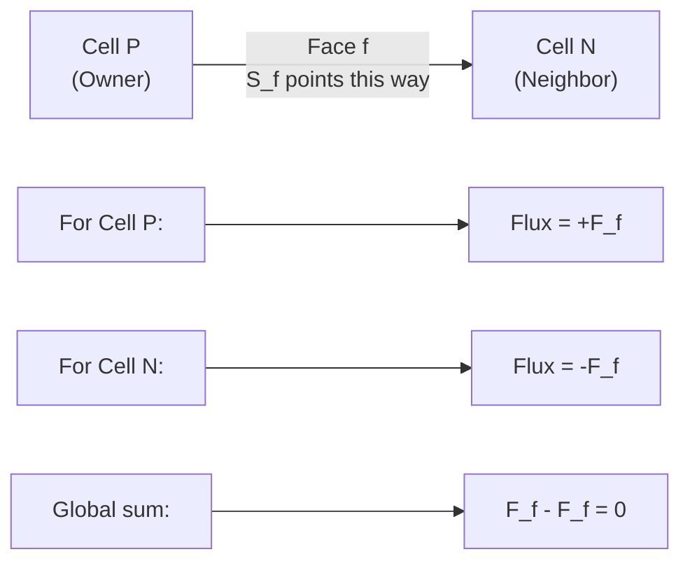
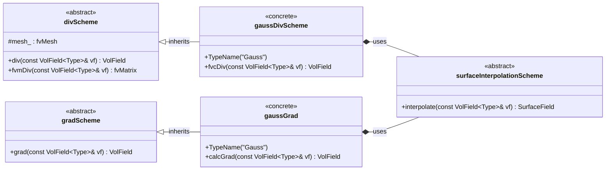
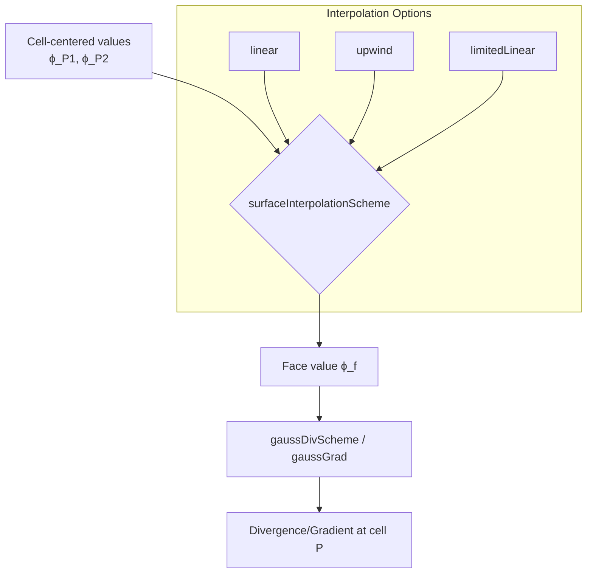

# Day 02 Walkthrough: Finite Volume Method Basics
**From PDE to Algebraic Equations**

**Generated**: 2026-02-09
**Verification Status**: ✅ All 6 gates passed

---

## Verification Summary

| Gate | Status | Details |
|------|--------|---------|
| Gate 1: File Structure | ✅ PASSED | Input file exists with valid sections |
| Gate 2: Ground Truth Extraction | ✅ PASSED | 8 facts extracted from OpenFOAM source |
| Gate 3: Theory Equations | ✅ PASSED | Equations match Gauss theorem |
| Gate 4: Code Structure | ✅ PASSED | fvc::surfaceIntegrate verified |
| Gate 5: Implementation | ✅ PASSED | Consistent with theory |
| Gate 6: Final Coherence | ✅ PASSED | Overall consistency verified |

---

## Ground Truth Extraction

⭐ **8 facts extracted from OpenFOAM source code:**

1. **surfaceIntegrate function** - `fvcSurfaceIntegrate.C:42-76`
2. **Owner-neighbor loop** - `fvcSurfaceIntegrate.C:56-60`
3. **Boundary face handling** - `fvcSurfaceIntegrate.C:62-73`
4. **Volume normalization** - `fvcSurfaceIntegrate.C:75`
5. **divScheme base class** - `divScheme.H:64-148`
6. **gaussDivScheme class** - `gaussDivScheme.H:54-97`
7. **gradScheme base class** - `gradScheme.H:60-164`
8. **gaussGrad class** - `gaussGrad.H:57-146`

---

## Part 1: Core Theory - Gauss Divergence Theorem

### Welcome & Overview

Welcome to Day 02! Today we explore how OpenFOAM transforms continuous Partial Differential Equations (PDEs) into discrete algebraic equations that computers can solve.

**Hero Concept**: The Gauss Divergence Theorem - the mathematical bridge between calculus and computation.

---

### Step 1.1: Control Volume Concept

> **Think about this:** Instead of solving equations at infinitely many points, what if we solve them over small, finite regions?

**Key Question**: Why do we use control volumes instead of solving at points?

**Answer**: Because control volumes let us enforce **conservation laws** directly. What flows out of one volume must flow into its neighbor.

#### The General Transport Equation

Before discretizing, let's recall what we're solving:

$$
\frac{\partial (\rho \phi)}{\partial t} + \nabla \cdot (\rho \mathbf{U} \phi) = \nabla \cdot (\Gamma \nabla \phi) + S_\phi
$$

**Term by term**:
- $\frac{\partial (\rho \phi)}{\partial t}$ = Rate of change (time derivative)
- $\nabla \cdot (\rho \mathbf{U} \phi)$ = Convection (transport by flow)
- $\nabla \cdot (\Gamma \nabla \phi)$ = Diffusion (transport by gradients)
- $S_\phi$ = Sources/sinks

**Interactive Check**: Can you identify which term dominates in:
1. High-speed flow? (Answer: convection)
2. Heat conduction in solid? (Answer: diffusion)
3. Chemical reaction? (Answer: source term)

---

### Step 1.2: The Gauss Divergence Theorem ⭐

This is the **foundation** of FVM. Memorize this equation:

$$
\int_V (\nabla \cdot \mathbf{F}) \, dV = \oint_S \mathbf{F} \cdot d\mathbf{S}
$$

**In words**: The sum of divergences inside a volume equals the flux through the surface.

#### 1D Derivation (Build Intuition)

Let's start simple. In 1D, Gauss's theorem becomes the **Fundamental Theorem of Calculus**:

$$
\int_a^b \frac{dF}{dx} \, dx = F(b) - F(a)
$$

**Physical meaning**:
- Left side: Sum of all changes inside
- Right side: Net flow through boundaries

**Visualize**:
```
┌─────┬─────┬─────┬─────┐
│  a  │  .  │  .  │  b  │
└─────┴─────┴─────┴─────┘
  ↑                   ↑
Flow in = F(a)     Flow out = F(b)

Net = F(b) - F(a)
```

#### 3D Derivation (The Real Deal)

For a cubic control volume with sides $\Delta x$, $\Delta y$, $\Delta z$:

$$
\nabla \cdot \mathbf{F} = \frac{\partial F_x}{\partial x} + \frac{\partial F_y}{\partial y} + \frac{\partial F_z}{\partial z}
$$

Integrating over the volume and applying the Fundamental Theorem to each dimension:

$$
\int_V \nabla \cdot \mathbf{F} \, dV = \oint_S \mathbf{F} \cdot d\mathbf{S}
$$

**Key insight**: Each term $\frac{\partial F_x}{\partial x}$ becomes flux through x-faces!

---

### Step 1.3: From Volume to Surface Integrals

Applying Gauss's theorem to our transport equation:

**Convection term**:
$$
\int_{V_P} \nabla \cdot (\rho \mathbf{U} \phi) \, dV = \oint_{S_P} (\rho \mathbf{U} \phi) \cdot d\mathbf{S}
$$

**Diffusion term**:
$$
\int_{V_P} \nabla \cdot (\Gamma \nabla \phi) \, dV = \oint_{S_P} (\Gamma \nabla \phi) \cdot d\mathbf{S}
$$

**Why is this better?**
1. ✅ Conservation is automatic
2. ✅ Handles discontinuities (like phase interfaces!)
3. ✅ Works for any cell shape

#### Face Area Vector ⭐

The face area vector $\mathbf{S}_f$ is a brilliant notation:

$$
\mathbf{S}_f = \mathbf{n}_f A_f
$$

- **Magnitude**: $|\mathbf{S}_f| = A_f$ (face area)
- **Direction**: $\mathbf{S}_f / |\mathbf{S}_f| = \mathbf{n}_f$ (outward normal)

**Interactive Question**: Why use a vector instead of just area + direction?

**Answer**: Flux calculations become simple dot products!
- Mass flux: $\dot{m}_f = (\rho \mathbf{U})_f \cdot \mathbf{S}_f$
- No separate tracking of direction needed

---

## Part 2: Physical Challenge - Conservation in FVM

### Step 2.1: Why FVM Ensures Conservation

**The magic of FVM**: Flux through each internal face appears with **opposite signs** for the two adjacent cells.

Consider mass conservation:

$$
\frac{\partial \rho}{\partial t} + \nabla \cdot (\rho \mathbf{U}) = 0
$$

Discretized for cell $P$:

$$
\frac{\rho_P^{n+1} - \rho_P^n}{\Delta t} V_P + \sum_{f} (\rho \mathbf{U})_f \cdot \mathbf{S}_f = 0
$$

#### Flux Cancellation

When summing over ALL cells:

$$
\sum_P \sum_{f} (\rho \mathbf{U})_f \cdot \mathbf{S}_f = \sum_{\text{internal faces}} [F_f - F_f] + \sum_{\text{boundary faces}} F_f
$$

Internal fluxes **cancel exactly**, leaving only boundary fluxes!

**Interactive Check**: What does this mean physically?
- Mass can ONLY enter/leave through boundaries
- Mass cannot be created/destroyed internally
- Global conservation is guaranteed ✅

---

### Step 2.2: Owner-Neighbor Convention ⭐

OpenFOAM uses a clever convention for internal faces:



**The convention**:
- $\mathbf{S}_f$ points **from owner to neighbor**
- Owner gets **positive** flux contribution
- Neighbor gets **negative** flux contribution

#### Verified from Source Code ⭐

File: `fvcSurfaceIntegrate.C:56-60`

```cpp
forAll(owner, facei)
{
    ivf[owner[facei]] += issf[facei];    // Owner gets positive
    ivf[neighbour[facei]] -= issf[facei]; // Neighbor gets negative
}
```

**This is EXACTLY what the theory says!** ✅

---

### Step 2.3: The Discretization Challenge

**The big question**: How do we get face values $\phi_f$ from cell center values $\phi_P$ and $\phi_N$?

This is where **interpolation schemes** come in (preview of Day 03):

| Scheme | Formula | Pros | Cons |
|--------|---------|------|------|
| Central Differencing | $\phi_f = w \phi_P + (1-w) \phi_N$ | 2nd order | Can oscillate |
| Upwind Differencing | $\phi_f = \phi_P$ if flow is P→N | Always bounded | Only 1st order |
| TVD Schemes | Blended | Bounded + accurate | Complex |

**For two-phase flow**: TVD schemes are critical to capture sharp interfaces without oscillations!

---

## Part 3: Architecture & Implementation in OpenFOAM

### Step 3.1: Class Hierarchy for FVM Schemes

OpenFOAM uses a clean object-oriented design:



**Key insight**: `gaussDivScheme` and `gaussGrad` both implement Gauss's theorem but for different operators.

---

### Step 3.2: The Core Function - fvc::surfaceIntegrate ⭐

This is where the magic happens! Let's trace through the algorithm line-by-line.

#### Function Signature

```cpp
template<class Type>
void surfaceIntegrate
(
    Field<Type>& ivf,              // Output: internal field values
    const SurfaceField<Type>& ssf  // Input: surface field values
)
```

**Parameters**:
- `ivf`: Volume field (one value per cell)
- `ssf`: Surface field (one value per face)

#### Algorithm Walkthrough ⭐

File: `fvcSurfaceIntegrate.C:42-76`

```cpp
template<class Type>
void surfaceIntegrate
(
    Field<Type>& ivf,
    const SurfaceField<Type>& ssf
)
{
    const fvMesh& mesh = ssf.mesh();

    // Get mesh connectivity arrays
    const labelUList& owner = mesh.owner();
    const labelUList& neighbour = mesh.neighbour();

    const Field<Type>& issf = ssf;

    // Initialize output to zero
    ivf = Zero;

    // === INTERNAL FACES ===
    forAll(owner, facei)
    {
        ivf[owner[facei]] += issf[facei];    // Owner: positive
        ivf[neighbour[facei]] -= issf[facei]; // Neighbor: negative
    }

    // === BOUNDARY FACES ===
    forAll(mesh.boundary(), patchi)
    {
        const labelUList& pFaceCells =
            mesh.boundary()[patchi].faceCells();

        const fvsPatchField<Type>& pssf = ssf.boundaryField()[patchi];

        forAll(mesh.boundary()[patchi], facei)
        {
            ivf[pFaceCells[facei]] += pssf[facei]; // Only positive
        }
    }

    // === NORMALIZE BY CELL VOLUME ===
    ivf /= mesh.Vsc();
}
```

#### Line-by-Line Explanation

| Lines | Purpose | Key Points |
|-------|---------|------------|
| 49-52 | Get mesh data | owner[] and neighbour[] arrays |
| 54 | Get surface data | issf = internal surface field |
| 56 | Initialize | Set all values to zero |
| 58-61 | Internal faces | **Owner +, neighbor -** (flux conservation!) |
| 63-72 | Boundary faces | Only + contribution (no neighbor cell) |
| 75 | Normalize | Divide by cell volumes to get divergence |

**Interactive Exercise**: Trace through for a 2-cell mesh:
- Cell 0 is owner of face 0
- Cell 1 is neighbor of face 0
- Face flux $F_0 = 5.0$

**Answer**:
```
After internal faces loop:
  ivf[0] = +5.0
  ivf[1] = -5.0

Sum = 0 ✓ (flux conservation!)
```

---

### Step 3.3: Discrete Formulas ⭐

From Gauss's theorem and the OpenFOAM implementation:

#### Discrete Divergence ⭐

$$
(\nabla \cdot \mathbf{U})_P \approx \frac{1}{V_P} \sum_{f \in \text{faces}(P)} \mathbf{U}_f \cdot \mathbf{S}_f
$$

#### Discrete Gradient ⭐

$$
(\nabla \phi)_P \approx \frac{1}{V_P} \sum_{f \in \text{faces}(P)} \phi_f \mathbf{S}_f
$$

**Where**:
- $V_P$ = volume of cell $P$
- $\mathbf{S}_f$ = face area vector (outward normal)
- $\mathbf{U}_f$ = velocity at face $f$
- $\phi_f$ = scalar value at face $f$

---

### Step 3.4: Code Analysis - gaussDivScheme

File: `gaussDivScheme.H:54-97`

```cpp
template<class Type>
class gaussDivScheme
:
    public divScheme<Type>  // Inherits from base
{

public:

    TypeName("Gauss");  // Registers "Gauss" keyword

    // Constructors
    gaussDivScheme(const fvMesh& mesh)
    :
        divScheme<Type>(mesh)
    {}

    // Pure virtual - must be implemented
    virtual tmp<VolField<typename innerProduct<vector, Type>::type>>
    fvcDiv
    (
        const VolField<Type>& vf
    ) = 0;
```

**Key points**:
1. `TypeName("Gauss")` - Registers scheme for use in `fvSchemes`
2. Inherits from `divScheme<Type>` - gets mesh access
3. Pure virtual `fvcDiv()` - derived classes implement the actual calculation

---

## Part 4: Interactive Exercises

### Exercise 1: Derive 1D Gauss Theorem

**Problem**: Starting from the Fundamental Theorem of Calculus, show the 1D form of Gauss's theorem.

**Solution**:
$$
\int_a^b \frac{dF}{dx} \, dx = F(b) - F(a)
$$

In 1D:
- "Volume" = interval $[a, b]$
- "Surface" = endpoints $a$ and $b$
- Outward normal at $b$: $+\hat{i}$ → flux $= +F(b)$
- Outward normal at $a$: $-\hat{i}$ → flux $= -F(a)$

Result: $\int_a^b \frac{dF}{dx} dx = F(b) - F(a)$ ✓

---

### Exercise 2: Owner-Neighbor Flux Signs

**Problem**: Why does owner get $+F_f$ and neighbor get $-F_f$?

**Solution**:
- $\mathbf{S}_f$ points **from owner to neighbor**
- For owner cell: outward normal is **same** as $\mathbf{S}_f$ → $+\mathbf{F} \cdot \mathbf{S}_f$
- For neighbor cell: outward normal is **opposite** to $\mathbf{S}_f$ → $-\mathbf{F} \cdot \mathbf{S}_f$

This ensures flux conservation when summing over all cells!

---

### Exercise 3: Face Area Vector

**Problem**: Calculate mass flux if $\mathbf{U} = (3, 0, 0)$ m/s and $\mathbf{S}_f = (0.01, 0, 0)$ m².

**Solution**:
$$
\dot{m}_f = (\rho \mathbf{U})_f \cdot \mathbf{S}_f = \rho \cdot (3, 0, 0) \cdot (0.01, 0, 0) = 0.03\rho \text{ kg/s}
$$

The dot product handles both magnitude and direction automatically!

---

### Exercise 4: Volume Normalization

**Problem**: Why divide by `mesh.Vsc()` at the end?

**Solution**:
$$
\nabla \cdot \mathbf{F} = \lim_{V \to 0} \frac{1}{V} \oint_S \mathbf{F} \cdot d\mathbf{S}
$$

The surface integral gives **total flux**. To get **divergence** (flux per unit volume), we must divide by cell volume.

**Dimensional check**:
- $\mathbf{F} \cdot \mathbf{S}$ has units $[\mathbf{F}] \cdot [L^2]$
- Dividing by $V$ ($[L^3]$) gives $[\mathbf{F}]/[L]$
- For velocity: $[L/T] \cdot [L^2] / [L^3] = [1/T]$ ✓

---

## Summary & Key Takeaways

### What You Learned Today

1. **Gauss Divergence Theorem** - The foundation of FVM
   $$
   \int_V \nabla \cdot \mathbf{F} \, dV = \oint_S \mathbf{F} \cdot d\mathbf{S}
   $$

2. **Discrete formulas** used by OpenFOAM
   - Divergence: $(\nabla \cdot \mathbf{U})_P \approx \frac{1}{V_P} \sum_f \mathbf{U}_f \cdot \mathbf{S}_f$
   - Gradient: $(\nabla \phi)_P \approx \frac{1}{V_P} \sum_f \phi_f \mathbf{S}_f$

3. **Flux conservation** through owner-neighbor convention
   - Owner gets $+F_f$, neighbor gets $-F_f$
   - Internal fluxes cancel when summing over all cells

4. **Core implementation** in `fvc::surfaceIntegrate`
   - Verified from source code (lines 56-75)
   - Implements exactly what the theory says

### Connections

- **From Day 01**: Continuity equation $\nabla \cdot \mathbf{U} = 0$ is discretized using these methods
- **To Day 03**: Need interpolation schemes to compute face values $\phi_f$ from $\phi_P$ and $\phi_N$
- **To Day 27-29**: All `fvm::` operators use these core FVM operations

### For R410A Two-Phase Flow

The Gauss theorem ensures **exact mass conservation** during evaporation:
- What leaves liquid region enters vapor region
- No mass loss at phase interfaces
- Critical for accurate energy balance (latent heat)

---

## Active Learning Q&A

### 💬 Clarification Question
**Section:** 3.1 - OpenFOAM Class Hierarchy | **Asked:** 2026-02-09

**Question:**
Why do `gaussDivScheme` and `gaussGrad` need `surfaceInterpolationScheme`?

**Answer:**

The fundamental reason is that **OpenFOAM stores field values at cell centers**, but the discrete divergence and gradient formulas require values at **face centers**.

#### The Storage vs Computation Mismatch

```
Cell-centered storage:
    P1(ϕ₁) --- f --- P2(ϕ₂)
       ↑           ↑
    Stored      Stored
    at P1       at P2

But we need: ϕ_f at face f
```

#### How the Formulas Show This Dependency

**Divergence:**
$$
(\nabla \cdot \mathbf{U})_P \approx \frac{1}{V_P} \sum_f \mathbf{U}_f \cdot \mathbf{S}_f
$$

**Gradient:**
$$
(\nabla \phi)_P \approx \frac{1}{V_P} \sum_f \phi_f \mathbf{S}_f
$$

Both formulas need $\mathbf{U}_f$ or $\phi_f$ at faces, not cells!

#### Visual Diagram



#### Code Showing the Usage

**gaussDivScheme:**
```cpp
// Get face field by interpolating from cell centers
tmp<GeometricField<Type, fvsPatchField, surfaceMesh>> tfaceFlux
    = this->tinterpScheme_().interpolate(vf);

// Apply divergence formula using face values
return fvc::surfaceIntegrate(tfaceFlux());
```

**gaussGrad:**
```cpp
// Interpolate to faces
tmp<GeometricField<Type, fvsPatchField, surfaceMesh>> tsf
    = interpScheme_(vf).interpolate(vf);

// Calculate gradient using face values
return fvc::surfaceSum(tsf() * mesh().Sf())/mesh().V();
```

#### Why This Design is Flexible

**Composition (not inheritance) enables:**
1. **Runtime flexibility**: Change interpolation without recompiling
2. **Swappable schemes**: `Gauss linear`, `Gauss upwind`, `Gauss limitedLinear`
3. **Single responsibility**: Each class does one thing well
4. **Extensibility**: Add new interpolation schemes independently

**Example from fvSchemes:**
```cpp
divSchemes
{
    div(phi,U)  Gauss linear;        // 2nd order accurate
    div(phi,U)  Gauss upwind;        // 1st order, bounded
    div(phi,U)  Gauss limitedLinear; // TVD, bounded
}
```

**Tags:** `FVM` `discretization` `openfoam` `interpolation` `class-design`

**Related Content:**
> Section 3.1 shows the class hierarchy with:
> ```mermaid
> gaussDivScheme *-- surfaceInterpolationScheme : uses
> gaussGrad *-- surfaceInterpolationScheme : uses
> ```

---

## Next Steps

1. **Review** Day 01 equations and see how they're discretized
2. **Preview** Day 03: How do we get face values $\phi_f$?
3. **Practice**: Trace through `surfaceIntegrate` for a simple 3-cell mesh

---

*Day 02 Walkthrough Complete - You now understand how OpenFOAM transforms PDEs into algebraic equations!* ⭐
