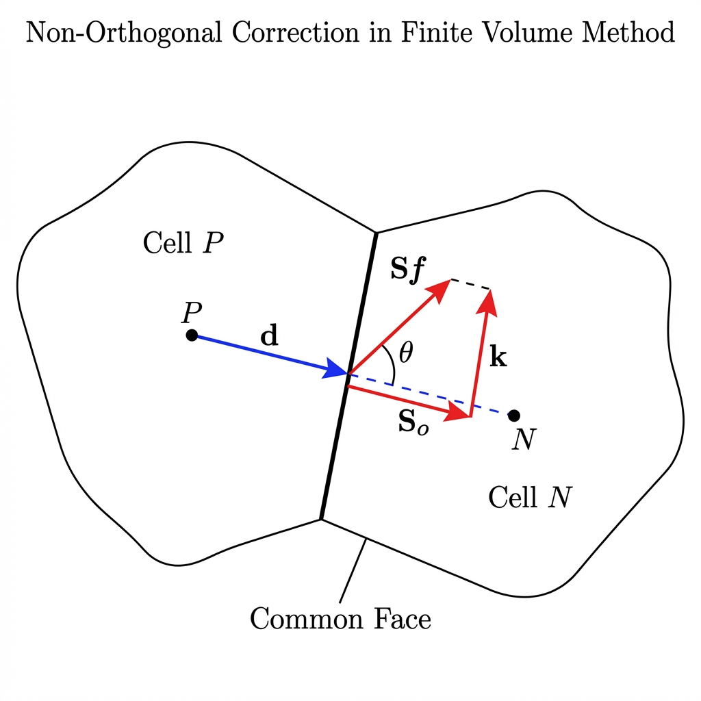
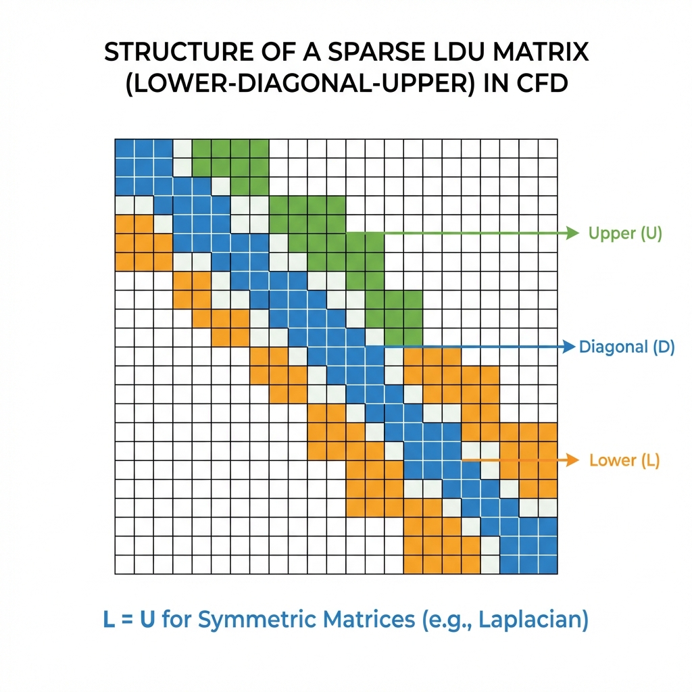
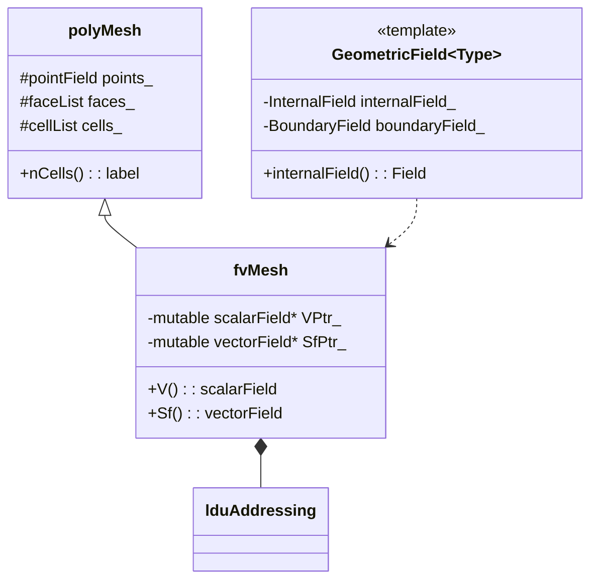
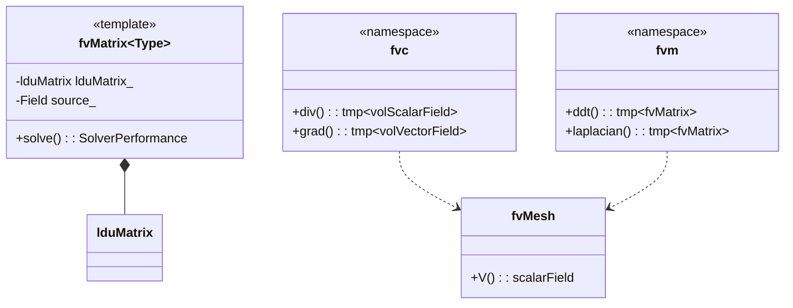
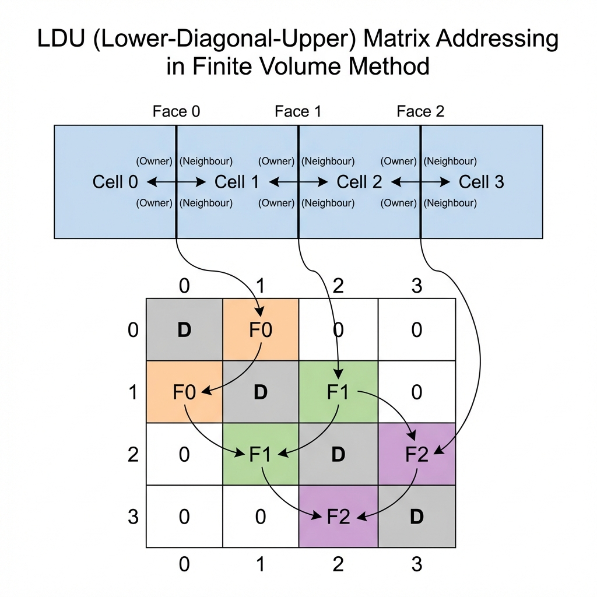
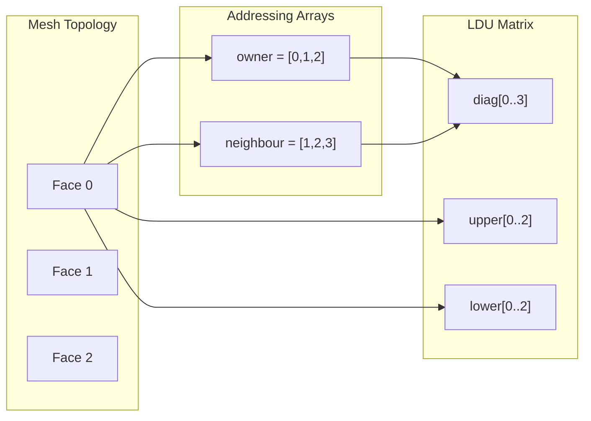

# Day 02: พื้นฐานวิธีปริมาตรจำกัด (FVM Basics) - Walkthrough Notes

> 🎓 **สไตล์การสอน:** Engineering Thai (คำศัพท์เทคนิคภาษาอังกฤษ อธิบายภาษาไทย)
> 📚 **Source:** DeepSeek + Claude synthesis

---

## 🎯 Section 2.1: การเจาะลึกสถาปัตยกรรมคลาส `fvMesh`

**📍 ตำแหน่ง:** Day 02 > Section 2 > 2.1 fvMesh Architecture

### 📝 คำอธิบาย (Synthesized from DeepSeek)

คลาส `fvMesh` คือ **"หัวใจ"** ของ OpenFOAM สำหรับการคำนวณ FVM โดยใช้ **Multiple Inheritance** จาก 3 คลาสหลัก:

#### 1️⃣ สืบทอดจาก `polyMesh` — โครงสร้างพื้นฐานของ Mesh

- เก็บ **topology**: จุด (`points`), หน้า (`faces`), เซลล์ (`cells`)
- เก็บ **owner/neighbour addressing**: เซลล์ไหนเชื่อมกับหน้าไหน
- **ทำไมต้องมี?** → `fvMesh` ต้องใช้ข้อมูลเหล่านี้เพื่อคำนวณ $V_P$, $\mathbf{S}_f$

#### 2️⃣ สืบทอดจาก `lduMesh` — การจัดการเมทริกซ์แบบ Sparse

- ให้ interface สำหรับ **LDU storage format** (Lower-Diagonal-Upper)
- **ทำไมต้องมี?** → การแก้ $A\mathbf{x} = \mathbf{b}$ ใน FVM ต้องการ `lowerAddr()` และ `upperAddr()` เพื่อประกอบเมทริกซ์
- **ความสำคัญ:** `lduMesh` ทำให้ `fvMesh` สามารถให้ข้อมูล owner-neighbour addressing ซึ่งจำเป็นสำหรับการประกอบเมทริกซ์และการคำนวณฟลักซ์

#### 3️⃣ สืบทอดจาก `surfaceInterpolation` — การประมาณค่าที่ผิวหน้า

- จัดการ scheme ต่างๆ (`linear`, `upwind`) สำหรับ interpolate ค่าจากศูนย์กลางเซลล์ไปยังผิวหน้า
- **ทำไมต้องมี?** → ฟลักซ์ $\mathbf{U}_f \cdot \mathbf{S}_f$ ต้องใช้ค่า $\mathbf{U}_f$ ที่หน้า แต่เราเก็บ $\mathbf{U}_P$ ที่เซลล์!

### ⚙️ Demand-Driven Geometry Pattern

OpenFOAM ใช้ **Lazy Evaluation** เพื่อประหยัดเวลา:

```cpp
class fvMesh {
    mutable scalarField* VPtr_;  // เก็บเป็น pointer

    const scalarField& V() const {
        if (!VPtr_) { calcV(); }  // คำนวณเมื่อถูกเรียกครั้งแรกเท่านั้น
        return *VPtr_;
    }
};
```

**กลไกสำคัญ:**

| กลไก | คำอธิบาย |
|------|----------|
| `mutable` keyword | อนุญาตให้เมธอด `const` แก้ไขสมาชิกข้อมูลได้ |
| Lazy evaluation | ข้อมูลจะถูกคำนวณเฉพาะเมื่อมีการร้องขอครั้งแรก |
| Caching | ข้อมูลที่คำนวณแล้วจะถูกเก็บไว้ใน heap เพื่อใช้ซ้ำ |
| Invalidation | เมื่อ mesh เปลี่ยนแปลง ต้องล้าง cache ด้วย `clearGeom()` |

**ข้อดี vs ข้อเสีย:**

| ✅ ข้อดี | ⚠️ ข้อเสีย |
|---------|-----------|
| ลดการคำนวณซ้ำซ้อน | **Hidden side effects**: เรียก `mesh.V()` อาจกระตุ้นการคำนวณนาน |
| Memory efficient: ไม่จองถ้าไม่ใช้ | **Thread safety**: `mutable` ทำให้ parallel code ยาก |
| อัตโนมัติ: ผู้ใช้ไม่ต้องจัดการเอง | Debugging ยากเพราะ state ซ่อนอยู่ใน pointer |

### 💡 Key Insight

> **Inheritance-based design** ของ OpenFOAM สะดวกสำหรับผู้ใช้ (`mesh.V()` เรียกตรงๆ) แต่ทำให้ **coupling แน่น (tight coupling)**
>
> ทางเลือกที่ดีกว่าคือ **Composition-over-Inheritance**:
> ```cpp
> class ControlVolumeMesh {
>     PolyMeshTopology topology_;      // แยกเป็น component
>     LduAddressing addressing_;
>     GeometryCache geometry_;
> };
> ```
> แต่ละส่วนทดสอบแยกได้ ไม่พึ่งพากัน → **Loose coupling**

### 🔗 เชื่อมโยง

| Day 01 (สมการควบคุม) | Day 02 (วันนี้) |
|-----------------------|-----------------|
| $\nabla \cdot \mathbf{U} = 0$ (ความต่อเนื่อง) | `fvMesh` ให้ $\mathbf{S}_f$, $V_P$ สำหรับแปลง $\nabla \cdot$ เป็น $\sum_f \mathbf{U}_f \cdot \mathbf{S}_f$ |

---

### ❓ Q&A: ทำไม `fvMesh` เลือก Inheritance แทน Composition?

**คำถาม:** ทำไม class `fvMesh` เลือกการ inheritance แทนการสร้าง object `polyMesh`, `lduMesh`, `surfaceInterpolation` แล้วนำ object มาใช้เลย?

**คำตอบ:**

มี 4 เหตุผลหลักที่ OpenFOAM เลือกใช้ **Inheritance**:

#### 1️⃣ ประสิทธิภาพ (Performance)

| Inheritance | Composition |
|-------------|-------------|
| **Zero-overhead abstraction** - ไม่มี pointer indirection | ต้องผ่าน member object ก่อน |
| **Direct member access** - `mesh.points()` เข้าถึงตรงๆ | ต้องเขียน `mesh.polyMesh_.points()` |
| **Cache locality** - data อยู่ memory เดียวกัน | อาจ fragmented |

#### 2️⃣ API Design และความสะดวก

```cpp
// Inheritance (OpenFOAM ใช้วิธีนี้)
mesh.points();     // สะดวก!
mesh.owner();
mesh.V();

// Composition (ถ้าใช้วิธีนี้)
mesh.polyMesh().points();    // ยาวกว่า
mesh.lduMesh().owner();
mesh.geometryCache().V();
```

นอกจากนี้ `fvMesh` **"is-a" `polyMesh`** จริงๆ (เป็น mesh สำหรับ finite volume) → natural relationship

#### 3️⃣ Historical Context

- OpenFOAM เริ่มพัฒนาตั้งแต่ **ยุค 90s** — C++ best practices ต่างจากปัจจุบัน
- ได้รับอิทธิพลจาก FORTRAN codebases ที่ใช้ deep hierarchy
- เริ่มจาก **research code** ที่เน้น flexibility มากกว่า maintainability

#### 4️⃣ Domain-Specific: CFD Mesh Hierarchy

ใน CFD, mesh types มี **natural hierarchy** ชัดเจน:
- `polyMesh` = geometry + topology พื้นฐาน
- `fvMesh` = polyMesh + FVM-specific data ($\mathbf{S}_f$, $V_P$)
- `dynamicFvMesh` = fvMesh + mesh motion

#### ⚖️ Trade-offs Summary

| Aspect | Inheritance (OpenFOAM) | Composition (ทางเลือก) |
|--------|------------------------|------------------------|
| **Performance** | ✅ ดีกว่า | ❌ Overhead |
| **API** | ✅ Clean | ❌ Verbose |
| **Flexibility** | ❌ Tight coupling | ✅ Swap implementations ได้ |
| **Testability** | ❌ Hard to mock | ✅ Dependency injection |

---

### ❓ Q&A: Composition หรือ Inheritance เหมาะกับโปรเจคเรามากกว่า?

**คำถาม:** ถ้าวิเคราะห์จริงๆ composition หรือ inheritance เหมาะกับ project เรามากกว่า?

**คำตอบ:**

สำหรับโปรเจค CFD engine ของเรา (phase change evaporator, ทีม 1-2 คน, เน้น learning) → **เลือก Composition อย่างชัดเจน**

#### 🎯 เหตุผลเฉพาะสำหรับ Context ของเรา:

| เป้าหมายโปรเจค | ทำไม Composition ดีกว่า |
|--------------|------------------------|
| **Phase change simulation** | จัดการ interface, liquid/vapor แยกส่วนได้ |
| **ทีมเล็ก 1-2 คน** | Code แต่ละส่วนเข้าใจง่าย, debug ง่าย |
| **ต้องการทดลอง schemes** | Swap scheme ได้โดยไม่แก้ hierarchy |
| **ไม่ต้อง backward compatible** | ไม่ติด legacy design ของ OpenFOAM |

#### 💻 โครงสร้างแนะนำ (Composition-based)

```cpp
class EvaporatorMesh {
private:
    // Core components - แยกกันชัดเจน
    MeshGeometry geometry_;           // จัดการ points, volumes
    MeshConnectivity connectivity_;   // จัดการ faces, neighbors
    FieldContainer fields_;           // จัดการ T, U, alpha
    
    // Phase-specific - เปลี่ยนได้
    std::unique_ptr<InterfaceTracker> interface_;
    std::unique_ptr<PhaseChangeModel> phaseModel_;
    
public:
    // Dependency Injection - ทดลอง model ต่างๆ ได้
    void setPhaseModel(std::unique_ptr<PhaseChangeModel> model) {
        phaseModel_ = std::move(model);
    }
    
    void computePhaseChange() {
        auto massTransfer = phaseModel_->compute(fields_);
        interface_->update(massTransfer);
    }
};
```

#### 🔬 ประโยชน์สำหรับการทดลอง Schemes

```cpp
// สลับ scheme ได้ง่าย — ไม่ต้องแก้ class hierarchy!
mesh.setSpatialScheme(std::make_unique<CentralDifference>());
// หรือ
mesh.setSpatialScheme(std::make_unique<UpwindScheme>());
// หรือ
mesh.setSpatialScheme(std::make_unique<QUICKScheme>());
```

#### ✅ สรุป: เลือก Composition เพราะ

1. **ทดลอง schemes ได้ง่าย** — เปลี่ยน component โดยไม่แก้ hierarchy
2. **Maintain ง่าย** — แต่ละส่วนแยกชัดเจน ทีมเล็กเข้าใจได้เร็ว
3. **เหมาะกับ phase change** — จัดการ interface และ phase แยกส่วนได้
4. **Testability สูง** — ทดสอบแต่ละ component แยกกันได้
5. **ไม่ต้อง refactor ใหญ่** — ขยายความสามารถได้โดยเพิ่ม component

> 💡 **บทเรียน:** OpenFOAM ใช้ inheritance เพราะ historical reasons และ performance ในยุค 90s แต่สำหรับโปรเจคใหม่ที่เน้น flexibility และ maintainability → **Composition ดีกว่า**

---

### ❓ Q&A: Mutable Pointer Pattern vs Explicit State Management (Brainstorm with DeepSeek)

**คำถาม:** ตรงหัวข้อ 2.1.1 บอกว่าเราใช้ `geometryStatus_` flag แทน `mutable` — ช่วยอธิบายแบบ step by step ได้ไหม? ของ OpenFOAM ไม่ดียังไง? ทำไมเราเปลี่ยน?

**คำตอบ:** (Synthesized from DeepSeek)

---

#### 📌 Step 1: เข้าใจ Mutable Pattern ของ OpenFOAM ก่อน

```cpp
class fvMesh {
private:
    mutable scalarField* VPtr_;  // mutable = แก้ไขได้แม้ใน const method
    
    void calcV() const {         // const method แต่แก้ไข VPtr_!
        VPtr_ = new scalarField(calculateVolumes());
    }

public:
    const scalarField& V() const {
        if (!VPtr_) {
            calcV();   // ⚠️ Side effect ใน const method!
        }
        return *VPtr_;
    }
};
```

**กลไก:**
1. `mutable` keyword = อนุญาตให้แก้ไข `VPtr_` แม้จะเป็น `const` method
2. **Lazy Initialization** = คำนวณเฉพาะเมื่อถูกเรียกครั้งแรก
3. ผู้ใช้เรียก `mesh.V()` ง่ายๆ ไม่ต้องกังวลเรื่อง initialization

---

#### ✅ ข้อดีของ Mutable Pattern (OpenFOAM)

| ข้อดี                   | คำอธิบาย                               |
| ----------------------- | -------------------------------------- |
| **Clean API**           | `mesh.V()` เรียกง่าย ไม่ต้อง init ก่อน |
| **Performance**         | ลดการคำนวณซ้ำ (**cache **ไว้)          |
| **Memory Efficient**    | คำนวณเฉพาะเมื่อจำเป็น                  |
| **Backward Compatible** | ทำงานกับ code เดิมได้                  |

---

#### ⚠️ ข้อเสียของ Mutable Pattern (ทำไมเราเปลี่ยน)

##### 1️⃣ **Hidden Side Effects**

```cpp
double computeSomething(const fvMesh& mesh) {
    // ดูเหมือน pure function แต่จริงๆ มี side effect!
    double vol = sum(mesh.V());  // อาจ trigger calculation
    return vol;
}
```
- `const` method ควรไม่แก้ไขอะไร แต่ `V()` แก้ไข `VPtr_`!
- **ทำลาย semantic ของ `const`**

##### 2️⃣ **Thread Safety Problem (Critical!)**

```cpp
void thread1(const fvMesh& mesh) {
    auto vol1 = mesh.V();  // Thread 1 เรียก calcV()
}

void thread2(const fvMesh& mesh) {
    auto vol2 = mesh.V();  // Thread 2 เรียก calcV() พร้อมกัน!
}
```

**ปัญหาที่เกิด:**
- **Race condition** — ทั้งสอง thread แก้ไข `VPtr_` พร้อมกัน
- **Double deletion** — ถ้า delete พร้อมกัน
- **Memory leak** — ถ้า new พร้อมกัน

##### 3️⃣ **Debugging ยาก**
- เรียก `mesh.V()` หลายที่ ไม่รู้ว่าที่ไหน trigger calculation จริง
- State ซ่อนอยู่ใน pointer

---

#### 📌 Step 2: Explicit State Management (แนวทางของเรา)

```cpp
enum class GeometryStatus { STALE, UP_TO_DATE };

class ControlVolumeMesh {
private:
    GeometryStatus geometryStatus_ = GeometryStatus::STALE;
    std::unique_ptr<scalarField> volumeField_;
    std::mutex geometryMutex_;  // Thread safety!
    
    void calculateVolumes() {
        volumeField_ = std::make_unique<scalarField>(computeVolumes());
        geometryStatus_ = GeometryStatus::UP_TO_DATE;
    }

public:
    // Non-const: สามารถ update state ได้
    const scalarField& getVolumes() {
        std::lock_guard<std::mutex> lock(geometryMutex_);
        
        if (geometryStatus_ == GeometryStatus::STALE) {
            calculateVolumes();  // Explicit update
        }
        return *volumeField_;
    }
    
    // Const: ถ้า stale → error! (fail fast)
    const scalarField& getVolumes() const {
        if (geometryStatus_ == GeometryStatus::STALE) {
            throw std::runtime_error("Geometry is stale!");
        }
        return *volumeField_;
    }
    
    // Explicit state transitions
    void markGeometryStale() {
        geometryStatus_ = GeometryStatus::STALE;
    }
    
    void updateGeometry() {
        std::lock_guard<std::mutex> lock(geometryMutex_);
        calculateVolumes();
    }
};
```

---

#### ✅ ทำไม Explicit State Management ดีกว่า

| ปัญหา Mutable | วิธีแก้ใน Explicit Pattern |
|---------------|---------------------------|
| Hidden side effects | ❌ `const` method ไม่แก้ไข state |
| Race condition | ✅ มี `mutex` ป้องกัน |
| Debugging ยาก | ✅ State transitions ชัดเจน |
| ไม่รู้ว่า stale หรือไม่ | ✅ มี `geometryStatus_` flag |

---

#### 🔄 การใช้งานจริง

```cpp
// OpenFOAM style (Mutable)
mesh.V();  // ไม่รู้ว่า calculate หรือ cache

// เราใช้ (Explicit)
if (!mesh.isGeometryUpToDate()) {
    mesh.updateGeometry();  // ชัดเจน!
}
auto volumes = mesh.getVolumes();
```

---

#### 💡 สรุป: ทำไมเราเปลี่ยน

| Aspect | Mutable (OpenFOAM) | Explicit (เรา) |
|--------|-------------------|----------------|
| **API** | ง่ายกว่า | ต้อง manage state เอง |
| **Thread Safety** | ❌ ไม่ปลอดภัย | ✅ ปลอดภัย |
| **Debugging** | ❌ ยาก | ✅ ง่าย |
| **Const Correctness** | ❌ ละเมิด | ✅ ถูกต้อง |
| **สำหรับโปรเจคเรา** | ❌ ไม่เหมาะ | ✅ เหมาะสม |

> 💡 **บทเรียน:** สำหรับ CFD engine ใหม่ที่ต้องรองรับ parallel computing → **Explicit State Management ดีกว่า** แม้ API จะ verbose กว่าเล็กน้อย แต่ปลอดภัยและ debug ง่าย

---

### ❓ Q&A: Cache ในบริบทนี้คืออะไร?

**คำถาม:** ที่บอกว่าข้อดีของ mutable คือ "ลดการคำนวณซ้ำ (cache ไว้)" — Cache คืออะไร? มันหมายถึงใช้ pointer เก็บ address ของ memory ที่จะถูก allocate ไว้ตลอด แบบนั้นไหม?

**คำตอบ:**

**ใช่ครับ เข้าใจถูกต้อง!** Cache ในบริบทนี้หมายถึง:

#### 🎯 ความหมายของ Cache

```cpp
mutable scalarField* VPtr_ = nullptr;  // เก็บ address ของ memory ที่ allocate ไว้
```

1. **ครั้งแรกที่เรียก `mesh.V()`:**
   - `VPtr_` เป็น `nullptr` (ยังไม่มี)
   - คำนวณ volumes → **แพง! O(N)** (loop ทุก cell)
   - `new scalarField(...)` → allocate memory บน **heap**
   - เก็บ address ไว้ใน `VPtr_`

2. **ครั้งที่สองเป็นต้นไป:**
   - `VPtr_` ไม่ใช่ `nullptr` แล้ว
   - **ไม่ต้องคำนวณใหม่!** → return ค่าที่ cache ไว้ทันที

#### 📊 เปรียบเทียบ

| | ไม่มี Cache | มี Cache |
|---|---|---|
| เรียก `V()` 1 ครั้ง | คำนวณ 1 ครั้ง | คำนวณ 1 ครั้ง |
| เรียก `V()` 100 ครั้ง | คำนวณ **100 ครั้ง** | คำนวณ **1 ครั้ง** |
| Performance | ❌ ช้า | ✅ เร็ว |

#### 💡 สรุป

> **Cache = เก็บผลลัพธ์ที่คำนวณแพงไว้ใน memory เพื่อใช้ซ้ำ โดยไม่ต้องคำนวณใหม่**

ใน OpenFOAM ใช้ `mutable` pointer เพื่อให้ `const` method สามารถเก็บ cache ได้ — นี่คือ "demand-driven" pattern ที่เราพูดถึง

---

### ❓ Q&A: ยืนยันความเข้าใจ ControlVolumeMesh Design (Brainstorm with DeepSeek)

**คำถาม:** 

**ความเข้าใจของฉัน:**
1. เปลี่ยนจาก `fvMesh` → `ControlVolumeMesh` ใช้ composition แยก 3 class: Geometry, Connectivity, Interpolation
2. แทน `mutable` pointer ด้วย flag (STALE/UP_TO_DATE) สำหรับ explicit state management

**คำถามเพิ่มเติม:**
1. ทำไมต้องมีระบบ update ค่า ถ้า OpenFOAM คำนวณแค่ครั้งเดียวแล้วใช้ตลอด?
2. ต้องมี getter + `lock_guard` สำหรับทุก member ไหม?

---

**คำตอบ:** (Synthesized from DeepSeek)

#### ✅ ยืนยันความเข้าใจ: **ถูกต้องทั้งหมด!**

| สิ่งที่เข้าใจ | ถูก/ผิด |
|-------------|---------|
| Composition แยก 3 class | ✅ ถูกต้อง |
| Flag (STALE/UP_TO_DATE) แทน mutable | ✅ ถูกต้อง |

---

#### 📌 คำถาม 1: ทำไมต้องมีระบบ update ค่า?

**คำตอบ:** ใน OpenFOAM จริงๆ **geometry ไม่ได้คงที่ตลอด!** มีหลายกรณีที่ต้อง update:

##### กรณีที่ geometry ต้อง update:

| กรณี | ตัวอย่าง | ต้อง update อะไร |
|------|----------|-----------------|
| **Mesh Motion** | Piston engine, FSI | $V_P$, $\mathbf{S}_f$, $\mathbf{C}_P$ ทุกอย่าง |
| **Adaptive Mesh Refinement (AMR)** | Shock capturing, boundary layers | topology + geometry |
| **Multiphase/Phase Change** | Interface tracking (VOF) | geometry เมื่อ interface เคลื่อนที่ |
| **Topology Changes** | Sliding mesh, cell removal | ทุกอย่าง |

```cpp
// ตัวอย่างจริงใน OpenFOAM
bool meshChanged = mesh.update();  // Mesh motion
if (meshChanged) {
    // ค่า V, Sf, C ทั้งหมดต้องคำนวณใหม่!
    mesh.clearGeom();  // ทำให้ cache เก่าเป็น STALE
}
```

##### สำหรับโปรเจคเรา (Phase Change Evaporator):

→ **จำเป็นต้องมี state management** เพราะ:
- Interface ระหว่าง liquid/vapor เคลื่อนที่ตลอด
- อาจใช้ AMR ในอนาคต
- ต้องรองรับ mesh motion ถ้าขยายโปรเจค

> 💡 OpenFOAM มี `clearGeom()` ที่ทำให้ cache เป็น STALE เหมือนกัน — แค่ซ่อนไว้!

---

#### 📌 คำถาม 2: ต้อง lock ทุก getter ไหม?

**คำตอบ:** **ไม่จำเป็น!** มี pattern ที่ดีกว่า:

##### ❌ BAD: Lock ทุก getter (ช้าเกินไป)

```cpp
// ❌ ห้ามทำแบบนี้!
double getCellVolume(label i) const {
    std::lock_guard<std::mutex> lock(mutex_);  // Overhead ทุกครั้ง!
    return volumes_[i];
}
```

##### ✅ GOOD: แยก read/write interface

```cpp
class ControlVolumeMesh {
private:
    mutable std::shared_mutex mutex_;  // Reader-Writer lock
    
public:
    // READ: ไม่ต้อง exclusive lock (หลาย thread อ่านพร้อมกันได้)
    const scalarField& volumes() const {
        std::shared_lock lock(mutex_);  // Lightweight!
        ensureUpdated();
        return volumes_;
    }
    
    // WRITE: exclusive lock (thread เดียวเท่านั้น)
    void updateGeometry() {
        std::unique_lock lock(mutex_);  // Exclusive
        calculateVolumes();
        markAsUpToDate();
    }
};
```

##### 💡 สรุป Pattern ที่แนะนำ:

| สถานการณ์ | Lock Type |
|-----------|-----------|
| **Read-only getter** | `std::shared_lock` (lightweight) |
| **Modify/Update** | `std::unique_lock` (exclusive) |
| **Check state** | `std::atomic` flag (no lock needed) |

---

#### 🎯 สรุปทั้งหมด

| หัวข้อ | คำตอบ |
|--------|-------|
| ความเข้าใจ design | ✅ ถูกต้อง |
| ต้อง update geometry ไหม | ✅ ใช่ — mesh motion, AMR, phase change |
| Lock ทุก getter ไหม | ❌ ไม่ — ใช้ reader-writer lock แทน |

> 💡 **บทเรียน:** OpenFOAM ดูเหมือนไม่ update แต่จริงๆ มี `clearGeom()` ที่ซ่อนอยู่ เราแค่ทำให้ **explicit** และ **thread-safe** มากขึ้น

---

### ❓ Q&A: เงื่อนไขที่ OpenFOAM เรียก `clearGeom()` คืออะไร?

**คำถาม:** OpenFOAM ก็มี `clearGeom()` เหมือนกัน — เงื่อนไขในการ clear cache คืออะไร? ต้องมีการใช้ค่าบ่อยครั้งก่อน clear แล้วค่อยคำนวณใหม่สิ?

**คำตอบ:**

**ถูกต้อง!** OpenFOAM เรียก `clearGeom()` เมื่อ:

```cpp
// 1. Mesh Motion (points ขยับ)
void fvMesh::movePoints(const pointField& newPoints) {
    clearGeom();  // ← ล้าง cache!
    primitiveMesh::movePoints(newPoints);
}

// 2. Topology Change (เพิ่ม/ลบ cell)
void fvMesh::updateMesh(const mapPolyMesh& map) {
    clearGeom();  // ← ล้าง cache!
    // ...
}
```

#### 📊 Pattern การใช้งาน:

```
┌─────────────────────────────────────────────────────────┐
│  Time Step 1:                                           │
│    mesh.V() → คำนวณครั้งแรก (CACHE MISS)                 │
│    mesh.V() → ใช้ค่าเดิม (CACHE HIT) ✅                  │
│    mesh.Sf() → ใช้ค่าเดิม (CACHE HIT) ✅                 │
│    ... ใช้ค่าเดิมหลายร้อยครั้งใน time step ...            │
│                                                          │
│  ⚡ mesh.movePoints() ⚡                                  │
│    → clearGeom() → VPtr_ = nullptr                       │
│                                                          │
│  Time Step 2:                                           │
│    mesh.V() → คำนวณใหม่! (CACHE MISS)                    │
│    mesh.V() → ใช้ค่าใหม่ (CACHE HIT) ✅                  │
└─────────────────────────────────────────────────────────┘
```

#### 💡 สรุป

| สถานการณ์ | Cache Status |
|-----------|--------------|
| ภายใน 1 time step | ใช้ค่าเดิม (CACHE HIT) |
| `mesh.movePoints()` | ล้าง → คำนวณใหม่ |
| `mesh.updateMesh()` | ล้าง → คำนวณใหม่ |
| **Static mesh ตลอด simulation** | คำนวณ **ครั้งเดียว** ใช้ตลอด! |

---

### ❓ Q&A: Bandwidth Reduction และ LDU Matrix คืออะไร? (Brainstorm with DeepSeek)

**คำถาม:** ที่บอกว่า "การนำไปใช้เริ่มต้นของเราใช้รายการที่เรียบง่ายและไม่ได้เรียงลำดับ...จะเป็นการปรับปรุงที่จำเป็นในเฟส 2" — คืออะไร? ต่างกับ OpenFOAM ยังไง?

---

**คำตอบ:** (Synthesized from DeepSeek)

#### 📌 Bandwidth คืออะไร?

**Bandwidth** = ระยะห่างสูงสุดระหว่าง non-zero element กับ diagonal

```
Matrix Pattern (BAD)         Matrix Pattern (GOOD)
┌─┬─┬─┬─┬─┐                  ┌─┬─┬─┬─┬─┐
│X│ │ │ │X│ ← กระจาย         │X│X│ │ │ │ ← รวมกลุ่ม
├─┼─┼─┼─┼─┤                  ├─┼─┼─┼─┼─┤
│ │X│ │X│ │                  │X│X│X│ │ │
├─┼─┼─┼─┼─┤                  ├─┼─┼─┼─┼─┤
│ │ │X│ │ │                  │ │X│X│X│ │
├─┼─┼─┼─┼─┤                  ├─┼─┼─┼─┼─┤
│ │X│ │X│ │                  │ │ │X│X│X│
├─┼─┼─┼─┼─┤                  ├─┼─┼─┼─┼─┤
│X│ │ │ │X│                  │ │ │ │X│X│
└─┴─┴─┴─┴─┘                  └─┴─┴─┴─┴─┘
Bandwidth = 4 (แย่!)         Bandwidth = 2 (ดี!)
```

#### 🚀 ทำไม Bandwidth ต่ำดีกว่า?

| Aspect | Bandwidth สูง | Bandwidth ต่ำ |
|--------|--------------|---------------|
| **Cache Hit** | ❌ ต่ำ (กระโดดไปมา) | ✅ สูง (ต่อเนื่อง) |
| **Memory Access** | ❌ random | ✅ sequential |
| **Solver Speed** | ❌ ช้า 30-100% | ✅ เร็ว |
| **Parallel Scaling** | ❌ communication สูง | ✅ efficient |

#### 🔧 Bandwidth Reduction (Cell Renumbering)

**Cuthill-McKee Algorithm:**
1. เลือก cell ที่มี neighbors น้อยที่สุดเป็นจุดเริ่ม
2. เรียงลำดับ neighbors ตาม degree
3. Repeat จนครบทุก cells
4. (Optional) Reverse order เพื่อลด bandwidth เพิ่ม

#### 🆚 เปรียบเทียบ OpenFOAM vs เรา (Phase 1)

| Aspect | OpenFOAM | เรา (Phase 1) |
|--------|----------|---------------|
| **Cell Ordering** | มี `renumberMesh` utility | ใช้ลำดับตามไฟล์ mesh |
| **Bandwidth Optimization** | ✅ ทำได้ | ❌ ยังไม่ทำ |
| **Performance** | ✅ optimized | ⚠️ อาจช้ากว่า 30-50% |

**OpenFOAM ใช้:**
```bash
# เรียก utility เพื่อ renumber cells
renumberMesh -overwrite -dict system/renumberMeshDict
```

#### 📊 ทำไมเราข้าม Phase 1? (Correctness vs Optimization)

ไม่ใช่เพราะ **"ยากเกินไป"** แต่เพราะ **"ไม่คุ้มค่าความซับซ้อนในตอนนี้"**:

| มุมมอง | OpenFOAM (Production) | เรา (Learning Phase 1) |
|--------|---------------------|------------------------|
| **Goal** | Speed (ต้องรัน case 10 ล้าน cells) | Correctness (ต้องเข้าใจ algorithm) |
| **Mesh Size** | 1,000,000+ cells | 1,000 - 10,000 cells |
| **Impact** | ลดเวลาจาก 10 ชม. → 6 ชม. (คุ้ม!) | ลดเวลาจาก 10 วิ → 7 วิ (ไม่คุ้ม!) |
| **Complexity** | ยอมรับได้เพื่อ performance | **Debugging ยาก** ถ้า map ผิด |

> 💡 **Strategic Choice:** เราเลือก **"Simple & Direct"** (เลขเรียงตามไฟล์) เพื่อให้ code อ่านง่ายและ debug ง่ายที่สุด เมื่อระบบถูกต้องแล้ว ค่อยเติม Optimization ใน Phase 2

#### 💡 แผน Phase 2:

```cpp
// Phase 2: เพิ่ม BandwidthReducer class เมื่อระบบเสถียรแล้ว
class BandwidthReducer {
public:
    // Cuthill-McKee algorithm
    labelList optimizeOrdering(const lduAddressing& addr);
    
    // Apply new ordering to mesh
    void renumberCells(ControlVolumeMesh& mesh, const labelList& order);
};
```

---

#### 🎯 สรุป

| หัวข้อ | คำตอบ |
|--------|-------|
| ความเข้าใจ | ✅ ถูกต้องครึ่งหนึ่ง |
| Bandwidth Reduction | การเรียงลำดับ cells ใหม่เพื่อ performance |
| ทำไม OpenFOAM ทำ | จำเป็นสำหรับงาน scale ใหญ่ |
| **ทำไมเราข้าม** | **Trade-off:** เลือกความง่ายในการ debug ก่อนความเร็ว |

---

## 🎯 Section 2.2: การนำ Gauss Scheme ไปใช้ — จากคณิตศาสตร์สู่โค้ด

**📍 ตำแหน่ง:** Day 02 > Section 2 > 2.2 Gauss Scheme Implementation

### 2.2.1 `gaussDivScheme` — คำนวณ Divergence

**📁 ที่ตั้งไฟล์:** `src/finiteVolume/.../gaussDivScheme.H`

**หลักการทางคณิตศาสตร์:**
$$(\nabla \cdot \mathbf{U})_P \approx \frac{1}{V_P} \sum_f \mathbf{U}_f \cdot \mathbf{S}_f$$

---

##### 📝 โครงสร้าง Template Class ใน OpenFOAM:

```cpp
namespace Foam { namespace fv {
    template<class Type>            // ← Template สำหรับ scalar/vector/tensor
    class gaussDivScheme
    :   public fv::divScheme<Type>  // ← สืบทอดจาก base class
    {
    public:
        TypeName("Gauss");          // ← Runtime type info สำหรับ lookup

        // Constructor
        gaussDivScheme(const fvMesh& mesh) : divScheme<Type>(mesh) {}

        // Member Function - คำนวณ div แบบ explicit
        tmp<GeometricField<
            typename innerProduct<vector, Type>::type,  // ← Return type ซับซ้อน!
            fvPatchField, volMesh
        >>
        fvcDiv(const GeometricField<Type, fvPatchField, volMesh>&) const;
    };
}}
```

**🔍 อธิบาย Key Features:**

| Element | อธิบาย |
|---------|--------|
| `template<class Type>` | รองรับทั้ง `scalar`, `vector`, `tensor` |
| `TypeName("Gauss")` | OpenFOAM macro สำหรับ runtime selection (Factory Pattern) |
| `innerProduct<vector, Type>::type` | Type trait: ถ้า Type=vector → return scalar |
| `tmp<...>` | Smart pointer จัดการ memory อัตโนมัติ |

---

##### 🔧 Algorithm ของ `fvcDiv` (ตามเนื้อหา 02.md):

1. สร้าง result field `tdiv` กำหนดค่าเริ่มต้น = 0
2. ดึง `mesh.Sf()` และ `owner/neighbour` lists
3. **ลูป Internal Faces:** interpolate → dot product → +owner, -neighbour
4. **ลูป Boundary Faces:** ใช้ BC → +owner เท่านั้น
5. หารด้วย `mesh.V()`

```cpp
// Simplified view of the loop
forAll(owner, facei) {
    Type phi_f = interpolate(vf, facei);  // scheme: linear, upwind
    flux = phi_f & Sf[facei];             // dot product
    
    result[own] += flux;   // ⬅️ บวกให้ owner
    result[nei] -= flux;   // ⬅️ ลบจาก neighbor
}
result /= mesh.V();
```

---

##### 🆚 สิ่งที่เราทำแตกต่าง (Phase 1 vs OpenFOAM):

| OpenFOAM | เรา (Phase 1) |
|----------|--------------|
| Template `<class Type>` รองรับทุก type | **Specialized** สำหรับ `volVectorField` → `volScalarField` เท่านั้น |
| Runtime scheme selection จาก `fvSchemes` dict | **Enum** `CENTRAL/UPWIND` ส่งตรงที่ constructor |
| Return `tmp<>` (smart pointer) | ส่ง **output reference** `volScalarField& divU` |

**💡 เหตุผล:**
- ลดความซับซ้อนเพื่อให้ **debug ง่าย**
- ไม่ต้องพึ่ง dictionary system ในช่วงแรก
- ควบคุม memory allocation เอง → profile ง่าย

---

#### ❓ Q&A: เจาะลึก `Type Traits` และ `TypeName` (Brainstorm with DeepSeek)

**คำถาม:** `innerProduct<vector, Type>::type` หมายถึงอะไร? และ `TypeName` คืออะไร?

**คำตอบ:** (Synthesized from DeepSeek)

#### 1. Type Traits: "เครื่องคิดเลขสำหรับ Types" 🧮

**Type Traits** คือเทคนิค C++ template แสนฉลาดที่ช่วย "คำนวณ output type" ตั้งแต่ตอน compile (Compile-time type calculation)

**ตัวอย่าง `innerProduct` (Dot Product):**
ถ้าเราเอา A มา dot กับ B... ผลลัพธ์จะเป็น type อะไร?

```cpp
// General Template
template<class T1, class T2> class innerProduct;

// ✅ Case 1: Vector dot Vector = Scalar
// (1,2,3) . (4,5,6) = 32
template<> 
class innerProduct<vector, vector> { 
    typedef scalar type; // <--- Trait บอกผลลัพธ์
};

// ✅ Case 2: Vector dot Tensor = Vector
// (1,2,3) . [3x3 Matrix] = (x,y,z)
template<> 
class innerProduct<vector, tensor> { 
    typedef vector type; // <--- Trait บอกผลลัพธ์
};
```

**ใน Code OpenFOAM:**
```cpp
typename innerProduct<vector, Type>::type
// แปลว่า: "ผลลัพธ์ของการเอา vector ไป dot กับ Type ปัจจุบันคืออะไร?"
// ถ้า Type = vector, บรรทัดนี้จะกลายเป็น "scalar" โดยอัตโนมัติ!
```

#### 2. `TypeName` Macro: "ป้ายชื่อสำหรับ Factory" 🏷️

**TypeName** คือ Macro ที่ OpenFOAM ใช้เพื่อทำ **Runtime Selection** (เลือก Model ผ่าน text ใน dictionary)

**Code ที่เราเขียน:**
```cpp
class myModel {
    TypeName("gauss"); // แค่บรรทัดเดียว
};
```

**Code ที่ Macro สร้างให้ (Behind the scenes):**
```cpp
class myModel {
public:
    // 1. สร้างชื่อให้ class เรียกใช้ได้ตอนรันไทม์
    static const word typeName = "gauss"; 
    
    // 2. ฟังก์ชันคืนค่าชื่อ
    virtual const word& type() const { return typeName; }

    // 3. (สำคัญสุด!) ลงทะเบียน Class นี้เข้าสู่ "Factory Map"
    // ทำให้เราสามารถสร้าง object จาก string ได้:
    // autoPtr<model> m = model::New("gauss"); 
};
```

> 💡 **สรุป:**
> - **Type Traits:** ช่วยจัดการ Math Types ที่ซับซ้อน (Vector/Tensor algebra)
> - **TypeName:** ช่วยให้ User เลือก model ผ่าน text file ได้ (Feature เด็ดของ OpenFOAM)

---

#### 📊 โครงสร้างลูป: Internal vs Boundary Faces

```
┌─────────────────────────────────────────────────────────────┐
│  INTERNAL FACES (มี owner + neighbour)                      │
│  forAll(owner, facei) {                                     │
│      flux → owner += flux                                   │
│            → neighbour -= flux                              │
│  }                                                          │
├─────────────────────────────────────────────────────────────┤
│  BOUNDARY FACES (มีเฉพาะ owner)                             │
│  forAll(boundaryField, patchi) {                           │
│      flux → owner += flux  (ใช้ BC กำหนดค่า)                │
│  }                                                          │
└─────────────────────────────────────────────────────────────┘
```

#### 🎯 ทำไมฟลักซ์ถูก + ให้ Owner และ - จาก Neighbor?

```
       S_f (ชี้จาก owner → neighbour)
        ↑
        │
Owner   │   Neighbour
  P ────┼──── N
        │
```

| เซลล์ | มุมมอง | ฟลักซ์ |
|-------|--------|--------|
| **Owner** | $\mathbf{S}_f$ ชี้**ออก** | $+\mathbf{U}_f \cdot \mathbf{S}_f$ |
| **Neighbor** | $\mathbf{S}_f$ ชี้**เข้า** (= $-\mathbf{S}_f$ ออก) | $-\mathbf{U}_f \cdot \mathbf{S}_f$ |

> 💡 **ผลลัพธ์:** ฟลักซ์ที่ออกจาก owner = ฟลักซ์ที่เข้า neighbor → **อนุรักษ์มวล!**

---

### 2.2.2 `gaussGrad` — คำนวณ Gradient

**📍 ตำแหน่ง:** Day 02 > Section 2 > 2.2.2 Gradient Implementation
**📁 ที่ตั้งไฟล์:** `src/finiteVolume/.../gaussGrad.H`

#### 📝 หลักการทางคณิตศาสตร์

$$(\nabla \phi)_P \approx \frac{1}{V_P} \sum_f \phi_f \mathbf{S}_f$$

**ความหมาย:** Gradient ของ $\phi$ ที่เซลล์ P = ผลรวมของ (ค่า $\phi$ ที่หน้า × เวกเตอร์พื้นที่) หารด้วยปริมาตร

---

#### 🎓 C++ Template Crash Course (จำเป็นต้องเข้าใจก่อนอ่าน Code)

**ปัญหา:** ถ้าเราต้องเขียน Gradient function สำหรับทุก Type:

```cpp
// ❌ ต้องเขียนซ้ำ!
vector gradScalar(const scalarField& phi);  // ∇(scalar) = vector
tensor gradVector(const vectorField& U);    // ∇(vector) = tensor
```

**วิธีแก้:** ใช้ **Template** = "พิมพ์เขียว" ที่ทำงานกับทุก Type

```cpp
//       ↓ ประกาศว่า "Type" คือ placeholder
template<class Type>
class GradScheme {
public:
    // Return type คำนวณจาก outerProduct trait
    typename outerProduct<vector, Type>::type
    calculate(const Field<Type>& phi);
};
```

**📐 โครงสร้าง Template Class:**

```cpp
template<class T>           // 1️⃣ ประกาศ Template Parameter
class ClassName             // 2️⃣ ชื่อ Class
{
    T member_;              // 3️⃣ ใช้ T เป็น Type ของ member

public:
    void method(T input);   // 4️⃣ ใช้ T ใน function signature
    T anotherMethod();
};

// 5️⃣ นิยาม method ข้างนอก class:
template<class T>           // ← ต้องเขียนอีกครั้ง!
void ClassName<T>::method(T input) {
    // implementation
}
```

**🔑 Syntax สำคัญ:**

| Syntax | ความหมาย |
|--------|----------|
| `template<class T>` | ประกาศว่า T คือ placeholder (ถูกแทนที่ด้วย Type จริงทีหลัง) |
| `ClassName<int>` | สร้าง Class โดยแทน T ด้วย `int` |
| `typename X::type` | บอก Compiler ว่า `X::type` คือ **ชื่อ Type** (ไม่ใช่ตัวแปร) |

---

#### 📊 `outerProduct` Type Trait — "เครื่องคิดเลขสำหรับ Return Type"

**ปัญหา:** Gradient ของ scalar ได้ vector, แต่ Gradient ของ vector ได้ tensor... Compiler จะรู้ได้ยังไง?

**ตอบ:** ใช้ **Type Trait** บอก Compiler ล่วงหน้า:

```cpp
// Template หลัก (ไม่มี definition)
template<class T1, class T2> class outerProduct;

// Specialization 1: vector ⊗ scalar = vector
template<>
class outerProduct<vector, scalar> {
public:
    typedef vector type;  // ← ผลลัพธ์คือ vector
};

// Specialization 2: vector ⊗ vector = tensor
template<>
class outerProduct<vector, vector> {
public:
    typedef tensor type;  // ← ผลลัพธ์คือ tensor
};
```

**❓ คำถาม:** `typedef vector type;` ทำหน้าที่อะไร?

**คำตอบ:** มันคือการ **"เก็บคำตอบ"** ไว้ให้คนอื่นมาเรียกใช้ทีหลัง!

```cpp
typedef vector type;
// แปลว่า: "ให้ชื่อ 'type' หมายถึง 'vector'"
// เหมือนสร้างกล่องชื่อ "type" แล้วใส่คำตอบ "vector" ไว้ข้างใน
```

**การเรียกใช้งาน:**

```cpp
// ถามว่า: vector ⊗ scalar = อะไร?
outerProduct<vector, scalar>::type answer1;  // answer1 มี Type = vector

// ถามว่า: vector ⊗ vector = อะไร?
outerProduct<vector, vector>::type answer2;  // answer2 มี Type = tensor
```

| ส่วน | หน้าที่ |
|------|---------|
| `typedef vector type;` | **เก็บคำตอบ** ว่า outer product ของ (vector, scalar) = vector |
| `::type` | **อ่านคำตอบ** ที่เก็บไว้ |
| `typename` | **บอก Compiler** ว่าคำตอบนั้นเป็น "ชื่อ Type" |

> 💡 **Type Trait = Class ที่เก็บ "ความรู้เกี่ยวกับ Type" ไว้ให้คนอื่นมาถาม**

**ตารางสรุป:**

| Input $\phi$ | `outerProduct<vector, Type>::type` | ผลลัพธ์ $\nabla\phi$ |
|-------------|-----------------------------------|---------------------|
| `scalar` ($p$, $T$) | `vector` | $\nabla p$ (3 components) |
| `vector` ($\mathbf{U}$) | `tensor` | $\nabla \mathbf{U}$ (9 components) |

---

#### 🔍 `typename` vs `TypeName` — คนละอย่างกัน!

| | `typename` (ตัวเล็ก) | `TypeName` (ตัวใหญ่) |
|---|---|---|
| **ที่มา** | C++ Standard Keyword | OpenFOAM Macro |
| **หน้าที่** | บอก Compiler ว่า "นี่คือชื่อ Type" | ลงทะเบียน Class เข้า Factory Map |
| **ใช้ตอน** | Compile-time | Compile + Runtime |

```cpp
// ❌ ไม่มี typename — Compiler งง!
outerProduct<vector, Type>::type result;

// ✅ มี typename — Compiler เข้าใจ
typename outerProduct<vector, Type>::type result;
```

> 💡 **จำง่ายๆ:** `typename` = ไวยากรณ์ C++, `TypeName` = เครื่องมือ OpenFOAM

---

#### 🔧 การนำไปใช้ใน OpenFOAM

```cpp
template<class Type>
class gaussGrad : public fv::gradScheme<Type>
{
public:
    TypeName("Gauss");  // ← OpenFOAM macro สำหรับ runtime selection

    // Return type: outerProduct trait กำหนดให้
    tmp<GeometricField<
        typename outerProduct<vector, Type>::type,  // ← คำนวณ Type อัตโนมัติ!
        fvPatchField, volMesh
    >>
    calcGrad(const GeometricField<Type, ...>& phi) const;
};
```

**Algorithm Loop:**

```cpp
forAll(owner, facei) {
    const Type phi_f = interpolate(phi, facei);
    
    // Outer product: S_f ⊗ φ_f
    const GradType Sfphi = Sf[facei] * phi_f;
    
    grad[own] += Sfphi;   // บวกให้ owner
    grad[nei] -= Sfphi;   // ลบจาก neighbor
}
grad /= mesh.V();         // normalize ด้วยปริมาตร
```

---

#### 💡 Key Insight

> **Template + Type Traits = Generic Programming**
> - เขียน `fvc::grad(phi)` ครั้งเดียว → ใช้ได้กับทุก Field type
> - Compiler รู้ return type อัตโนมัติจาก `outerProduct` trait
> - ไม่ต้องเขียนซ้ำสำหรับ scalar, vector, tensor

---

### 2.2.3 `gaussLaplacianScheme` — คำนวณ Laplacian

**📍 ตำแหน่ง:** Day 02 > Section 2 > 2.2.3 Laplacian Implementation
**📁 ที่ตั้งไฟล์:** `src/finiteVolume/.../gaussLaplacianScheme.H`

#### 📝 หลักการทางคณิตศาสตร์

**Laplacian Operator (Diffusion Term):**
$$\left[\nabla \cdot (\Gamma \nabla \phi)\right]_P \approx \frac{1}{V_P} \sum_f \Gamma_f (\nabla \phi)_f \cdot \mathbf{S}_f$$

**ความหมาย:** 
- $\Gamma$ = diffusivity (เช่น ความหนืด $\nu$, thermal conductivity $k$)
- $(\nabla \phi)_f \cdot \mathbf{S}_f$ = flux ของ gradient ผ่านหน้า
- ใช้สำหรับ **diffusion terms** ในสมการ momentum, energy, species

---

#### 🔧 Algorithm: Surface Normal Gradient (`snGrad`)

**ปัญหา:** เราต้องคำนวณ $(\nabla \phi)_f \cdot \mathbf{S}_f$ ที่หน้า แต่เรามีค่า $\phi$ ที่ศูนย์กลางเซลล์เท่านั้น!

**วิธีแก้:** ใช้ **Surface Normal Gradient (snGrad):**

$$(\nabla \phi)_f \cdot \mathbf{S}_f \approx |\mathbf{S}_f| \frac{\phi_N - \phi_P}{|\mathbf{d}|}$$

**Simplified (Orthogonal Mesh):**
```cpp
// snGrad = (phi_N - phi_P) / distance
scalar snGrad = (phi[nei] - phi[own]) / mag(delta);
scalar flux = gamma_f * snGrad * magSf[facei];
```

---

#### ⚠️ Non-Orthogonal Correction

**ปัญหา:** ถ้า mesh ไม่ orthogonal (ทิศทาง $\mathbf{d}$ ไม่ตั้งฉากกับหน้า):



**วิธีแก้:** เพิ่ม **correction term:**

$$(\nabla \phi)_f \cdot \mathbf{S}_f = \underbrace{|\mathbf{S}_f| \frac{\phi_N - \phi_P}{|\mathbf{d}|}}_{\text{Orthogonal}} + \underbrace{(\nabla \phi)_f \cdot \mathbf{k}}_{\text{Correction}}$$

โดย $\mathbf{k} = \mathbf{S}_f - \frac{|\mathbf{S}_f|}{|\mathbf{d}|}\mathbf{d}$

> 💡 **Phase 1 ของเรา:** ข้าม non-orthogonal correction ก่อน เพื่อให้ code ง่าย (ใช้กับ orthogonal mesh เท่านั้น)

---

#### 🔧 การนำไปใช้ใน OpenFOAM

```cpp
template<class Type, class GType>
class gaussLaplacianScheme : public fv::laplacianScheme<Type, GType>
{
public:
    TypeName("Gauss");  // ← Runtime selection

    // Explicit: คำนวณเป็น field
    tmp<GeometricField<Type, fvPatchField, volMesh>>
    fvcLaplacian(
        const GeometricField<GType, fvsPatchField, surfaceMesh>& gamma,
        const GeometricField<Type, fvPatchField, volMesh>& phi
    ) const;

    // Implicit: ประกอบเข้า matrix
    tmp<fvMatrix<Type>>
    fvmLaplacian(
        const GeometricField<GType, fvsPatchField, surfaceMesh>& gamma,
        GeometricField<Type, fvPatchField, volMesh>& phi
    ) const;
};
```

**Algorithm Loop (Simplified):**

```cpp
forAll(owner, facei) {
    // Surface normal gradient
    scalar snGrad = (phi[nei] - phi[own]) / delta[facei];
    
    // Diffusive flux = Γ × snGrad × |S|
    scalar flux = gamma[facei] * snGrad * magSf[facei];
    
    laplacian[own] += flux;   // บวกให้ owner
    laplacian[nei] -= flux;   // ลบจาก neighbor
}
laplacian /= mesh.V();
```

---

#### 🆚 Laplacian vs Divergence vs Gradient

| Operator | สูตร | Input → Output | ใช้สำหรับ |
|----------|------|----------------|----------|
| **Divergence** | $\nabla \cdot \mathbf{U}$ | vector → scalar | Continuity, convection |
| **Gradient** | $\nabla \phi$ | scalar → vector | Pressure gradient |
| **Laplacian** | $\nabla \cdot (\Gamma \nabla \phi)$ | scalar → scalar | Diffusion |

---

#### 💡 Key Insight

> **Laplacian = Divergence(Gradient)**
> - คำนวณ Gradient ที่หน้าก่อน ($\nabla \phi$)
> - แล้ว Dot กับ Surface Vector ($\cdot \mathbf{S}_f$)
> - คูณด้วย Diffusivity ($\Gamma$)
> - ผลลัพธ์ = "Diffusive Flux" ที่ไหลเข้า/ออกเซลล์

---

#### ❓ Q&A: เข้าใจ `fvmLaplacian` — การประกอบ Matrix

**คำถาม:** โค้ด `fvmLaplacian` ทำงานยังไง?

**คำตอบ:** มันไม่ได้คำนวณค่าตรงๆ แต่ **"ประกอบ Matrix"** ($A\mathbf{x} = \mathbf{b}$) สำหรับ solver

**📐 โครงสร้าง Matrix (LDU Format):**



**🔧 Algorithm Step-by-Step:**

```cpp
// 1️⃣ สร้าง Matrix ว่าง
tmp<fvMatrix<Type>> tfvm(new fvMatrix<Type>(vf, ...));
fvMatrix<Type>& fvm = tfvm.ref();

// 2️⃣ Loop ทุก internal face
forAll(owner, facei)
{
    const label own = owner[facei];   // index เซลล์ owner
    const label nei = neighbour[facei]; // index เซลล์ neighbor

    // 3️⃣ คำนวณ coefficient = Γ|S| / |d|
    const scalar coeff = gammaMagSf[facei]/mag(mesh.delta()[facei]);

    // 4️⃣ ใส่ค่าเข้า Matrix!
    fvm.diag()[own] += coeff;    // Diagonal ของ owner (บวก)
    fvm.diag()[nei] += coeff;    // Diagonal ของ neighbor (บวก)
    fvm.upper()[facei] -= coeff; // Off-diagonal (ลบ!)
    fvm.lower()[facei] -= coeff; // Off-diagonal (ลบ!)
}
```

**ทำไมใส่ค่าแบบนี้?**

สมการ Laplacian: $\nabla^2 \phi_P = \sum_f \frac{\Gamma |S|}{|d|} (\phi_N - \phi_P)$
Here is the fixed table with corrected LaTeX formatting and removed column errors.

|**Matrix Part**|**Value ( ค่าที่ใส่ )**|**Reason ( เหตุผล )**|
|---|---|---|
|`diag[own] += coeff`|$+\frac{\Gamma S}{d}$|Coefficient of $\phi_P$ itself (coefficient ของ $\phi_P$ เอง)|
|`diag[nei] += coeff`|$+\frac{\Gamma S}{d}$|Neighbor cell contribution (เซลล์ neighbor ก็มี contribution)|
|`upper/lower -= coeff`|$-\frac{\Gamma S}{d}$|Connection P↔N (**Negative** sign)|

### Markdown Code (Copy & Paste):

Markdown


| Matrix Part | Value ( ค่าที่ใส่ ) | Reason ( เหตุผล ) |
| :--- | :--- | :--- |
| `diag[own] += coeff` | $+\frac{\Gamma S}{d}$ | Coefficient of $\phi_P$ itself |
| `diag[nei] += coeff` | $+\frac{\Gamma S}{d}$ | Neighbor cell contribution |
| `upper/lower -= coeff` | $-\frac{\Gamma S}{d}$ | Connection P↔N (**Negative** sign) |

---

#### ❓ Q&A: `fvMatrix<Type>` รู้ว่ากำลัง solve scalar หรือ vector ไหม?

**คำถาม:** `fvMatrix` จำเป็นต้องรู้ว่ามันกำลัง solve ค่าที่เป็น vector หรือ scalar หรือไม่?

**คำตอบ:** **ใช่ครับ!** แต่รู้ตอน **Compile-time** ผ่าน Template ไม่ใช่ Runtime

```cpp
template<class Type>
class fvMatrix
{
    Field<Type>& diag();      // ถ้า Type=vector → Field<vector>
    Field<Type>& source();    // ถ้า Type=vector → Field<vector>
    scalarField& upper();     // เป็น scalar เสมอ!
    scalarField& lower();     // เป็น scalar เสมอ!
};
```

**📊 สรุป Structure:**

| Component | Type | คำอธิบาย |
|-----------|------|----------|
| `diag()` | `Field<Type>` | Coefficient ของตัวเอง (ต้องรู้ว่า scalar/vector) |
| `source()` | `Field<Type>` | RHS (ต้องรู้ว่า scalar/vector) |
| `upper()` | `scalarField` | Connection กับ neighbor (scalar เสมอ) |
| `lower()` | `scalarField` | Connection กับ neighbor (scalar เสมอ) |

**ทำไม Upper/Lower เป็น scalar เสมอ?**

Off-diagonal coefficients แสดง **"ความเชื่อมโยงระหว่างเซลล์"** ซึ่งเป็นค่าเดียว (scalar) เสมอ!

```
สมการ: aₚφₚ + aₙφₙ = bₚ
              ↑
       aₙ คือ scalar coefficient
       (ถึงแม้ φ จะเป็น vector ก็ตาม)
```

> 💡 **Template ทำให้ `fvMatrix` รู้ Type ตอน Compile-time**
> - ไม่ต้องมี `if (isVector)` ตอน Runtime
> - Compiler สร้าง `fvMatrix<scalar>` และ `fvMatrix<vector>` แยกกัน
> - **Zero-overhead abstraction:** เร็วเท่า code ที่เขียนเฉพาะแต่ละ Type!

---

#### 🆚 `fvm::` vs `fvc::` — Implicit vs Explicit

| Aspect | `fvm::` (Implicit) | `fvc::` (Explicit) |
|--------|-------------------|-------------------|
| **Return Type** | `fvMatrix<Type>` | `GeometricField<Type>` |
| **ใช้ตรงไหน** | ด้านซ้ายสมการ (LHS) | ด้านขวาสมการ (RHS/source) |
| **Stability** | ✅ เสถียรกว่า | ⚠️ ต้องดู CFL |
| **Cost** | แพง (แก้ matrix) | ถูก (คำนวณตรง) |
| **Memory** | ใหญ่ (เก็บ LDU matrix) | เล็ก (เก็บแค่ field) |

**ตัวอย่างในสมการโมเมนตัม:**

```cpp
fvVectorMatrix UEqn
(
    fvm::ddt(U)                 // เวลา (implicit)
  + fvm::div(phi, U)            // การพา (implicit)
  - fvm::laplacian(nu, U)       // การแพร่ (implicit)
 ==
    fvc::grad(p)                // เกรเดียนต์ความดัน (explicit)
  + sources                     // source terms (explicit)
);
```

### 💡 Key Insight

> **Gauss Scheme = ลูปรวมฟลักซ์ผ่านทุกหน้าของเซลล์**
> - `fvc::` → คำนวณเป็น field ใหม่ (explicit, ถูก, ไม่เสถียร)
> - `fvm::` → ประกอบเข้า matrix (implicit, แพง, เสถียร)

### 🔗 เชื่อมโยง

| Section 2.1 (fvMesh) | Section 2.2 (วันนี้) |
|---------------------|---------------------|
| `mesh.Sf()` = เวกเตอร์พื้นที่ผิว | ใช้ใน `flux = U_f & Sf` |
| `mesh.owner()`, `mesh.neighbour()` | ใช้ในลูปแจกจ่ายฟลักซ์ |
| `mesh.V()` = ปริมาตรเซลล์ | ใช้หาร normalize ผลลัพธ์ |

---

## 🎯 Section 2.3: Design Patterns และปรัชญาการ Implement

**📍 ตำแหน่ง:** Day 02 > Section 2 > 2.3 Design Patterns

### 📝 ภาพรวม (Synthesized from DeepSeek + Scout)

โค้ดเบสของ OpenFOAM ใช้ Design Patterns ที่ทรงพลัง 3 อย่างหลักๆ:

1. **Template Metaprogramming** — Type safety + Performance
2. **Factory Pattern (Runtime Selection)** — Flexibility + Extensibility  
3. **Smart Pointer `tmp<T>`** — Memory efficiency

---

### 2.3.1 Template Metaprogramming สำหรับ Type Genericity

**📍 ตำแหน่ง:** Day 02 > Section 2 > 2.3.1 Template Metaprogramming
**📁 ที่ตั้งไฟล์:** `src/OpenFOAM/primitives/Tensor/Tensor.H`, `products.H`

#### 📝 ทำไมต้องใช้ใน CFD?

- ต้องการให้ algorithm เดียวกันทำงานกับ **scalar**, **vector**, **tensor** ได้
- ต้องการ **compile-time type safety** (รู้ผิดตอน compile ไม่ใช่ runtime)
- ต้องการ **zero-overhead abstraction** (เร็วเท่า code ที่เขียนเฉพาะ)

#### 🔧 Type Traits: เครื่องคิดเลขสำหรับ Types

```cpp
// 1. กำหนด type traits สำหรับผลลัพธ์
template<class Form1, class Form2>
class innerProduct
{
public:
    typedef typename Form1::cmptType type;
};

// Specialization สำหรับ vector·vector → scalar
template<class Cmpt, int nCmpt>
class innerProduct<VectorSpace<Cmpt, nCmpt>, VectorSpace<Cmpt, nCmpt>>
{
public:
    typedef Cmpt type;  // ผลลัพธ์เป็น scalar!
};
```

**ตัวอย่างการใช้งาน:**

```cpp
vector v1(1,0,0), v2(0,1,0);
scalar s = v1 & v2;  // Compiler รู้ว่าได้ scalar

tensor t1, t2;
tensor t3 = t1 & t2; // Compiler รู้ว่าได้ tensor
```

> 💡 **Key Insight:** Type Traits ทำให้เขียน `fvc::div(phi)` ครั้งเดียว แล้ว Compiler สร้าง optimized code ให้แต่ละ Type อัตโนมัติ

---

### 2.3.2 Runtime Selection ผ่าน Factory Pattern

**📍 ตำแหน่ง:** Day 02 > Section 2 > 2.3.2 Factory Pattern
**📁 ที่ตั้งไฟล์:** `src/OpenFOAM/db/runTimeSelection/`

#### 📝 ทำไมต้องใช้ใน CFD?

- ต้องการเปลี่ยน **solver**, **turbulence model**, **boundary condition** โดยไม่ต้อง recompile
- ต้องการ **plugin system** สำหรับ user-defined models
- ต้องการอ่านจาก **dictionary file** แล้วสร้าง object ที่เหมาะสม

#### ❌ ปัญหาที่แก้:

```cpp
// ถ้าใช้ if-else — ต้องแก้ code ทุกครั้งที่เพิ่ม model ใหม่!
if (modelType == "kEpsilon") {
    model = new kEpsilon();
} else if (modelType == "kOmega") {
    model = new kOmega();
} // ... เพิ่มใหม่ต้องแก้ตรงนี้
```

#### ✅ วิธีแก้ด้วย Factory Pattern:

```cpp
// 1. ลงทะเบียน class ด้วย TypeName macro
class kEpsilon : public RASModel
{
    TypeName("kEpsilon");  // ← ลงทะเบียนชื่อ
    // ...
};

// 2. เพิ่มเข้า Runtime Selection Table
addToRunTimeSelectionTable(RASModel, kEpsilon, dictionary);
```

**การใช้งาน (ใน dictionary file):**

```cpp
// fvSchemes
divSchemes { default Gauss linear; }

// ใน code — อ่านชื่อแล้วสร้าง object อัตโนมัติ
autoPtr<RASModel> turbulence = RASModel::New(U, phi, transport);
// New() อ่านจาก dictionary แล้วสร้าง object ที่ถูกต้อง!
```

> 💡 **Key Insight:** เพิ่ม model ใหม่แค่สร้าง class + ใส่ macro 2 บรรทัด ไม่ต้องแก้ core code เลย!

---

### 2.3.3 Smart Pointer `tmp<T>` สำหรับการจัดการหน่วยความจำ

**📍 ตำแหน่ง:** Day 02 > Section 2 > 2.3.3 Smart Pointer
**📁 ที่ตั้งไฟล์:** `src/OpenFOAM/memory/tmp/tmp.H`

#### 📝 ทำไมต้องใช้ใน CFD?

- CFD มี **temporary objects เยอะมาก** จาก mathematical expressions
- ต้องการ **reuse memory** เพื่อลด allocation overhead
- ต้องการ **copy-on-write** semantics

#### 🆚 `tmp<T>` vs `std::unique_ptr` vs `std::shared_ptr`

| Feature | `tmp<T>` | `std::unique_ptr` | `std::shared_ptr` |
|---------|----------|-------------------|-------------------|
| **Ownership** | Flexible (temp/const) | Exclusive | Shared |
| **Copy** | Shallow (reuse memory) | ❌ Move only | Deep copy |
| **Copy-on-Write** | ✅ Yes | ❌ No | ❌ No |
| **Memory Reuse** | ✅ Yes | ❌ No | ❌ No |

#### 🔧 ปัญหาที่ `std::unique_ptr` แก้ไม่ได้:

```cpp
// Mathematical expression ที่มี temporaries เยอะ:
volScalarField a, b, c;
tmp<volScalarField> t = a + b + c;
// เกิด temporary objects หลายตัว แต่ tmp reuse memory ได้!

// ถ้าใช้ unique_ptr:
std::unique_ptr<volScalarField> p1(new volScalarField(a + b));
std::unique_ptr<volScalarField> p2(new volScalarField(*p1 + c));
// memory allocation 2 ครั้ง → ช้า!
```

#### 🔧 Internal Mechanism ของ `tmp<T>`:

```cpp
template<class T>
class tmp
{
    mutable T* ptr_;      // pointer to object
    mutable bool isTmp_;  // เป็น temporary หรือไม่
    
public:
    tmp(T* p = nullptr) : ptr_(p), isTmp_(p != nullptr) {}
    
    // Reuse mechanism
    template<class T2>
    tmp<T>& operator=(const tmp<T2>& t)
    {
        if (isTmp_ && ptr_) {
            // reuse memory ถ้าเป็น temporary!
            ptr_->operator=(t());
        } else {
            ptr_ = new T(t());
            isTmp_ = true;
        }
        return *this;
    }
    
    // Automatic cleanup
    ~tmp()
    {
        if (isTmp_ && ptr_) { delete ptr_; }
    }
};
```

> 💡 **Copy-on-Write:** หลาย `tmp` ชี้ไปที่ data เดียวกันได้ จะ copy เมื่อมีการ modify เท่านั้น!

---

### 🆚 สิ่งที่เราทำแตกต่าง (Phase 1 vs OpenFOAM)

| OpenFOAM | เรา (Phase 1) |
|----------|---------------|
| Full Template Genericity | Specialized classes (`FiniteVolumeField<scalar>`) |
| Runtime Selection via Macros | Simple `if-else` / Enum |
| `tmp<T>` smart pointer | `std::unique_ptr` + pass-by-reference |

**เหตุผล:**
- ลดความซับซ้อนในช่วง learning
- Debug ง่ายกว่า
- Phase 2 จะ upgrade เป็น full patterns

---

### 💡 Key Insight

> **Design Patterns ใน OpenFOAM ทำให้:**
> 1. **Type Safety** — Compile-time error แทน runtime crash
> 2. **Flexibility** — เปลี่ยน model/scheme จาก text file ได้
> 3. **Performance** — Memory reuse + zero-overhead abstraction
>
> ทั้งหมดนี้จำเป็นสำหรับ CFD ที่คำนวณหนักและใช้ memory สูง!

### 🔗 เชื่อมโยง

| Section 2.2 (Schemes) | Section 2.3 (วันนี้) |
|----------------------|---------------------|
| `template<class Type>` ใน gaussDivScheme | Template Metaprogramming |
| `TypeName("Gauss")` macro | Factory Pattern |
| `tmp<GeometricField>` return type | Smart Pointer `tmp<T>` |

---

## 🎯 Section 3: Class Design (การออกแบบคลาส)

**📍 ตำแหน่ง:** Day 02 > Section 3

### 3.1 ภาพรวมทางสถาปัตยกรรม

**📍 ตำแหน่ง:** Day 02 > Section 3 > 3.1 Architecture Overview

#### 📝 หลักการออกแบบ

การ implement FVM ต้องแยก 3 ส่วนหลักออกจากกัน:

| Layer | หน้าที่ | ตัวอย่าง Class |
|-------|--------|----------------|
| **Mesh Topology** | เก็บ geometry + connectivity | `polyMesh`, `fvMesh` |
| **Field Data** | เก็บค่าตัวแปรที่ศูนย์กลางเซลล์/หน้า | `volScalarField`, `surfaceScalarField` |
| **Discretization Ops** | ทำ discretization operations | `fvc::`, `fvm::`, `gaussDivScheme` |

---

#### 📊 Class Hierarchy Diagram (อธิบาย)

#### 📊 Class Hierarchy Diagrams (แยกเป็น 2 ส่วน)

เพื่อให้ดูง่ายขึ้น เราจะแยกเป็น 2 ส่วน: **โครงสร้างข้อมูล** และ **การคำนวณ**

**1. Mesh & Field Architecture (โครงสร้างข้อมูล):**



**2. Operations & Equation System (การคำนวณ):**



---

#### 🔍 การอธิบายทีละ Class

##### 1️⃣ `polyMesh` — Pure Geometry

```cpp
// เก็บ geometry ล้วนๆ ไม่รู้เรื่อง numerical method
class polyMesh {
    pointField points_;     // พิกัดจุด
    faceList faces_;        // หน้า (รายการ point indices)
    cellList cells_;        // เซลล์ (รายการ face indices)
    labelList owner_;       // เซลล์ owner ของแต่ละหน้า
    labelList neighbour_;   // เซลล์ neighbour ของแต่ละหน้า
};
```

**ใช้สำหรับ:** mesh motion, Lagrangian particles, ข้อมูล topology ทั่วไป

---

##### 2️⃣ `fvMesh` — Finite Volume Ready

```cpp
// สืบทอดจาก polyMesh + เพิ่มข้อมูลสำหรับ FV
class fvMesh : public polyMesh {
    mutable scalarField* VPtr_;   // Cell volumes (demand-driven)
    mutable vectorField* SfPtr_;  // Face area vectors (demand-driven)
    mutable vectorField* CPtr_;   // Cell centres
    mutable vectorField* CfPtr_;  // Face centres
    
    scalarField& V() const { if (!VPtr_) calcV(); return *VPtr_; }
    // ...
};
```

**เพิ่มจาก polyMesh:**
- `V()` = ปริมาตรเซลล์ — ใช้ normalize ผลลัพธ์
- `Sf()` = เวกเตอร์พื้นที่หน้า — ใช้คำนวณ flux
- `C()`, `Cf()` = ศูนย์กลางเซลล์/หน้า

> 💡 **Demand-Driven Pattern:** คำนวณเมื่อเรียกใช้ครั้งแรกเท่านั้น!

---

##### 3️⃣ `GeometricField<Type, PatchField, GeoMesh>`

```cpp
template<class Type, class PatchField, class GeoMesh>
class GeometricField {
    InternalField internalField_;   // ค่าข้างใน domain
    BoundaryField boundaryField_;   // ค่าที่ขอบ
    const GeoMesh& mesh_;           // อ้างอิง mesh
};
```

**Template Parameters:**

| Parameter | ความหมาย | ตัวอย่าง |
|-----------|----------|----------|
| `Type` | ชนิดข้อมูลต่อ element | `scalar`, `vector`, `tensor` |
| `PatchField` | วิธีเก็บข้อมูลที่ขอบ | `fvPatchField`, `fvsPatchField` |
| `GeoMesh` | ชนิด mesh | `volMesh`, `surfaceMesh` |

**Concrete Classes:**

```cpp
// vol = เก็บที่ศูนย์กลางเซลล์
typedef GeometricField<scalar, fvPatchField, volMesh> volScalarField;
typedef GeometricField<vector, fvPatchField, volMesh> volVectorField;

// surface = เก็บที่หน้า
typedef GeometricField<scalar, fvsPatchField, surfaceMesh> surfaceScalarField;
```

---

##### 4️⃣ `fvMatrix<Type>` — Equation System

```cpp
template<class Type>
class fvMatrix {
    lduMatrix& ldu();        // LDU matrix (diag, upper, lower)
    Field<Type>& source();   // RHS vector
    
    SolverPerformance solve();  // แก้ระบบสมการ
};
```

**Relationship:**
```
fvMatrix<Type>
    │
    ├── lduMatrix (เก็บ matrix coefficients)
    │       ├── diag_   (diagonal)
    │       ├── upper_  (off-diagonal)
    │       └── lower_  (off-diagonal)
    │
    └── source_ (RHS vector, type = Field<Type>)
```

---

##### 5️⃣ `fvc::` vs `fvm::` Namespaces

| Namespace | Return Type | หน้าที่ |
|-----------|-------------|---------|
| `fvc::` | `tmp<GeometricField>` | **Explicit** calculation (RHS) |
| `fvm::` | `tmp<fvMatrix>` | **Implicit** matrix assembly (LHS) |

```cpp
// ตัวอย่างการใช้งาน
fvVectorMatrix UEqn
(
    fvm::ddt(U)              // → fvMatrix (implicit, LHS)
  + fvm::div(phi, U)         // → fvMatrix (implicit, LHS)
 ==
    fvc::grad(p)             // → volVectorField (explicit, RHS)
);
```

---

#### 🔗 Diagram Relationships อธิบาย

| สัญลักษณ์ | ความหมาย | ตัวอย่าง |
|----------|----------|----------|
| `A <\|-- B` | B สืบทอดจาก A | `polyMesh <\|-- fvMesh` |
| `A *-- B` | A มี B เป็น member | `fvMesh *-- lduAddressing` |
| `A ..> B` | A ใช้งาน B | `fvc ..> fvMesh` |

**สรุปความสัมพันธ์:**

1. **Inheritance:** `fvMesh` สืบทอดจาก `polyMesh` (เพิ่ม FV data)
2. **Composition:** `fvMesh` มี `lduAddressing` (owner/neighbour lists)
3. **Usage:** `fvc::`, `fvm::` ใช้งาน `fvMesh` และ `gaussDivScheme`

---

#### 💡 Key Insight

> **Separation of Concerns:**
> - **Mesh** (topology + geometry) แยกจาก **Field** (data)
> - **Field** แยกจาก **Operations** (discretization)
> - **Explicit** (fvc) แยกจาก **Implicit** (fvm)
>
> ทำให้ code ยืดหยุ่น เปลี่ยน scheme/solver ได้โดยไม่แก้ application code!

---

### 3.2 ข้อกำหนดคลาสหลัก

**📍 ตำแหน่ง:** Day 02 > Section 3 > 3.2 Class Specifications

#### 3.2.1 คลาส `fvMesh` — โดเมนการคำนวณ

```cpp
class fvMesh 
: 
    public polyMesh,        // Topology + points/faces/cells
    public lduMesh,         // LDU addressing interface
    public surfaceInterpolation  // Interpolation weights
{
public:
    TypeName("fvMesh");   // Runtime type info
    
    // Demand-driven geometry
    const scalarField& V() const;   // Cell volumes
    const vectorField& Sf() const;  // Face area vectors
    const vectorField& C() const;   // Cell centres
    const vectorField& Cf() const;  // Face centres
    
    // Addressing
    const labelList& owner() const;
    const labelList& neighbour() const;
    
    // Geometry management
    void clearGeom();    // Clear cached geometry
    void updateGeom();   // Recalculate geometry
};
```

**Key Methods:**

| Method | Return | ใช้ทำอะไร |
|--------|--------|----------|
| `V()` | `scalarField` | ปริมาตรเซลล์ — หาร normalize divergence |
| `Sf()` | `vectorField` | เวกเตอร์พื้นที่หน้า — คำนวณ flux |
| `owner()` | `labelList` | เซลล์ owner ของแต่ละหน้า |
| `neighbour()` | `labelList` | เซลล์ neighbour ของแต่ละหน้า |

---

#### 3.2.2 คลาสเทมเพลต `GeometricField`

```cpp
template<class Type, template<class> class PatchField, class GeoMesh>
class GeometricField
:
    public Field<Type>,      // Internal data storage
    public regIOobject       // I/O registration
{
public:
    // Nested types
    class InternalField : public Field<Type> { ... };
    class BoundaryField : public FieldField<PatchField, Type> { ... };
    
    // Member data
    InternalField internalField_;   // Values inside domain
    BoundaryField boundaryField_;   // Values at boundaries
    dimensionSet dimensions_;       // Physical dimensions
    
    // Access
    const Mesh& mesh() const;
    InternalField& internalField();
    BoundaryField& boundaryField();
};
```

**Template Parameters อธิบาย:**

| Parameter | ความหมาย | ตัวอย่าง |
|-----------|----------|----------|
| `Type` | ชนิดข้อมูลต่อจุด | `scalar`, `vector`, `tensor` |
| `PatchField` | Template สำหรับ BC | `fvPatchField`, `fvsPatchField` |
| `GeoMesh` | ชนิด mesh reference | `volMesh`, `surfaceMesh` |

---

#### 3.2.3 ประเภทฟิลด์เฉพาะทาง

> ⚠️ **หมายเหตุสำคัญ: typedef vs Inheritance**
>
> ใน **OpenFOAM จริง** `volScalarField` เป็น **typedef**:
> ```cpp
> typedef GeometricField<scalar, fvPatchField, volMesh> volScalarField;
> ```
>
> แต่ใน **CFD engine ของเรา** เราใช้ **inheritance** เพื่อ:
> - เพิ่ม method เฉพาะเช่น `addExpansionSource()` สำหรับ phase change
> - ทำให้ขยายความสามารถได้ง่ายขึ้นในภายหลัง

**`volScalarField` — ฟิลด์สเกลาร์ศูนย์กลางเซลล์ (Our Implementation):**

```cpp
class volScalarField
:
    public GeometricField<scalar, fvPatchField, volMesh>
{
public:
    // Custom method สำหรับ Phase Change (ไม่มีใน OpenFOAM)
    void addExpansionSource
    (
        const dimensionedScalar& mDot,       // Mass transfer rate
        const dimensionedScalar& rhoVapor,   // Vapor density
        const dimensionedScalar& rhoLiquid,  // Liquid density
        const volScalarField& alpha          // Volume fraction
    );
};
```

**`surfaceScalarField` — ฟิลด์สเกลาร์ที่หน้าเซลล์:**

```cpp
class surfaceScalarField
:
    public GeometricField<scalar, fvsPatchField, surfaceMesh>
{
    // เก็บค่า flux ที่หน้าเซลล์ (phi)
};
```

**ตำแหน่งการเก็บข้อมูล:**

| Field Type | เก็บที่ไหน | ขนาด | ตัวอย่างการใช้ |
|------------|----------|------|---------------|
| `volScalarField` | ศูนย์กลางเซลล์ | `nCells` | p, T, alpha |
| `volVectorField` | ศูนย์กลางเซลล์ | `nCells` | U |
| `surfaceScalarField` | หน้าเซลล์ | `nFaces` | phi (flux) |

---

#### 🆚 เปรียบเทียบ: OpenFOAM vs Our Implementation

| Aspect | OpenFOAM | เรา (Phase 1) |
|--------|----------|---------------|
| `volScalarField` | `typedef` | `class` (inheritance) |
| Custom methods | ไม่มี | `addExpansionSource()` |
| Extensibility | ต้องใช้ free functions | เพิ่ม method ได้โดยตรง |
| Compatibility | Standard API | Custom API |

**เหตุผลที่เราเลือก inheritance:**
1. เพิ่ม domain-specific methods สำหรับ phase change ได้ง่าย
2. เรียนรู้ได้ชัดเจนกว่า
3. Phase 2 จะ refactor ให้ compatible กับ OpenFOAM API

---

#### 💡 Key Insight

> **Field = Data + Mesh Reference + Boundary Conditions**
>
> `GeometricField` รวม 3 สิ่งนี้ไว้ด้วยกัน:
> - `internalField_` = ค่าข้างใน domain
> - `boundaryField_` = ค่าที่ขอบ (BC-aware)
> - `mesh_` = อ้างอิง mesh สำหรับ geometry info

---

#### 📝 เพิ่มเติม: PatchField คืออะไร?

**`PatchField`** คือ class template สำหรับจัดการ **Boundary Conditions** ที่ขอบของ domain

```cpp
template<class Type>
class fvPatchField
{
    const fvPatch& patch_;      // อ้างอิง boundary patch
    Field<Type> values_;        // ค่าที่ boundary
    
    // Methods สำหรับ BC types ต่างๆ
    virtual void evaluate();           // คำนวณค่าใหม่
    virtual void updateCoeffs();       // อัปเดต coefficients
};
```

**ประเภท PatchField ที่พบบ่อย:**

| BC Type | PatchField Class | ทำอะไร |
|---------|------------------|--------|
| Fixed value | `fixedValueFvPatchField` | กำหนดค่าคงที่ (Dirichlet) |
| Zero gradient | `zeroGradientFvPatchField` | $\nabla \phi = 0$ (Neumann) |
| Inlet/outlet | `inletOutletFvPatchField` | เปลี่ยนตาม flow direction |

**หน้าที่ใน `GeometricField<Type, PatchField, GeoMesh>`:**
- `PatchField` template parameter บอกว่าใช้ class อะไรจัดการ BC
- `fvPatchField` = สำหรับ volume fields (ศูนย์กลางเซลล์)
- `fvsPatchField` = สำหรับ surface fields (หน้าเซลล์)

---

#### ❓ Q&A: ต้องมี polyMesh แยกจาก fvMesh ไหม?

**คำถาม:** สำหรับ CFD engine ของเรา จำเป็นต้องแยก `polyMesh` ออกมาเป็น base class หรือเปล่า?

**คำตอบ:** **ไม่จำเป็นครับ!** สำหรับ Phase 1 เราสามารถเขียน class เดียวได้เลย

**เหตุผลที่ OpenFOAM แยก:**

```
polyMesh (topology only)
    │
    └── fvMesh (+ FV geometry: V, Sf, C)
            │
            └── dynamicFvMesh (+ mesh motion)
```

- รองรับ **Lagrangian particles** ที่ต้องการแค่ topology
- รองรับ **mesh motion** ที่ต้อง recalculate geometry
- **Code reuse** ระหว่าง solvers หลายประเภท

**สำหรับเรา (Phase 1):**

```cpp
// เขียน class เดียวที่ทำทุกอย่าง
class ControlVolumeMesh
{
    // Topology (เหมือน polyMesh)
    std::vector<Point> points_;
    std::vector<Face> faces_;
    std::vector<int> owner_;
    std::vector<int> neighbour_;
    
    // FV Geometry (เหมือน fvMesh)
    std::vector<double> V_;    // Cell volumes
    std::vector<Vector> Sf_;   // Face area vectors
    std::vector<Point> C_;     // Cell centres
    
    // LDU Addressing
    std::vector<int> lowerAddr_;
    std::vector<int> upperAddr_;
};
```

**ข้อดีของ approach นี้:**
1. ✅ Code ง่ายกว่า — ไม่ต้องจัดการ inheritance
2. ✅ Debug ง่ายกว่า — ทุกอย่างอยู่ใน class เดียว
3. ✅ เหมาะกับ learning phase

**ข้อเสีย (ยอมรับได้ใน Phase 1):**
- ❌ ไม่รองรับ Lagrangian particles แยก
- ❌ Refactor ทีหลังถ้าต้องการ mesh motion

> 💡 **สรุป:** Phase 1 ใช้ `ControlVolumeMesh` class เดียว → Phase 2 แยกเป็น hierarchy ถ้าจำเป็น

---

### 3.2.4 คลาส `lduAddressing` — การเชื่อมต่อเมทริกซ์

**📍 ตำแหน่ง:** Day 02 > Section 3 > 3.2.4 LDU Addressing

#### 📝 หน้าที่ของ lduAddressing

`lduAddressing` เก็บข้อมูลการเชื่อมต่อระหว่างเซลล์สำหรับ **LDU matrix storage** โดยไม่เก็บค่าในเมทริกซ์เอง — เก็บแค่ "ใครเชื่อมกับใคร"

```cpp
class lduAddressing {
    labelList lowerAddr_;   // owner cell of each face
    labelList upperAddr_;   // neighbour cell of each face
    
    // เข้าถึงผ่าน face index
    label owner(label facei) const { return lowerAddr_[facei]; }
    label neighbour(label facei) const { return upperAddr_[facei]; }
};
```

---

#### 🔍 ความสัมพันธ์: Face → Owner/Neighbour → Matrix

**Key Insight:** ทุก internal face เชื่อม 2 เซลล์เข้าด้วยกัน — นี่คือ off-diagonal entries ใน matrix!

```
Face Index  →  (owner, neighbour)  →  Matrix Position
    0       →     (0, 1)          →  A[0,1] และ A[1,0]
    1       →     (1, 2)          →  A[1,2] และ A[2,1]
    2       →     (2, 3)          →  A[2,3] และ A[3,2]
```

---

#### 📊 ตัวอย่างแบบละเอียด: 4 Cells, 3 Internal Faces

**Mesh:**
```
┌─────┐     ┌─────┐     ┌─────┐     ┌─────┐
│     │     │     │     │     │     │     │
│  0  │──F0─│  1  │──F1─│  2  │──F2─│  3  │
│     │     │     │     │     │     │     │
└─────┘     └─────┘     └─────┘     └─────┘
```

**Arrays:**
```cpp
// Face 0: เชื่อม Cell 0 กับ Cell 1
// Face 1: เชื่อม Cell 1 กับ Cell 2
// Face 2: เชื่อม Cell 2 กับ Cell 3

lowerAddr_ = { 0, 1, 2 };  // owner cells
upperAddr_ = { 1, 2, 3 };  // neighbour cells
```

---

#### 🔄 Loop ผ่าน Internal Faces: Step-by-Step

```cpp
// สมมติเราประกอบ Laplacian: ∇²φ
for (int facei = 0; facei < nInternalFaces; ++facei) {
    int own = owner(facei);   // เซลล์ owner
    int nei = neighbour(facei); // เซลล์ neighbour
    double coeff = gamma * magSf[facei] / delta[facei];
    
    // ใส่ค่าเข้า matrix
    diag[own] += coeff;
    diag[nei] += coeff;
    upper[facei] = -coeff;  // off-diagonal
    lower[facei] = -coeff;  // off-diagonal (symmetric)
}
```

**Trace ทีละ iteration:**

| `facei` | `own` | `nei` | Effect |
|---------|-------|-------|--------|
| 0 | 0 | 1 | `diag[0]+=c`, `diag[1]+=c`, `upper[0]=-c`, `lower[0]=-c` |
| 1 | 1 | 2 | `diag[1]+=c`, `diag[2]+=c`, `upper[1]=-c`, `lower[1]=-c` |
| 2 | 2 | 3 | `diag[2]+=c`, `diag[3]+=c`, `upper[2]=-c`, `lower[2]=-c` |

**ผลลัพธ์ Matrix (ถ้า coeff = 1):**

```
       │ Cell 0 │ Cell 1 │ Cell 2 │ Cell 3 │
───────┼────────┼────────┼────────┼────────┤
Row 0  │   1    │   -1   │   0    │   0    │
Row 1  │  -1    │   2    │  -1    │   0    │
Row 2  │   0    │  -1    │   2    │  -1    │
Row 3  │   0    │   0    │  -1    │   1    │
```

---

#### ❓ Q&A: ทำไม +coeff กับ -coeff?

**คำถาม:** ทำไม `diag` ถึง `+= coeff` แต่ `upper/lower` ถึง `= -coeff`?

**คำตอบ:** มาจากการ discretize สมการ Laplacian!

**1. สมการ Continuous:**

$$\nabla^2 \phi = \nabla \cdot (\nabla \phi)$$

**2. Discretize ที่หน้า f (เชื่อม Cell P กับ Cell N):**

$$\text{flux}_f = \Gamma_f \frac{\phi_N - \phi_P}{|\mathbf{d}|} \cdot |\mathbf{S}_f| = \text{coeff} \times (\phi_N - \phi_P)$$

**3. เขียนเป็น Matrix Form:**

สำหรับ Row P (owner cell): ย้าย flux มาทางซ้าย

$$\underbrace{(+\text{coeff})}_{\text{diagonal[P]}} \phi_P + \underbrace{(-\text{coeff})}_{\text{off-diagonal}} \phi_N = \text{source}$$

**4. สรุปเครื่องหมาย:**

| Term | เครื่องหมาย | เหตุผล |
|------|-------------|--------|
| `diag[own] += coeff` | **+** | $+\text{coeff} \times \phi_P$ ย้ายมาทางซ้าย |
| `diag[nei] += coeff` | **+** | $+\text{coeff} \times \phi_N$ ย้ายมาทางซ้าย |
| `upper[facei] = -coeff` | **−** | $-\text{coeff} \times \phi_N$ (off-diag in row P) |
| `lower[facei] = -coeff` | **−** | $-\text{coeff} \times \phi_P$ (off-diag in row N) |

> 💡 **Key Insight:** 
> Flux = $\text{coeff}(\phi_N - \phi_P)$ → เมื่อย้ายมาทางซ้าย:
> - ค่าของตัวเอง ($\phi_P$) ได้ **+coeff** (diagonal)
> - ค่าเพื่อนบ้าน ($\phi_N$) ได้ **-coeff** (off-diagonal)

---

#### 💡 สำคัญ: Face Index = Off-Diagonal Index

**LDU Storage ใช้ face index โดยตรง:**

```cpp
// upper[facei] = ค่า off-diagonal ที่ row=owner, col=neighbour
// lower[facei] = ค่า off-diagonal ที่ row=neighbour, col=owner

// ไม่ต้องแปลง index — face index = off-diagonal entry index!
upper[facei] = -coeff;
lower[facei] = -coeff;
```

**เทียบกับ sparse matrix ทั่วไป (CSR):**
- CSR ต้องหา position ใน array ก่อน
- LDU ใช้ face index ตรงๆ → เร็วกว่า!

---

#### 📊 Diagram แสดงการ Mapping





---

#### 🆚 เปรียบเทียบ: LDU vs CSR

| Feature | LDU (OpenFOAM) | CSR (General) |
|---------|----------------|---------------|
| Index lookup | O(1) ใช้ face index | O(log n) ต้องค้นหา |
| Memory | 3 arrays | 3 arrays |
| Symmetric support | ✅ Easy (upper = lower) | ต้องเก็บทั้ง 2 ฝั่ง |
| Best for | FVM on unstructured mesh | General sparse matrix |

---

#### 💡 Key Insight

> **Face-Based Addressing เป็นหัวใจของ LDU:**
> 
> - ทุก internal face = 1 connection ใน matrix
> - `owner[facei]` และ `neighbour[facei]` บอกว่า face นั้นเชื่อม cell ไหนกับ cell ไหน
> - `upper[facei]` และ `lower[facei]` = off-diagonal coefficients
> - **ใช้ face index เข้าถึงทั้ง addressing และ matrix values!**

---

### 3.2.5 คลาสเทมเพลต `gaussDivScheme` — การแบ่งส่วน Divergence

**📍 ตำแหน่ง:** Day 02 > Section 3 > 3.2.5 Divergence Scheme

#### 📝 หน้าที่

`gaussDivScheme` implement **Gauss Divergence Theorem** สำหรับคำนวณ $\nabla \cdot \mathbf{F}$:

$$\int_V (\nabla \cdot \mathbf{F}) \, dV = \oint_S \mathbf{F} \cdot d\mathbf{S}$$

**แปลงเป็น discrete form:**

$$(\nabla \cdot \mathbf{F})_P \approx \frac{1}{V_P} \sum_{\text{faces of P}} \mathbf{F}_f \cdot \mathbf{S}_f$$

---

#### 🔧 Class Declaration

```cpp
template<class Type>
class gaussDivScheme : public fv::divScheme<Type>
{
    TypeName("gauss");  // Runtime selection
    
    // Explicit divergence → returns Field
    tmp<GeometricField<innerProduct<vector,Type>::type, ...>> fvcDiv(...);
    
    // Implicit divergence → returns Matrix
    tmp<fvMatrix<Type>> fvmDiv(...);
    
private:
    tmp<surfaceInterpolationScheme<Type>> tinterpScheme_;  // วิธี interpolate
};
```

**Template Metaprogramming:**
- `innerProduct<vector, Type>::type` กำหนด return type อัตโนมัติ
- `div(vector field)` → `scalar`
- `div(scalar field)` → ไม่มีนิยาม (compile error!)

---

#### 🔄 Algorithm: `fvcDiv` (Explicit Divergence)

```cpp
// Step 1: Interpolate field to faces
surfaceField<Type> vfFace = tinterpScheme_().interpolate(vf);

// Step 2: Loop internal faces
forAll(owner, facei) {
    label own = owner[facei];
    label nei = neighbour[facei];
    
    // Flux = field · area vector
    DivType flux = vfFace[facei] & Sf[facei];
    
    // Owner: flux ออก = +
    // Neighbour: flux เข้า = -
    divIn[own] += flux;
    divIn[nei] -= flux;
}

// Step 3: Add boundary contributions
forAll(mesh.boundary(), patchi) {
    // ... boundary faces เข้าออกจาก domain
    divIn[celli] += boundaryFlux;
}

// Step 4: Normalize by cell volume
divIn /= V;
```

---

#### 📊 Step-by-Step Visual: 3 Cells

**Mesh:**
```
┌─────┐     ┌─────┐     ┌─────┐
│     │     │     │     │     │
│  0  │──F0─│  1  │──F1─│  2  │
│     │     │     │     │     │
└─────┘     └─────┘     └─────┘
  V₀          V₁          V₂
```

**Loop Trace (สมมติ flux₀ = 5, flux₁ = 3):**

| `facei` | `own` | `nei` | flux | `div[own]` | `div[nei]` |
|---------|-------|-------|------|------------|------------|
| 0 | 0 | 1 | 5 | +5 | -5 |
| 1 | 1 | 2 | 3 | +3 | -3 |

**Before volume normalization:**
- `div[0]` = +5
- `div[1]` = -5 + 3 = -2
- `div[2]` = -3

**After dividing by V:**
- `div[0]` = +5/V₀
- `div[1]` = -2/V₁
- `div[2]` = -3/V₂

---

#### ❓ Q&A: ทำไม Owner + Neighbour −?

**คำถาม:** ทำไม `divIn[own] += flux` แต่ `divIn[nei] -= flux`?

**คำตอบ:** เพราะ **normal vector $\mathbf{S}_f$ ชี้จาก owner ไป neighbour เสมอ!**

```
   Owner Cell          Neighbour Cell
   ┌─────────┐         ┌─────────┐
   │         │   Sf    │         │
   │    P    │ ──────→ │    N    │
   │         │   flux  │         │
   └─────────┘    +    └─────────┘

   flux ออกจาก P = +    flux เข้าสู่ N = - (เครื่องหมายกลับ)
```

> 💡 **Conservation:** ผลรวมของ flux ต้อง = 0 สำหรับ internal faces
> (ออกจาก cell นี้ = เข้าสู่ cell ถัดไป)

---

#### 🆚 `fvcDiv` vs `fvmDiv`

| Method | Return | ใช้เมื่อไหร่ |
|--------|--------|------------|
| `fvcDiv()` | `GeometricField` (ค่า) | Explicit: source term, post-processing |
| `fvmDiv()` | `fvMatrix` (matrix) | Implicit: LHS ของสมการ, stable |

```cpp
// Explicit: คำนวณ divergence แล้วใส่เป็น source
fvScalarMatrix pEqn = ... == fvc::div(U);

// Implicit: ใส่เข้า matrix โดยตรง (stable กว่า)
fvScalarMatrix pEqn = fvm::div(phi, p) == ...;
```

---

#### 💡 Key Insight

> **gaussDivScheme = Loop รวม flux แล้วหารด้วยปริมาตร**
>
> 1. **Interpolate** ค่าจากศูนย์กลางเซลล์ไปยังหน้า
> 2. **Loop faces:** สะสม flux เข้า owner, ลบจาก neighbour
> 3. **Boundary:** เพิ่ม flux จากขอบ
> 4. **Normalize:** หารด้วย cell volume
>
> ทุก step ใช้ `owner[]` และ `neighbour[]` arrays!

---

## 🎯 Section 3.3: Advanced Template Patterns

**📍 ตำแหน่ง:** Day 02 > Section 3 > 3.3 Advanced Patterns

---

### 3.3.1 Template Metaprogramming สำหรับความปลอดภัยของชนิดข้อมูล

**📍 ตำแหน่ง:** Day 02 > Section 3 > 3.3.1 Template Metaprogramming

---

#### 📝 Syntax Breakdown: Template Basics

**1. Template Declaration (การประกาศ Template):**

```cpp
template<class Type>        // ← Template parameter declaration
struct innerProductReturnType   // ← Primary template
{
    typedef typename typeOfRank<Type>::type type;
};
```

**แยกชิ้นส่วน:**

| Syntax | ความหมาย |
|--------|----------|
| `template<class Type>` | ประกาศว่านี่คือ template มี parameter ชื่อ `Type` |
| `class` vs `typename` | ใช้แทนกันได้ใน parameter list |
| `struct` | ใช้ struct เพราะ member เป็น public by default |
| `typedef ... type;` | กำหนด nested type ชื่อ `type` |
| `typename` (ใน body) | บอก compiler ว่า `::type` เป็นชนิดข้อมูล ไม่ใช่ตัวแปร |

---

**2. Template Specialization (การ Specialize Template):**

```cpp
// Primary template (ใช้กับทุก Type)
template<class Type>
struct innerProductReturnType<vector, Type> { ... };

// Full specialization สำหรับ scalar
template<>                                  // ← ว่างเปล่า = full specialization
struct innerProductReturnType<vector, scalar>  // ← ระบุ Type ที่แน่นอน
{
    typedef scalar type;
};

// Full specialization สำหรับ vector
template<>
struct innerProductReturnType<vector, vector>
{
    typedef tensor type;
};
```

**แยกชิ้นส่วน:**

| Syntax | ความหมาย |
|--------|----------|
| `template<>` | **Full Specialization** — ไม่มี parameter เหลือ |
| `ClassName<specific, types>` | ระบุ types ที่ต้องการ specialize |
| No `template<>` = Primary | Template ปกติที่ใช้เมื่อไม่มี specialization ตรง |

---

**3. `typename` Keyword — เมื่อไหร่ต้องใช้?**

```cpp
template<class Type>
struct Example
{
    // ❌ Error: compiler ไม่รู้ว่า ::type เป็น type หรือ member
    // typeOfRank<Type>::type x;
    
    // ✅ Correct: บอก compiler ว่าเป็น type
    typename typeOfRank<Type>::type x;
};
```

**Rule:** ใช้ `typename` เมื่อ:
1. อยู่ใน template
2. เข้าถึง nested name ผ่าน `::` 
3. Nested name เป็น **type** (ไม่ใช่ value)

---

#### 📊 Type Traits Pattern: การคำนวณ Type ตอน Compile

**เป้าหมาย:** ให้ Compiler กำหนด return type อัตโนมัติ

```cpp
// Input: vector, vector → Output: tensor (outer product)
// Input: vector, scalar → Output: vector (scaling)
// Input: scalar, scalar → Output: scalar (multiply)
```

**Implementation:**

```cpp
// 1. Primary template (default case)
template<class Form1, class Form2>
struct innerProduct
{
    typedef typename Form1::cmptType type;  // fall through to component type
};

// 2. Specialization: vector · vector = scalar
template<>
struct innerProduct<vector, vector>
{
    typedef scalar type;  // dot product gives scalar!
};

// 3. Specialization: tensor · vector = vector
template<>
struct innerProduct<tensor, vector>
{
    typedef vector type;  // matrix-vector multiply
};
```

**การใช้งาน:**

```cpp
// Compiler เลือก specialization ที่ตรงที่สุด
typedef innerProduct<vector, vector>::type Result1;  // = scalar
typedef innerProduct<tensor, vector>::type Result2;  // = vector
```

---

#### ❓ Q&A: FieldOperationDispatcher คืออะไร?

**คำถาม:** `FieldOperationDispatcher` ทำหน้าที่อะไร?

**คำตอบ:** เป็น **Design Pattern** ที่แยก "การวน loop" ออกจาก "operation" เพื่อลด code ซ้ำ

**ปัญหา (ถ้าไม่มี Dispatcher):**

```cpp
// ต้องเขียนซ้ำสำหรับทุก operation!
Field<scalar> addFields(const Field<scalar>& f1, const Field<scalar>& f2) {
    Field<scalar> result(f1.size());
    for (int i = 0; i < f1.size(); ++i) {
        result[i] = f1[i] + f2[i];  // บวก
    }
    return result;
}

Field<scalar> multiplyFields(const Field<scalar>& f1, const Field<scalar>& f2) {
    Field<scalar> result(f1.size());
    for (int i = 0; i < f1.size(); ++i) {
        result[i] = f1[i] * f2[i];  // คูณ (code เหมือนกัน แค่เปลี่ยน operator!)
    }
    return result;
}
```

**วิธีแก้ (Dispatcher Pattern):**

```cpp
// 1. กำหนด Operation แยก (เล็กๆ)
struct AddOp { static scalar apply(scalar a, scalar b) { return a + b; } };
struct MulOp { static scalar apply(scalar a, scalar b) { return a * b; } };

// 2. Dispatcher จัดการ loop (เขียนครั้งเดียว!)
template<class Type, class Op>
struct FieldOperationDispatcher {
    static Field<Type> apply(const Field<Type>& f1, const Field<Type>& f2) {
        Field<Type> result(f1.size());
        for (int i = 0; i < f1.size(); ++i) {
            result[i] = Op::apply(f1[i], f2[i]);  // ← เรียก Op
        }
        return result;
    }
};
```

**เปรียบเทียบ:**

| Without Dispatcher | With Dispatcher |
|-------------------|-----------------|
| เขียน loop ซ้ำทุก operation | Loop เขียนครั้งเดียว |
| แก้ bug ต้องแก้หลายที่ | แก้ที่เดียว |
| เพิ่ม operation = copy code | เพิ่ม operation = สร้าง struct เล็กๆ |

> 💡 **สรุป:** `FieldOperationDispatcher` = **Strategy Pattern ด้วย Templates** — เร็วกว่า virtual functions และ type-safe!

---

#### 🔧 Syntax Breakdown: FieldOperationDispatcher

```cpp
template<class Type, class Op>  // ← 2 template parameters
struct FieldOperationDispatcher
{
    // Static method — ไม่ต้องสร้าง object
    static tmp<Field<Type>> apply(const Field<Type>& f1, const Field<Type>& f2)
    {
        Field<Type> result(f1.size());
        forAll(f1, i)
        {
            result[i] = Op::apply(f1[i], f2[i]);  // ← เรียก Op's static method
        }
        return tmp<Field<Type>>(new Field<Type>(result));
    }
};
```

**แยกชิ้นส่วน:**

| Syntax | ความหมาย |
|--------|----------|
| `template<class Type, class Op>` | สอง parameters: ชนิดข้อมูล และ operation |
| `static` method | เรียกได้โดยไม่ต้อง instantiate |
| `Op::apply(...)` | เรียก static method ของ Op class |
| `tmp<Field<Type>>` | Smart pointer ของ Field<Type> |

**ตัวอย่าง Op:**

```cpp
struct AddOp {
    static scalar apply(scalar a, scalar b) { return a + b; }
};

struct MulOp {
    static scalar apply(scalar a, scalar b) { return a * b; }
};

// การใช้งาน:
auto sum = FieldOperationDispatcher<scalar, AddOp>::apply(field1, field2);
auto product = FieldOperationDispatcher<scalar, MulOp>::apply(field1, field2);
```

---

#### 📊 สรุป Syntax Patterns

| Pattern | Syntax | ใช้เมื่อไหร่ |
|---------|--------|------------|
| **Primary Template** | `template<class T> struct X {...}` | Default implementation |
| **Full Specialization** | `template<> struct X<int> {...}` | เฉพาะ type นั้นๆ |
| **Partial Specialization** | `template<class T> struct X<T*> {...}` | กลุ่มของ types (เช่น pointers) |
| **Nested Type** | `typedef ... type;` | กำหนด type ภายใน struct |
| **Type Access** | `typename X<T>::type` | เข้าถึง nested type |

---

#### 💡 Key Insight

> **Template Metaprogramming = การคำนวณที่เกิดตอน Compile Time**
>
> 1. **Compiler เลือก Template** ที่เหมาะสม (primary vs specialization)
> 2. **Nested types** (`::type`) ถูกกำหนดตอน compile
> 3. **Zero runtime cost** — ทุกอย่างเสร็จก่อน run
> 4. **Type Safety** — ถ้า type ไม่ตรง = compile error (ดีกว่า runtime crash!)
>
> ```cpp
> // ถ้าพยายามทำ div(scalar field) → Compile Error!
> // เพราะไม่มี specialization สำหรับ innerProduct<vector, scalar>
> ```

---

### 3.3.2 แบบแผนการคำนวณแบบ Demand-Driven

**📍 ตำแหน่ง:** Day 02 > Section 3 > 3.3.2 Demand-Driven Pattern

---

#### 📝 แนวคิด: Lazy Evaluation

**Demand-Driven** = **คำนวณเมื่อต้องใช้ ไม่ใช่ตอนสร้าง**

```cpp
// ❌ Eager (คำนวณทันที)
fvMesh mesh(...);
scalarField V = calculateVolumes();    // คำนวณทันที แม้ยังไม่ใช้!
vectorField Sf = calculateFaceAreas(); // อาจไม่ได้ใช้เลย!

// ✅ Demand-Driven (คำนวณเมื่อเรียก)
fvMesh mesh(...);
// ยังไม่คำนวณอะไร...
const scalarField& V = mesh.V();  // เรียกครั้งแรก → คำนวณ
const scalarField& V2 = mesh.V(); // เรียกครั้งที่สอง → ใช้ค่าที่ cache ไว้
```

---

#### 🔧 Syntax Breakdown: `mutable` และ `const`

**ปัญหา:** `data()` เป็น `const` method แต่ต้องแก้ไข `dataPtr_`

```cpp
class DemandDrivenData
{
protected:
    mutable DataType* dataPtr_;  // ← mutable ทำให้แก้ได้ใน const method
    
public:
    // const method แต่ต้อง modify dataPtr_
    const DataType& data() const
    {
        if (!dataPtr_) {
            calcData();  // สร้าง data ครั้งแรก
        }
        return *dataPtr_;
    }
};
```

**Keyword Breakdown:**

| Keyword | ความหมาย |
|---------|----------|
| `mutable` | อนุญาตให้แก้ไขใน `const` method ได้ |
| `const` method | ไม่แก้ไข logical state ของ object |
| Combined | Cache ได้โดยไม่เปลี่ยน "ค่าที่ user เห็น" |

---

#### 📊 DemandDrivenData Class อธิบาย

```cpp
template<class DataType>
class DemandDrivenData
{
protected:
    mutable DataType* dataPtr_;           // 1. Cache pointer
    virtual void calcData() const = 0;    // 2. Pure virtual → subclass implement
    
public:
    DemandDrivenData() : dataPtr_(nullptr) {}  // 3. เริ่มต้น null
    
    const DataType& data() const              // 4. Lazy accessor
    {
        if (!dataPtr_) {        // ถ้ายังไม่มี...
            calcData();         // คำนวณ!
        }
        return *dataPtr_;       // return cached value
    }
    
    void clearData()                          // 5. Invalidate cache
    {
        delete dataPtr_;
        dataPtr_ = nullptr;
    }
};
```

**Flow:**

```
mesh.V() เรียกครั้งแรก
    ↓
dataPtr_ == nullptr?  ──Yes──→  calcData() → คำนวณ V
    ↓ No                              ↓
return *dataPtr_  ←───────────  dataPtr_ = new scalarField(...)
```

---

#### 🔧 ตัวอย่าง: fvMesh ใช้ Demand-Driven

```cpp
class fvMesh : public polyMesh
{
    mutable scalarField* VPtr_;    // Cell volumes (demand-driven)
    mutable vectorField* SfPtr_;   // Face area vectors (demand-driven)
    
    void calcV() const             // Calculate only when needed
    {
        VPtr_ = new scalarField(nCells());
        // ... คำนวณปริมาตรทุกเซลล์ ...
    }
    
public:
    const scalarField& V() const
    {
        if (!VPtr_) { calcV(); }   // Lazy!
        return *VPtr_;
    }
    
    void clearGeom()               // เมื่อ mesh เปลี่ยน
    {
        delete VPtr_; VPtr_ = nullptr;
        delete SfPtr_; SfPtr_ = nullptr;
    }
};
```

---

#### 🆚 เปรียบเทียบ: Eager vs Demand-Driven

| Aspect | Eager | Demand-Driven |
|--------|-------|---------------|
| **เมื่อไหร่คำนวณ** | ตอนสร้าง object | ตอนเรียกใช้ครั้งแรก |
| **Memory** | จองทันที | จองเมื่อต้องใช้ |
| **Startup time** | ช้า (คำนวณทุกอย่าง) | เร็ว (ยังไม่ทำอะไร) |
| **Unused data** | ยังคำนวณ | ไม่คำนวณ! |
| **Mesh motion** | ต้อง recalc ทุกอย่าง | clearGeom() แล้ว lazy recalc |

---

#### ⚠️ Trade-offs และข้อเสียของ Demand-Driven

**1. Latency Spike ตอนเรียกครั้งแรก:**
```cpp
const scalarField& V = mesh.V();  // ⏱️ ช้า! (คำนวณ)
const scalarField& V2 = mesh.V(); // ⚡ เร็ว (cached)
```
→ ถ้าเรียกใน time-critical loop อาจทำให้ **frame แรกช้ากว่าปกติ**

**2. Thread Safety Issues:**
```cpp
// Thread 1 และ 2 เรียกพร้อมกัน → Race condition!
const scalarField& V1 = mesh.V();  // Thread 1: calcData()
const scalarField& V2 = mesh.V();  // Thread 2: calcData() อีก!
```
→ ต้องใส่ **mutex** ถ้าเป็น multi-threaded (OpenFOAM ส่วนใหญ่ single-threaded)

**3. Debugging ยากขึ้น:**
- Error อาจบอกว่า crash ใน `V()` แต่จริงๆ bug อยู่ใน `calcV()`
- ไม่รู้ว่า **เมื่อไหร่** calculation เกิดขึ้นจริง

**4. Memory Leak Risk:**
```cpp
void clearData() {
    delete dataPtr_;
    dataPtr_ = nullptr;  // ถ้าลืม nullptr → dangling pointer!
}
```

**5. Unpredictable Memory Footprint:**
- Memory usage **ขึ้นๆ ลงๆ** ตาม usage pattern
- ไม่รู้ล่วงหน้าว่าจะใช้ memory เท่าไหร่

---

#### 🎯 เมื่อไหร่ควร/ไม่ควรใช้

| ✅ ควรใช้ | ❌ ไม่ควรใช้ |
|----------|------------|
| ข้อมูลอาจไม่ได้ใช้ทุกครั้ง | ข้อมูลต้องใช้แน่นอนทุกครั้ง |
| Single-threaded | Multi-threaded (ต้อง lock) |
| Startup time สำคัญ | Latency consistency สำคัญ |
| Memory-constrained | Real-time/predictable timing |

**สำหรับ CFD Engine ของเรา:**
- ✅ **เหมาะ** ถ้า mesh ไม่เปลี่ยนบ่อย และไม่ใช้ parallel
- ⚠️ **ระวัง** ถ้าจะใช้ OpenMP/MPI ต้องเพิ่ม thread safety

---

#### 💡 Key Insight

> **Demand-Driven = Cache + Lazy Evaluation**
>
> 1. **`mutable`** อนุญาตให้ cache ใน const method
> 2. **Check null → Calculate → Return** pattern
> 3. **`clearData()`** invalidate cache เมื่อ mesh เปลี่ยน
> 4. **ประหยัด** ทั้ง memory และ compute time
>
> **แต่ต้องแลกกับ:** latency spike, thread safety, debugging complexity
>
> ใช้กับ: `V()`, `Sf()`, `C()`, `Cf()`, weights ต่างๆ ใน fvMesh

---

### 3.3.3 แบบแผน Factory สำหรับการเลือก Scheme

**📍 ตำแหน่ง:** Day 02 > Section 3 > 3.3.3 Factory Pattern

---

#### 📝 ปัญหาที่แก้: Runtime Selection

**สถานการณ์:** CFD มีหลาย schemes (upwind, central, QUICK) ที่ต้องเลือกใช้ตามโจทย์

**❌ ปัญหา (Hard-coded):**
```cpp
void calculateFlux(const volVectorField& phi)
{
    // ต้องเลือก scheme ตั้งแต่ compile-time
    upwindScheme scheme(mesh);  // ถ้าอยากเปลี่ยนเป็น central ต้อง recompile!
}
```

**✅ วิธีแก้ (Factory Pattern):**
```cpp
void calculateFlux(const volVectorField& phi)
{
    // อ่านชื่อ scheme จาก dictionary (text file)
    word schemeName = dict.lookup("divScheme");
    
    // Factory สร้าง object ที่ถูกต้องอัตโนมัติ
    autoPtr<divScheme> scheme = divScheme::New(schemeName, mesh);
}
```

---

#### 🔧 Components ของ Factory Pattern

**1. TypeName Macro:**
```cpp
class gaussDivScheme : public divScheme
{
    TypeName("Gauss");  // ลงทะเบียนชื่อ "Gauss"
};
```

**2. addToRunTimeSelectionTable Macro:**
```cpp
// ลงทะเบียนเข้า factory table
addToRunTimeSelectionTable(divScheme, gaussDivScheme, dictionary);
```

**3. ::New() Factory Method:**
```cpp
// Static factory method
autoPtr<divScheme> divScheme::New(const word& name, const fvMesh& mesh)
{
    // ค้นหาใน hash table
    ConstructorPtr cstr = constructionTable().lookup(name);
    
    if (!cstr) {
        FatalError << "Unknown scheme: " << name << endl;
    }
    
    return cstr(mesh);  // เรียก constructor ที่ลงทะเบียนไว้
}
```

---

#### ❓ Q&A: Factory Pattern คืออะไร?

**คำถาม:** Factory Pattern ทำหน้าที่อะไร?

**คำตอบ:** เป็น pattern ที่แยก **การสร้าง object** ออกจาก **การใช้งาน**

**Flow:**
```
User → fvSchemes dictionary: "divSchemes { default Gauss linear; }"
          ↓
Code → divScheme::New("Gauss", mesh)
          ↓
Factory → ค้นหา "Gauss" ใน constructionTable
          ↓
Return → autoPtr<gaussDivScheme>
```

**ข้อดี:**
- เปลี่ยน scheme แค่แก้ text file ไม่ต้อง recompile
- เพิ่ม scheme ใหม่แค่สร้าง class + ใส่ macro
- Plugin system (dynamic loading)

---

#### ⚠️ Trade-offs และข้อเสียของ Factory Pattern

**1. Runtime Overhead:**
```cpp
// Hash table lookup ทุกครั้งที่เรียก ::New()
autoPtr<divScheme> scheme = divScheme::New(name, mesh);
// O(1) แต่ช้ากว่า direct construction
```
→ ใช้ได้ถ้าสร้าง object ไม่บ่อย (ต้น simulation OK, ใน inner loop ไม่ OK)

**2. Error ตอน Runtime ไม่ใช่ Compile-time:**
```cpp
// ถ้า typo ใน dictionary file
divSchemes { default Gaus linear; }  // ❌ typo: "Gaus" แทน "Gauss"
// จะรู้ว่าผิดตอน run ไม่ใช่ตอน compile!
```
→ ต้องมี validation + clear error messages

**3. Debugging ยากขึ้น:**
- Stack trace ยาว (ผ่าน factory → lookup → constructor)
- ไม่รู้ว่า concrete class อะไรถูกสร้างมา (polymorphism)

**4. Macro Complexity:**
```cpp
// Macros ซ่อน logic เยอะ ทำให้อ่านยาก
addToRunTimeSelectionTable(divScheme, gaussDivScheme, dictionary);
// กว่าจะรู้ว่า macro นี้ทำอะไร ต้องอ่าน definition
```

**5. Global State (Static Hash Table):**
```cpp
static HashTable<ConstructorPtr> constructionTable_;
// Static = global state = ปัญหา thread safety, testing, initialization order
```

---

#### 🎯 เมื่อไหร่ควร/ไม่ควรใช้

| ✅ ควรใช้ | ❌ ไม่ควรใช้ |
|----------|------------|
| Scheme/model selection ตอน setup | Object สร้างใน inner loop |
| User-configurable components | Fixed components ที่ไม่เปลี่ยน |
| Plugin architecture | Performance-critical code |
| Production solver | Learning/prototype phase |

**สำหรับ CFD Engine ของเรา:**
- ⚠️ **Phase 1:** ใช้ simple if-else หรือ enum ก่อน — ง่ายกว่า debug ง่ายกว่า
- ✅ **Phase 2:** เพิ่ม Factory Pattern เมื่อต้องการ extensibility
- 📝 **Reason:** Trade complexity for flexibility เมื่อจำเป็น

---

#### 💡 Key Insight

> **Factory Pattern = Flexibility vs Simplicity Trade-off**
>
> 1. **ข้อดี:** เปลี่ยน component จาก text file, plugin system
> 2. **ข้อเสีย:** Runtime errors, debugging harder, macro complexity
> 3. **OpenFOAM ใช้:** เพราะต้องการ user-configurable schemes
> 4. **เราใช้:** Phase 2+ เมื่อต้องการ extensibility

---

## 🎯 Section 3.4: การพิจารณาด้านประสิทธิภาพ

**📍 ตำแหน่ง:** Day 02 > Section 3 > 3.4 Performance Considerations

---

### 3.4.1 การปรับปรุงโครงสร้างหน่วยความจำ (SoA vs AoS)

#### 📝 ปัญหา: Cache Locality

**Array of Structures (AoS) — OpenFOAM Default:**
```cpp
// AoS: vector field เก็บแบบนี้
// Memory: [x0,y0,z0][x1,y1,z1][x2,y2,z2]...
vectorField U(nCells);  // แต่ละ cell มี vector {x,y,z}
```

**ปัญหา:** ถ้าต้องการแค่ component x:
```cpp
// ต้อง load ทั้ง x,y,z แต่ใช้แค่ x → cache waste!
forAll(U, i) {
    result[i] = U[i].x;  // load 24 bytes ใช้แค่ 8 bytes
}
```

---

#### ✅ Structure of Arrays (SoA)

```cpp
class VectorFieldSoA
{
    scalarField x_;  // [x0, x1, x2, ...]
    scalarField y_;  // [y0, y1, y2, ...]
    scalarField z_;  // [z0, z1, z2, ...]
    
public:
    scalarField& x() { return x_; }
    scalarField& y() { return y_; }
    scalarField& z() { return z_; }
};
```

**ข้อดี:** Component-wise operations ใช้ cache 100%
```cpp
// ใช้ได้ทั้ง cache line!
forAll(x_, i) {
    result[i] = x_[i] * 2;  // load 8 bytes ใช้ 8 bytes
}
```

---

#### ❓ Q&A: SoA vs AoS คืออะไร?

**คำถาม:** ต่างกันยังไง?

| Layout | Memory Pattern | Best for |
|--------|---------------|----------|
| **AoS** | `[xyz][xyz][xyz]...` | Access full vector ทุก cell |
| **SoA** | `[xxx...][yyy...][zzz...]` | Access one component ทุก cell |

---

#### ⚠️ Trade-offs ของ SoA

**1. Code Complexity:**
```cpp
// AoS: ง่าย
vector U = field[i];

// SoA: ต้อง assemble
vector U(field.x()[i], field.y()[i], field.z()[i]);
```

**2. ไม่ดีสำหรับ vector-wise operations:**
```cpp
// เช่น dot product ต้อง access 3 arrays
scalar dot = x_[i]*v.x + y_[i]*v.y + z_[i]*v.z;  // 3 cache misses!
```

**3. Conversion Overhead:**
```cpp
// ถ้าต้องแปลงกลับเป็น AoS
vectorField aos = soa.toAoS();  // O(n) copy!
```

---

#### 🎯 เมื่อไหร่ควร/ไม่ควรใช้ SoA

| ✅ ควรใช้ | ❌ ไม่ควรใช้ |
|----------|------------|
| Component-wise operations | Vector-wise operations |
| SIMD vectorization | Mixed component access |
| Large arrays (> 10K elements) | Small arrays |
| Inner loops ที่ run บ่อย | Setup code |

**สำหรับ CFD Engine ของเรา:**
- ⚠️ **Phase 1:** ใช้ AoS (OpenFOAM style) — ง่ายกว่า debug กว่า
- ✅ **Phase 2+:** เปลี่ยนเป็น SoA สำหรับ hotspots ที่ profiler ชี้

---

### 3.4.2 การรวมลูป (Loop Fusion)

#### 📝 ปัญหา: Memory Bandwidth

**แยก Loops:**
```cpp
// Loop 1: คำนวณ phi
forAll(owner, facei) {
    phi[facei] = 0.5*(U[owner[facei]] + U[neighbour[facei]]) & Sf[facei];
}

// Loop 2: คำนวณ gradP
forAll(owner, facei) {
    gradP[facei] = (p[neighbour[facei]] - p[owner[facei]]) * Sf[facei];
}
```

**ปัญหา:** Arrays ถูก load 2 รอบ → 2x memory traffic!

---

#### ✅ Fused Loop

```cpp
forAll(owner, facei) {
    const label own = owner[facei];
    const label nei = neighbour[facei];
    
    // ทำทุกอย่างใน loop เดียว
    const vector Uf = 0.5*(U[own] + U[nei]);
    phi[facei] = Uf & Sf[facei];
    
    const scalar pf = 0.5*(p[own] + p[nei]);
    gradPf[facei] = (p[nei] - p[own]) * Sf[facei] / magSf[facei];
}
```

**ข้อดี:** Arrays loaded once → memory bandwidth ลดลง 50%

---

#### ⚠️ Trade-offs ของ Loop Fusion

**1. Code Readability:**
```cpp
// แยก: แต่ละ function ทำอย่างเดียว
computeFlux(U, phi);
computeGradient(p, gradP);

// Fused: function ใหญ่ขึ้น ซับซ้อนขึ้น
computeFluxAndGradient(U, p, phi, gradP);  // ยาวมาก!
```

**2. Maintainability:**
- แยก: แก้ flux ไม่กระทบ gradient
- Fused: แก้อันนึงอาจ break อีกอัน

**3. ไม่ได้ช่วยเสมอ:**
```cpp
// ถ้า arrays เล็กพอที่ fit ใน cache อยู่แล้ว → fusion ไม่ช่วย
```

---

#### 🎯 เมื่อไหร่ควร/ไม่ควร Fuse

| ✅ ควร Fuse | ❌ ไม่ควร Fuse |
|------------|---------------|
| Loops ใช้ data เดียวกัน | Loops ใช้ data ต่างกัน |
| Arrays ใหญ่ > L3 cache | Arrays เล็ก fit L1/L2 |
| Memory-bound operations | Compute-bound operations |
| Profiler ชี้ว่า bottleneck | ไม่รู้ว่า bottleneck อยู่ไหน |

**สำหรับ CFD Engine ของเรา:**
- ⚠️ **Phase 1:** เขียนแยก function ก่อน — test ง่าย
- ✅ **Phase 2+:** Fuse เฉพาะ hotspots ที่ profiler ชี้
- 📝 **Rule:** "Profile first, optimize later"

---

#### 💡 Key Insight

> **Performance = Measure First, Optimize Second**
>
> 1. **SoA:** ดีสำหรับ component-wise, แต่เพิ่ม complexity
> 2. **Loop Fusion:** ลด memory traffic, แต่ลด readability
> 3. **Trade-off:** Performance vs Maintainability
>
> **CFD Engine ของเรา:** Phase 1 เน้น correctness → Phase 2 เน้น optimization

---

# 🛠️ Section 4: Implementation (การนำไปใช้)

**📍 ตำแหน่ง:** Day 02 > Section 4

> 📝 **หมายเหตุ:** Section นี้เป็นการ implement จริง จะอธิบายแบบ step-by-step

---

## 4.1 โครงสร้างไฟล์และคลาสพื้นฐาน

**Classes ที่จะ implement:**

| File | Class | หน้าที่ |
|------|-------|--------|
| `fvCore.H` | Basic types | label, scalar, vector, Field<T> |
| `ControlVolumeMesh.H` | Mesh | Topology + Geometry |
| `FiniteVolumeField.H` | Field | Data storage |
| `GaussDivergence.H` | Operators | Divergence computation |
| `LduMatrix.H` | Matrix | Linear system |

---

### 4.1.1 ไฟล์ส่วนหัว: `fvCore.H`

**📍 ตำแหน่ง:** Day 02 > Section 4 > 4.1.1 Basic Types

---

#### 📝 1. โครงสร้างไฟล์

```cpp
#ifndef FV_CORE_H
#define FV_CORE_H

#include <vector>
#include <memory>
#include <cmath>
// ... other includes

namespace Foam
{
    // ทุกอย่างอยู่ใน namespace Foam
}

#endif // FV_CORE_H
```

**อธิบาย:**
- `#ifndef/#define/#endif` = **Include Guard** ป้องกัน double include
- `namespace Foam` = เลียนแบบ OpenFOAM structure

---

#### 📝 2. Basic Types (ประเภทพื้นฐาน)

```cpp
// ประเภท label สำหรับการอ้างอิง (ดัชนี)
typedef int label;

// ประเภท scalar สำหรับค่าจุดทศนิยม
typedef double scalar;
```

**ทำไมต้อง typedef?**

| Type | ใช้ทำอะไร | ทำไมไม่ใช้ int/double ตรงๆ |
|------|----------|--------------------------|
| `label` | Index, count | อาจเปลี่ยนเป็น `int64_t` สำหรับ mesh ใหญ่ |
| `scalar` | Floating point | อาจเปลี่ยนเป็น `float` สำหรับ GPU |

---

#### 📝 3. class vector — Step by Step

```cpp
class vector
{
public:
    scalar x, y, z;  // 1. Data members
    
    // 2. Constructors
    vector() : x(0.0), y(0.0), z(0.0) {}
    vector(scalar xVal, scalar yVal, scalar zVal) : x(xVal), y(yVal), z(zVal) {}
```

**Breakdown:**

| ส่วน | อธิบาย |
|------|--------|
| `scalar x, y, z;` | เก็บ 3 components (public = access ง่าย) |
| `vector()` | Default constructor: (0, 0, 0) |
| `: x(0.0), ...` | **Member initializer list** — เร็วกว่า assignment |

---

#### 📝 4. Operator Overloading — ทำไมและอย่างไร

**Dot Product (Inner Product):**
```cpp
scalar operator&(const vector& v) const 
{ 
    return x*v.x + y*v.y + z*v.z; 
}
```

**Breakdown:**

| Syntax | ความหมาย |
|--------|----------|
| `scalar` | Return type (dot product = scalar) |
| `operator&` | Overload operator `&` |
| `const vector& v` | Parameter: reference ไม่ copy, const ไม่แก้ไข |
| `const` (ท้าย) | Method ไม่แก้ไข `this` object |

**การใช้งาน:**
```cpp
vector a(1, 2, 3);
vector b(4, 5, 6);
scalar dot = a & b;  // = 1*4 + 2*5 + 3*6 = 32
```

---

**Cross Product (Outer Product):**
```cpp
vector operator^(const vector& v) const
{
    return vector(
        y*v.z - z*v.y,   // x component
        z*v.x - x*v.z,   // y component
        x*v.y - y*v.x    // z component
    );
}
```

**สูตรทางคณิตศาสตร์:**
$$\mathbf{a} \times \mathbf{b} = \begin{vmatrix} \mathbf{i} & \mathbf{j} & \mathbf{k} \\ a_x & a_y & a_z \\ b_x & b_y & b_z \end{vmatrix}$$

---

**Scalar Multiplication (2 versions):**
```cpp
// 1. vector * scalar
vector operator*(scalar s) const { return vector(x*s, y*s, z*s); }

// 2. scalar * vector (ต้องใช้ friend)
friend vector operator*(scalar s, const vector& v) { return v * s; }
```

**ทำไมต้อง `friend`?**
- `a * 2.0` → เรียก `a.operator*(2.0)` ✅
- `2.0 * a` → `2.0.operator*(a)` ❌ (scalar ไม่มี method!)
- ต้องใช้ **free function** ที่เข้าถึง private members = `friend`

---

**Compound Assignment:**
```cpp
vector& operator+=(const vector& v) 
{ 
    x += v.x; y += v.y; z += v.z; 
    return *this;  // return reference สำหรับ chaining
}
```

**Chaining:**
```cpp
vector a, b, c;
a += b += c;  // ทำได้เพราะ return *this
```

---

#### 📝 5. class tensor (3x3 Matrix)

```cpp
class tensor
{
public:
    scalar xx, xy, xz;
    scalar yx, yy, yz;
    scalar zx, zy, zz;
    
    // Outer product: vector ⊗ vector = tensor
    static tensor outerProduct(const vector& a, const vector& b)
    {
        tensor t;
        t.xx = a.x * b.x; t.xy = a.x * b.y; t.xz = a.x * b.z;
        t.yx = a.y * b.x; t.yy = a.y * b.y; t.yz = a.y * b.z;
        t.zx = a.z * b.x; t.zy = a.z * b.y; t.zz = a.z * b.z;
        return t;
    }
};
```

**สูตร:**
$$(\mathbf{a} \otimes \mathbf{b})_{ij} = a_i b_j$$

---

#### 📝 6. Type Traits (innerProduct, outerProduct)

```cpp
// Primary template (undefined)
template<class Type1, class Type2>
struct innerProduct {};

// Specializations
template<> struct innerProduct<vector, vector> { typedef scalar type; };
template<> struct innerProduct<scalar, vector> { typedef vector type; };
```

**เชื่อมโยงกับ Section 3.3.1:**
- ใช้สำหรับ **compile-time type safety**
- `innerProduct<vector, vector>::type` = `scalar`

---

#### 📝 7. Field Template Class

```cpp
template<class Type>
class Field
{
private:
    std::vector<Type> data_;  // เก็บใน std::vector
    
public:
    // Constructors
    explicit Field(label size) : data_(size) {}
    explicit Field(label size, const Type& initVal) : data_(size, initVal) {}
    
    // Access
    Type& operator[](label i) { return data_[i]; }
    const Type& operator[](label i) const { return data_[i]; }
    
    // Size
    label size() const { return static_cast<label>(data_.size()); }
};
```

**ทำไมต้อง `explicit`?**
```cpp
Field<scalar> f1(100);     // ✅ OK
Field<scalar> f2 = 100;    // ❌ Error! (ป้องกัน implicit conversion)
```

---

#### 📝 8. Constants

```cpp
const scalar SMALL = 1e-15;     // เลขเล็กมาก (ป้องกัน divide by zero)
const scalar GREAT = 1e15;      // เลขใหญ่มาก
const scalar ROOTVSMALL = 1e-8; // sqrt(SMALL) ประมาณ
```

**การใช้งาน:**
```cpp
scalar gradP = (p[nei] - p[own]) / max(delta, SMALL);  // ป้องกัน /0
```

---

#### ❓ Q&A: ทำไมเลือก Design นี้?

**คำถาม:** ทำไมไม่ใช้ `std::array<double, 3>` แทน class vector?

**คำตอบ:**

| `std::array<double, 3>` | Custom `vector` class |
|------------------------|----------------------|
| ไม่มี dot/cross operators | มี `&` และ `^` operators |
| `v[0]` (index) | `v.x` (readable) |
| ไม่มี CFD semantics | มี `mag()`, `magSqr()` |

> 💡 **Trade-off:** Custom class = more code, but better readability และ CFD-specific operations

---

#### 💡 Key Insight

> **fvCore.H = รากฐานของทุกอย่าง**
>
> 1. **Basic Types:** `label`, `scalar`, `vector`, `tensor`
> 2. **Type Traits:** Compile-time type safety
> 3. **Field<T>:** Generic container สำหรับ mesh data
> 4. **Operator Overloading:** `&` (dot), `^` (cross), `+=`, etc.
>
> ทุก class ที่จะสร้างต่อไปจะใช้ types จาก fvCore.H

---

### 4.1.2 ไฟล์ส่วนหัว: `ControlVolumeMesh.H`

**📍 ตำแหน่ง:** Day 02 > Section 4 > 4.1.2 Mesh Class

---

#### 📝 1. class face — เก็บหน้าของเซลล์

```cpp
class face
{
private:
    std::vector<label> vertices_;  // ดัชนีของจุดที่ประกอบเป็นหน้า
    
public:
    face() {}
    explicit face(const std::vector<label>& vertices) : vertices_(vertices) {}
    
    label size() const { return static_cast<label>(vertices_.size()); }
    label operator[](label i) const { return vertices_[i]; }
};
```

**Breakdown:**

| ส่วน | อธิบาย |
|------|--------|
| `vertices_` | เก็บ index ของ points ที่ประกอบเป็นหน้า (ไม่เก็บ coordinates ตรง) |
| `operator[]` | Access vertex index by position |

**Visual:**
```
Face มี 4 vertices: [3, 7, 8, 4]
         
    7────────8
   /        /
  /        /
 3────────4
 
vertices_[0] = 3, vertices_[1] = 7, ...
```

---

#### 📝 2. face::centre() — คำนวณจุดศูนย์กลางหน้า

```cpp
point centre(const Field<point>& points) const
{
    point sum(0, 0, 0);
    for (label i = 0; i < size(); ++i)
        sum += points[vertices_[i]];  // บวกพิกัดทุกจุด
    return sum * (1.0 / size());      // หารด้วยจำนวนจุด
}
```

**สูตร:**
$$\mathbf{C}_f = \frac{1}{n}\sum_{i=1}^{n} \mathbf{p}_i$$

---

#### 📝 3. face::area() — คำนวณ Area Vector (Newell's Method)

```cpp
vector area(const Field<point>& points) const
{
    vector areaVec(0, 0, 0);
    
    const point& p0 = points[vertices_[0]];
    for (label i = 1; i < size() - 1; ++i)
    {
        const point& p1 = points[vertices_[i]];
        const point& p2 = points[vertices_[i + 1]];
        
        vector edge1 = p1 - p0;
        vector edge2 = p2 - p0;
        vector triArea = edge1 ^ edge2;  // Cross product
        
        areaVec += triArea;
    }
    
    return areaVec * 0.5;
}
```

**อธิบาย Algorithm:**
1. แบ่งหน้าเป็น triangles (fan from vertex 0)
2. คำนวณ cross product ของแต่ละ triangle
3. รวมกัน แล้วหาร 2

```
     p2
    /  \
   /    \
  /      \
p0────────p1

Area of triangle = 0.5 * |edge1 × edge2|
Direction of area vector = normal to face (right-hand rule)
```

---

#### 📝 4. class cell — เก็บเซลล์

```cpp
class cell
{
private:
    std::vector<label> faces_;  // ดัชนีของหน้าที่ล้อมรอบเซลล์
    
public:
    cell() {}
    explicit cell(const std::vector<label>& faces) : faces_(faces) {}
    
    label size() const { return static_cast<label>(faces_.size()); }
    label operator[](label i) const { return faces_[i]; }
};
```

**Visual:**
```
Cell มี 6 faces (hexahedron):
faces_ = [0, 1, 2, 3, 4, 5]

     ┌─────────┐
    /         /|
   /    4    / |
  ┌─────────┐  |
  |         |3 |
  |    0    |  ┘
  |         | /
  └─────────┘
```

---

#### 📝 5. class ControlVolumeMesh — Main Mesh Class

**Data Members:**

```cpp
class ControlVolumeMesh
{
private:
    // ===== TOPOLOGY (ไม่เปลี่ยน) =====
    Field<point> points_;      // พิกัดจุด
    Field<face> faces_;        // หน้าทั้งหมด
    Field<cell> cells_;        // เซลล์ทั้งหมด
    Field<label> owner_;       // owner cell ของแต่ละหน้า
    Field<label> neighbour_;   // neighbour cell (internal faces only)
    
    // ===== GEOMETRY (Demand-Driven) =====
    mutable std::unique_ptr<Field<scalar>> VPtr_;   // Cell volumes
    mutable std::unique_ptr<Field<vector>> SfPtr_;  // Face area vectors
    mutable std::unique_ptr<Field<point>> CPtr_;    // Cell centres
    mutable std::unique_ptr<Field<point>> CfPtr_;   // Face centres
    
    // ===== BOUNDARY INFO =====
    label nInternalFaces_;
    label nBoundaryFaces_;
```

**Breakdown:**

| Category | Data | เปลี่ยนเมื่อไหร่ |
|----------|------|-----------------|
| **Topology** | points, faces, cells, owner, neighbour | Mesh motion |
| **Geometry** | V, Sf, C, Cf | Demand-driven (recalculate on demand) |
| **Counts** | nInternalFaces, nBoundaryFaces | Fixed after construction |

---

#### 📝 6. Demand-Driven Geometry — ทำไม unique_ptr + mutable?

```cpp
// ประกาศ:
mutable std::unique_ptr<Field<scalar>> VPtr_;

// Accessor:
const Field<scalar>& V() const
{
    if (!VPtr_)  // ยังไม่มี?
    {
        calcCellVolumes();  // คำนวณ + สร้าง VPtr_
    }
    return *VPtr_;
}
```

**Breakdown:**

| Keyword | ทำไมต้องใช้ |
|---------|------------|
| `mutable` | แก้ไขได้ใน const method (cache) |
| `std::unique_ptr` | Automatic memory management (delete เมื่อ replace) |
| `!VPtr_` | Check null → lazy evaluation |

**เชื่อมโยงกับ Section 3.3.2 (Demand-Driven Pattern)**

---

#### 📝 7. Accessors — Topology vs Geometry

```cpp
// TOPOLOGY: return reference โดยตรง (always available)
const Field<point>& points() const { return points_; }
const Field<label>& owner() const { return owner_; }

// GEOMETRY: return reference แต่อาจคำนวณก่อน (demand-driven)
const Field<scalar>& V() const;   // อาจเรียก calcCellVolumes()
const Field<vector>& Sf() const;  // อาจเรียก calcFaceAreas()
```

---

#### 📝 8. Mesh Quality Methods

```cpp
scalar minCellVolume() const;
scalar maxCellVolume() const;
scalar maxNonOrthogonality() const;  // สำคัญสำหรับ solver stability

void writeStats(std::ostream& os) const;  // Debug output
```

**Non-Orthogonality:**
- มุมระหว่าง face normal กับเส้นเชื่อมศูนย์กลางเซลล์
- > 70° = mesh quality warning
- > 85° = solver อาจ fail

---

#### ❓ Q&A: ทำไมแยก Topology กับ Geometry?

**คำถาม:** ทำไมไม่เก็บ V, Sf ตรงๆ ตั้งแต่แรก?

**คำตอบ:**

| Approach | ข้อดี | ข้อเสีย |
|----------|------|--------|
| **เก็บตรงๆ** | Access เร็ว | ต้อง recalculate ทุกอย่างเมื่อ mesh เปลี่ยน |
| **Demand-Driven** | คำนวณเฉพาะที่ใช้ | First access ช้ากว่า |

**สำหรับ CFD:**
- Static mesh: คำนวณครั้งเดียว cache ไว้
- Moving mesh: invalidate + recalculate on demand

---

#### 💡 Key Insight

> **ControlVolumeMesh = Topology + Geometry**
>
> 1. **Topology:** points, faces, cells, owner, neighbour (fixed structure)
> 2. **Geometry:** V, Sf, C, Cf (demand-driven calculation)
> 3. **face class:** เก็บ vertex indices + คำนวณ centre/area
> 4. **cell class:** เก็บ face indices
> 5. **Design:** Lazy evaluation ด้วย `mutable` + `unique_ptr`

---

### 4.1.3 ไฟล์การนำไปใช้: `ControlVolumeMesh.C`

**📍 ตำแหน่ง:** Day 02 > Section 4 > 4.1.3 Mesh Implementation

---

#### 📝 1. Constructors

**Default Constructor:**
```cpp
ControlVolumeMesh::ControlVolumeMesh()
:
    nInternalFaces_(0),
    nBoundaryFaces_(0),
    nBoundaryPatches_(0)
{}
```

**Full Constructor:**
```cpp
ControlVolumeMesh::ControlVolumeMesh
(
    const Field<point>& points,
    const Field<face>& faces,
    const Field<cell>& cells,
    const Field<label>& owner,
    const Field<label>& neighbour
)
:
    points_(points),   // Copy topology
    faces_(faces),
    cells_(cells),
    owner_(owner),
    neighbour_(neighbour),
    ...
{
    // 1. นับ internal faces
    for (label facei = 0; facei < faces_.size(); ++facei)
    {
        if (neighbour_[facei] != -1)  // มี neighbour = internal
            nInternalFaces_++;
    }
    nBoundaryFaces_ = faces_.size() - nInternalFaces_;
    
    // 2. สร้าง LDU addressing
    lduPtr_ = std::make_shared<lduAddressing>(owner_, neighbour_, cells_.size());
    
    // 3. Reset geometry pointers (demand-driven)
    VPtr_.reset();
    SfPtr_.reset();
    CPtr_.reset();
    CfPtr_.reset();
}
```

**Key Points:**
- `neighbour_[facei] == -1` → boundary face
- Geometry pointers reset → จะคำนวณเมื่อเรียกใช้

---

#### 📝 2. calcCellVolumes() — Face-Based Volume Calculation

```cpp
void ControlVolumeMesh::calcCellVolumes() const
{
    if (VPtr_) return;  // Already calculated
    
    VPtr_ = std::make_unique<Field<scalar>>(nCells(), 0.0);
    Field<scalar>& V = *VPtr_;
    
    // Internal faces: contribute to owner and neighbour
    for (label facei = 0; facei < nInternalFaces_; ++facei)
    {
        const label own = owner_[facei];
        const label nei = neighbour_[facei];
        
        const vector Sf = faces_[facei].area(points_);
        const point Cf = faces_[facei].centre(points_);
        
        // Pyramid volume formula
        scalar facePyramidVol = (Cf & Sf) / 3.0;
        
        V[own] += facePyramidVol;
        V[nei] -= facePyramidVol;  // Opposite sign!
    }
    
    // Boundary faces: contribute to owner only
    for (label facei = nInternalFaces_; facei < nFaces(); ++facei)
    {
        const label own = owner_[facei];
        const vector Sf = faces_[facei].area(points_);
        const point Cf = faces_[facei].centre(points_);
        
        scalar facePyramidVol = (Cf & Sf) / 3.0;
        V[own] += facePyramidVol;
    }
}
```

**สูตร Pyramid Volume:**

$$V_{\text{pyramid}} = \frac{1}{3} \mathbf{C}_f \cdot \mathbf{S}_f$$

**Visual:**
```
        Apex (origin)
           *
          /|\
         / | \
        /  |  \
       /   |   \
      /  Cf*    \
     /     |     \
    /_____Sf______\
        Face
        
Pyramid volume = (1/3) * base_area * height
               = (1/3) * |Sf| * (Cf · n̂)
               = (1/3) * (Cf · Sf)
```

---

#### ❓ Q&A: ทำไม V[nei] -= facePyramidVol?

**คำถาม:** ทำไมหักลบจาก neighbour?

**คำตอบ:** เพราะ **normal vector Sf ชี้จาก owner ไป neighbour เสมอ!**

```
     Owner Cell              Neighbour Cell
   ┌───────────┐           ┌───────────┐
   │           │     Sf    │           │
   │     *     │ ────────→ │     *     │
   │   apex    │           │   apex    │
   └───────────┘           └───────────┘
   
   สำหรับ Owner: Cf · Sf > 0 → volume บวก
   สำหรับ Neighbour: ต้องกลับทิศ Sf → volume ลบ
```

**Final check:**
```cpp
// Ensure positive volumes
if (V[celli] < 0)
    V[celli] = -V[celli];
if (V[celli] < SMALL)
    V[celli] = SMALL;  // Prevent divide by zero
```

---

#### 📝 3. calcFaceAreas() — Simple Loop

```cpp
void ControlVolumeMesh::calcFaceAreas() const
{
    if (SfPtr_) return;  // Guard
    
    SfPtr_ = std::make_unique<Field<vector>>(nFaces());
    Field<vector>& Sf = *SfPtr_;
    
    for (label facei = 0; facei < nFaces(); ++facei)
    {
        Sf[facei] = faces_[facei].area(points_);  // เรียก face::area()
    }
}
```

**Pattern:** Guard → Allocate → Calculate

---

#### 📝 4. calcCellCenters() — Vertex Averaging

```cpp
void ControlVolumeMesh::calcCellCenters() const
{
    if (CPtr_) return;
    
    CPtr_ = std::make_unique<Field<point>>(nCells(), point(0, 0, 0));
    Field<point>& C = *CPtr_;
    
    for (label celli = 0; celli < nCells(); ++celli)
    {
        const cell& c = cells_[celli];
        point sum(0, 0, 0);
        label count = 0;
        
        // รวมทุก vertex ของทุก face
        for (label faceIdx = 0; faceIdx < c.size(); ++faceIdx)
        {
            const face& f = faces_[c[faceIdx]];
            for (label vertIdx = 0; vertIdx < f.size(); ++vertIdx)
            {
                sum += points_[f[vertIdx]];
                count++;
            }
        }
        
        if (count > 0)
            C[celli] = sum * (1.0 / count);
    }
}
```

**หมายเหตุ:** นี่เป็น **simplified version** — OpenFOAM ใช้ volume-weighted centroid

---

#### 📝 5. Demand-Driven Accessors — Pattern

```cpp
const Field<scalar>& ControlVolumeMesh::V() const
{
    if (!VPtr_)           // 1. Check null
        calcCellVolumes(); // 2. Calculate if needed
    return *VPtr_;         // 3. Return cached
}

const Field<vector>& ControlVolumeMesh::Sf() const
{
    if (!SfPtr_)
        calcFaceAreas();
    return *SfPtr_;
}

// Same pattern for C(), Cf()
```

**Pattern ซ้ำทุก accessor:**
1. Check pointer
2. Calculate if null
3. Return dereferenced

---

#### 📝 6. updateGeometry() — Invalidate Cache

```cpp
void ControlVolumeMesh::updateGeometry()
{
    VPtr_.reset();   // Delete + set null
    SfPtr_.reset();
    CPtr_.reset();
    CfPtr_.reset();
    // Next access will recalculate
}
```

**ใช้เมื่อไหร่:**
- Mesh motion (points เปลี่ยน)
- Mesh refinement
- Dynamic mesh

---

#### 💡 Key Insight

> **ControlVolumeMesh.C = Implementation of Demand-Driven Pattern**
>
> 1. **Constructor:** Copy topology, reset geometry pointers
> 2. **calcXxx():** Guard → Allocate → Calculate
> 3. **Accessor:** Check null → Calculate → Return cached
> 4. **Update:** Reset pointers → Next access recalculates
>
> **สูตรสำคัญ:**
> - Pyramid volume: $V = \frac{1}{3} \mathbf{C}_f \cdot \mathbf{S}_f$
> - Face area: Cross product of edges $\times 0.5$

---

### 4.1.4 ไฟล์ส่วนหัว: `FiniteVolumeField.H`

**📍 ตำแหน่ง:** Day 02 > Section 4 > 4.1.4 Field Class

---

#### 📝 1. Template Class Declaration

```cpp
template<class Type, class Mesh = ControlVolumeMesh>
class FiniteVolumeField
{
public:
    // Type Traits
    typedef typename innerProduct<vector, Type>::type DivergenceType;
    typedef typename outerProduct<vector, Type>::type GradientType;
```

**Breakdown:**

| Syntax | อธิบาย |
|--------|--------|
| `template<class Type, class Mesh>` | 2 template parameters |
| `Mesh = ControlVolumeMesh` | Default template argument |
| `innerProduct<vector, Type>::type` | Compile-time type deduction |
| `typename` | บอก compiler ว่า `::type` เป็น type ไม่ใช่ value |

**Type Traits ตาม Type:**

| `Type` | `DivergenceType` (∇·) | `GradientType` (∇) |
|--------|----------------------|-------------------|
| `scalar` | `scalar` | `vector` |
| `vector` | `scalar` | `tensor` |

---

#### 📝 2. Data Members

```cpp
private:
    // 1. Internal field (cell centre values)
    Field<Type> internalField_;
    
    // 2. Boundary field
    std::unique_ptr<BoundaryField<Type>> boundaryFieldPtr_;
    
    // 3. Mesh reference
    const Mesh& mesh_;
    
    // 4. Field name
    std::string name_;
```

**Visual:**
```
┌────────────────────────────────────────┐
│         FiniteVolumeField              │
├────────────────────────────────────────┤
│  internalField_: [v0, v1, v2, ...]    │  ← nCells values
│                                        │
│  boundaryFieldPtr_: [b0, b1, ...]     │  ← nBoundaryFaces values
│                                        │
│  mesh_: &mesh  ───────────────────X───│→ ControlVolumeMesh
│                                        │
│  name_: "U" or "p"                     │
└────────────────────────────────────────┘
```

---

#### 📝 3. Constructors

**Constructor 1: Initialize with value**
```cpp
FiniteVolumeField(const Mesh& mesh, const std::string& name, const Type& initValue)
:
    internalField_(mesh.nCells(), initValue),  // สร้าง field ขนาด nCells
    mesh_(mesh),
    name_(name)
{
    boundaryFieldPtr_ = std::make_unique<BoundaryField<Type>>(mesh.nBoundaryFaces());
}
```

**Constructor 2: Initialize with existing field**
```cpp
FiniteVolumeField(const Mesh& mesh, const std::string& name, const Field<Type>& internalField)
:
    internalField_(internalField),  // Copy field
    mesh_(mesh),
    name_(name)
{
    // Validation!
    if (internalField_.size() != mesh.nCells())
        throw std::runtime_error("Size mismatch!");
    
    boundaryFieldPtr_ = std::make_unique<BoundaryField<Type>>(mesh.nBoundaryFaces());
}
```

---

#### 📝 4. Accessors

```cpp
// Mesh access
const Mesh& mesh() const { return mesh_; }

// Internal field access (const and non-const)
Field<Type>& internalField() { return internalField_; }
const Field<Type>& internalField() const { return internalField_; }

// Boundary field access
BoundaryField<Type>& boundaryField();
const BoundaryField<Type>& boundaryField() const;
```

**Pattern:**
- Non-const accessor สำหรับ modify
- Const accessor สำหรับ read-only

---

#### 📝 5. Differential Operators (Methods)

```cpp
// Divergence: ∇ · field
FiniteVolumeField<DivergenceType, Mesh> divergence() const;

// Gradient: ∇ field
FiniteVolumeField<GradientType, Mesh> gradient() const;
```

**Return Types:**
- `divergence()` of `volVectorField` → `volScalarField`
- `gradient()` of `volScalarField` → `volVectorField`

---

#### 📝 6. class BoundaryField — Simplified Boundary

```cpp
template<class Type>
class BoundaryField
{
private:
    Field<Type> boundaryValues_;  // Flat array of boundary values
    
public:
    BoundaryField(label size) : boundaryValues_(size) {}
    
    Type& operator[](label i) { return boundaryValues_[i]; }
    const Type& operator[](label i) const { return boundaryValues_[i]; }
    
    label size() const { return boundaryValues_.size(); }
};
```

**Note:** นี่เป็น **simplified version** — OpenFOAM แยก patches + conditions

---

#### ❓ Q&A: เทียบกับ OpenFOAM GeometricField

**คำถาม:** `FiniteVolumeField` ต่างจาก OpenFOAM `GeometricField` อย่างไร?

| Feature | Our `FiniteVolumeField` | OpenFOAM `GeometricField` |
|---------|------------------------|--------------------------|
| **Template params** | `<Type, Mesh>` | `<Type, PatchField, GeoMesh>` |
| **Boundary** | Flat array | Per-patch with BC types |
| **Dimensions** | None | `dimensionSet` |
| **I/O** | Manual | Automatic dictionary |

**สำหรับ Phase 1:**
- ใช้ simplified boundary เพียงพอ
- เพิ่ม patch system ใน Phase 2+

---

#### 💡 Key Insight

> **FiniteVolumeField = Data + Mesh Reference + Boundary**
>
> 1. **Template:** `<Type, Mesh>` สำหรับ flexibility
> 2. **Type Traits:** `DivergenceType`, `GradientType` for compile-time safety
> 3. **Data:** `internalField_` (nCells) + `boundaryFieldPtr_` (nBoundaryFaces)
> 4. **Reference:** `mesh_` links field to geometry
>
> **เทียบกับ OpenFOAM:** Simplified แต่ครบ concept

---

### 4.1.5 ไฟล์การนำไปใช้: `FiniteVolumeFieldI.H`

**📍 ตำแหน่ง:** Day 02 > Section 4 > 4.1.5 Template Implementation

---

#### 📝 1. interpolateFace() — Face Interpolation

```cpp
template<class Type, class Mesh>
Type FiniteVolumeField<Type, Mesh>::interpolateFace(label facei) const
{
    if (facei < mesh_.nInternalFaces())
    {
        // Internal face: linear interpolation
        const label own = mesh_.owner()[facei];
        const label nei = mesh_.neighbour()[facei];
        
        return 0.5 * (internalField_[own] + internalField_[nei]);
    }
    else
    {
        // Boundary face: use owner cell value
        const label own = mesh_.owner()[facei];
        return internalField_[own];
    }
}
```

**Breakdown:**

| Face Type | Method | สูตร |
|-----------|--------|------|
| Internal | Linear (Central) | $\phi_f = 0.5(\phi_{own} + \phi_{nei})$ |
| Boundary | Owner value | $\phi_f = \phi_{own}$ |

**Note:** Boundary ใช้ owner value เป็น simplified — ใน OpenFOAM ใช้ BC class

---

#### 📝 2. divergence() — Gauss Divergence Implementation

```cpp
template<class Type, class Mesh>
FiniteVolumeField<typename FiniteVolumeField<Type, Mesh>::DivergenceType, Mesh>
FiniteVolumeField<Type, Mesh>::divergence() const
{
    // 1. Create result field
    FiniteVolumeField<DivergenceType, Mesh> result(mesh_, "div(" + name_ + ")", zero<DivergenceType>());
    
    const Field<vector>& Sf = mesh_.Sf();
```

**Return Type:** ใช้ nested `DivergenceType` typedef

---

#### 📝 3. if constexpr — Compile-Time Type Dispatch

```cpp
// Calculate flux based on Type
DivergenceType flux;

if constexpr (std::is_same<Type, scalar>::value)
{
    // scalar field: simplified
    flux = phiFace * (Sf[facei].x);
}
else if constexpr (std::is_same<Type, vector>::value)
{
    // vector field: U · Sf
    flux = phiFace & Sf[facei];
}
```

**Breakdown:**

| Syntax | อธิบาย |
|--------|--------|
| `if constexpr` | Compile-time if (C++17) |
| `std::is_same<Type, scalar>::value` | Check if Type == scalar |
| Code inside `if constexpr` | Only compiled if condition true |

**ข้อดี:** 
- ไม่มี runtime overhead
- Compiler removes unused branches

---

#### 📝 4. Gauss Theorem Loop

```cpp
// Internal faces: contribute to owner and neighbour
for (label facei = 0; facei < mesh_.nInternalFaces(); ++facei)
{
    const label own = mesh_.owner()[facei];
    const label nei = mesh_.neighbour()[facei];
    
    Type phiFace = interpolateFace(facei);
    DivergenceType flux = phiFace & Sf[facei];  // if vector
    
    // Gauss theorem: +flux to owner, -flux to neighbour
    result.internalField()[own] += flux;
    result.internalField()[nei] -= flux;
}

// Boundary faces: contribute to owner only
for (label facei = mesh_.nInternalFaces(); facei < mesh_.nFaces(); ++facei)
{
    const label own = mesh_.owner()[facei];
    Type phiFace = interpolateFace(facei);
    DivergenceType flux = phiFace & Sf[facei];
    
    result.internalField()[own] += flux;
}
```

**เชื่อมโยงกับทฤษฎี Day 01:**
$$\nabla \cdot \mathbf{U} \approx \frac{1}{V} \sum_f \mathbf{U}_f \cdot \mathbf{S}_f$$

---

#### 📝 5. Normalize by Cell Volume

```cpp
// Divide by cell volume
for (label celli = 0; celli < mesh_.nCells(); ++celli)
{
    result.internalField()[celli] /= mesh_.V()[celli];
}

return result;
```

**Complete Formula:**
$$(\nabla \cdot \mathbf{U})_P = \frac{1}{V_P} \sum_f (\mathbf{U} \cdot \mathbf{S})_f$$

---

#### ❓ Q&A: if constexpr คืออะไร?

**คำถาม:** ต่างจาก `if` ปกติอย่างไร?

| `if` ปกติ | `if constexpr` |
|-----------|---------------|
| ตรวจสอบ runtime | ตรวจสอบ compile-time |
| ทั้ง 2 branches ต้อง compile ได้ | Branch ที่ false ไม่ต้อง compile |
| มี overhead (branch prediction) | Zero overhead |

**ตัวอย่าง:**
```cpp
// if constexpr version:
if constexpr (std::is_same<Type, scalar>::value)
    flux = phiFace * Sf.x;  // ถ้า Type = vector, บรรทัดนี้ไม่ถูก compile!

// if ปกติ (จะ error ถ้า Type = vector):
if (std::is_same<Type, scalar>::value)
    flux = phiFace * Sf.x;  // จะ error เพราะ vector * scalar.x ไม่ valid
```

---

#### 💡 Key Insight

> **FiniteVolumeFieldI.H = Gauss Theorem in Code**
>
> 1. **interpolateFace():** Central differencing or boundary
> 2. **if constexpr:** Compile-time type dispatch (C++17)
> 3. **Divergence Loop:** 
>    - Internal: `+flux` to owner, `-flux` to neighbour
>    - Boundary: `+flux` to owner only
> 4. **Normalize:** Divide by cell volume
>
> **สูตร:** $(\nabla \cdot \phi)_P = \frac{1}{V_P} \sum_f \phi_f \cdot \mathbf{S}_f$

---
