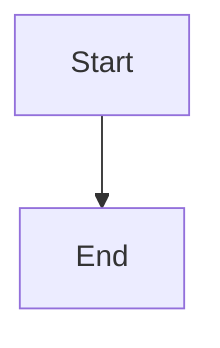
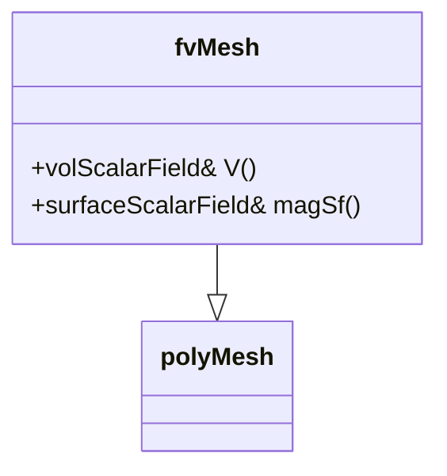
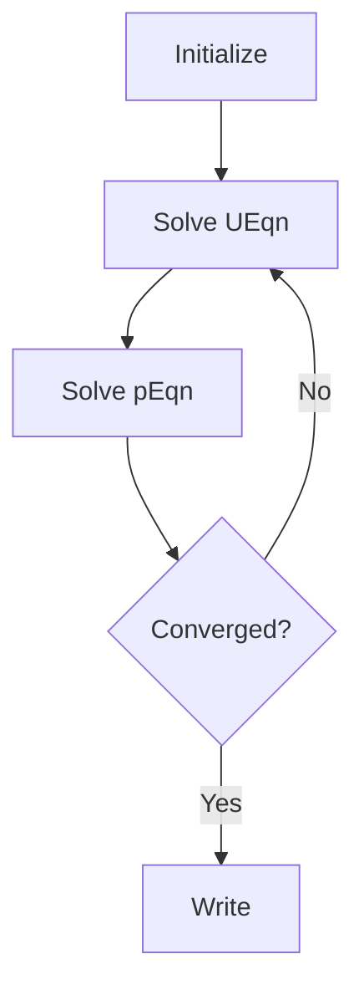
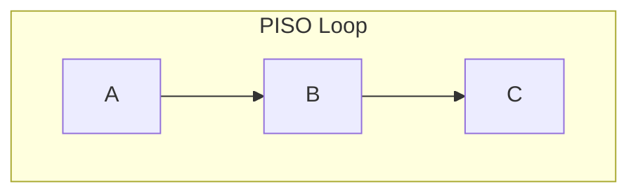

# Obsidian-Compatible Markdown Format Rules
## For HARDCORE OpenFOAM Content Generation

> **Purpose:** All generated content MUST follow these rules for Obsidian compatibility.
> This document is referenced by `generate_day.sh` to ensure consistent formatting.

---

## I. File Structure & Metadata (Rules 1-5)

### Rule 1: YAML Frontmatter Required
Always start notes with YAML frontmatter:
```yaml
---
tags: [openfoam, cfd, day-01]
date: 2026-01-01
aliases: [Governing Equations, สมการควบคุม]
difficulty: hardcore
topic: Governing Equations & OpenFOAM Implementation
---
```

### Rule 2: Date Format (ISO 8601)
Use `YYYY-MM-DD` format: `date: 2026-01-01`

### Rule 3: Tags Format
Use lowercase, hyphenated tags in array format:
- ✅ `tags: [openfoam, finite-volume, cfd]`
- ❌ `tags: OpenFOAM, Finite Volume`

### Rule 4: H1 Matches Filename
The first `# Heading` should match the topic:
- File: `2026-01-01.md`
- H1: `# Governing Equations & OpenFOAM Implementation`

### Rule 5: Sequential Heading Hierarchy
Never skip heading levels:
- ✅ `# → ## → ### → ####`
- ❌ `# → ### (skipped ##)`

---

## II. Headings & Anchors (Rules 6-10)

### Rule 6: ASCII-Only Anchors
For Table of Contents links, use ASCII-only anchors:
- ✅ `[Theory](#1-theory-core-equations)`
- ❌ `[1.1 Theory (ทฤษฎี)](#11-theory-ทฤษฎี)`

### Rule 7: Explicit Anchor IDs
Use explicit anchors with `{#id}` syntax for reliable linking:
```markdown
## 2. OpenFOAM Class Hierarchy {#2-class-hierarchy}
```

### Rule 8: Heading Numbering
Major sections use numeric prefixes:
```markdown
## 1. Theory: Core Equations & Physics
## 2. OpenFOAM Class Hierarchy
## 3. Code Walkthrough
```

### Rule 9: Subsection Numbering
Subsections follow parent numbering:
```markdown
### 3.1 UEqn.H
### 3.2 pEqn.H
```

### Rule 10: Horizontal Rules for Section Separation
Use `---` between major sections for visual clarity.

---

## III. Links & Embedding (Rules 11-16)

### Rule 11: Internal Wikilinks
Use Obsidian wikilinks for internal references:
```markdown
See [[2026-01-02|Day 2: FVM]] for discretization details.
```

### Rule 12: Heading Links
Link to specific sections:
```markdown
See [[2026-01-01#3-code-walkthrough|Code Walkthrough]]
```

### Rule 13: External Links (Markdown Format)
Use standard Markdown for external URLs:
```markdown
[OpenFOAM User Guide](https://www.openfoam.com/documentation/user-guide)
```

### Rule 14: Source File References
Format OpenFOAM source paths consistently:
```markdown
**Reference:** `$FOAM_SRC/finiteVolume/fvMesh/fvMesh.H`
```

### Rule 15: Image Embedding with Size
Resize images using pipe syntax:
```markdown
![[mesh_diagram.png|500]]
```

### Rule 16: Note Embedding
Embed related notes:
```markdown
![[common/fvMesh_overview]]
```

---

## IV. LaTeX & Math (Rules 17-22)

### Rule 17: Inline Math
Use single dollar signs with NO spaces:
- ✅ `$\rho$`, `$\nabla \cdot \mathbf{U}$`
- ❌ `$ \rho $`

### Rule 18: Block Math (Display)
Use double dollar signs on separate lines:
```markdown
$$
\frac{\partial \rho}{\partial t} + \nabla \cdot (\rho \mathbf{U}) = 0
$$
```

### Rule 19: Named Equations
Add descriptive text before equations:
```markdown
**Continuity Equation (สมการความต่อเนื่อง):**
$$
\nabla \cdot \mathbf{U} = 0
$$
```

### Rule 20: Multi-line Equations (Align)
Use `aligned` environment for multi-line:
```markdown
$$
\begin{aligned}
\frac{\partial \mathbf{U}}{\partial t} &= -\nabla p \\
&+ \nu \nabla^2 \mathbf{U}
\end{aligned}
$$
```

### Rule 21: Greek Letters
Use proper LaTeX commands:
- `$\rho$` (density), `$\mu$` (viscosity), `$\nu$` (kinematic viscosity)
- `$\nabla$` (gradient), `$\partial$` (partial)

### Rule 22: Subscripts and Superscripts
```markdown
$U_x$, $p^{n+1}$, $\phi_{face}$
```

---

## V. Code Blocks (Rules 23-27)

### Rule 23: Language Specification
Always specify the language:
```markdown
```cpp
volScalarField p(...);
```
```

### Rule 24: C++ for OpenFOAM Code
```cpp
fvVectorMatrix UEqn
(
    fvm::ddt(U)
  + fvm::div(phi, U)
  - fvm::laplacian(nu, U)
);
```

### Rule 25: OpenFOAM Dictionary Syntax
```foam
gradSchemes
{
    default     Gauss linear;
}
```

### Rule 26: Shell Commands
```bash
blockMesh
simpleFoam
postProcess -func 'grad(U)'
```

### Rule 27: Line Numbers for Long Code
Add comments for line references in explanations:
```cpp
// Line 1-5: Field declaration
volScalarField p
(
    IOobject(...),
    mesh
);
```

---

## VI. Mermaid Diagrams (Rules 28-33)

### Rule 28: Code Block Format
```markdown

```

### Rule 29: Class Diagrams


### Rule 30: Flowcharts (Algorithm Steps)


### Rule 31: Direction Options
- `TD` / `TB`: Top to Bottom
- `LR`: Left to Right
- `BT`: Bottom to Top

### Rule 32: Node Shapes
- `[Rectangle]` for processes
- `{Diamond}` for decisions
- `([Stadium])` for start/end
- `((Circle))` for connectors

### Rule 33: Subgraphs for Grouping


---

## VII. Callouts & Highlighting (Rules 34-38)

### Rule 34: Info Callouts
```markdown
> [!INFO] Key Concept
> The fvMesh class inherits from polyMesh.
```

### Rule 35: Warning Callouts
```markdown
> [!WARNING] Common Mistake
> Do not forget to set boundary conditions!
```

### Rule 36: Tip Callouts
```markdown
> [!TIP] Performance
> Use GAMG solver for pressure for faster convergence.
```

### Rule 37: Collapsible Callouts
```markdown
> [!FAQ]- What is FVM?
> Finite Volume Method discretizes PDEs over control volumes.
```

### Rule 38: Text Highlighting
Use `==text==` for important terms:
```markdown
The ==continuity equation== ensures mass conservation.
```

---

## VIII. Tables (Rules 39-42)

### Rule 39: Header Row Required
```markdown
| Parameter | Value | Unit |
|-----------|-------|------|
| ν         | 1e-6  | m²/s |
```

### Rule 40: Alignment
```markdown
| Left | Center | Right |
|:-----|:------:|------:|
| a    |   b    |     c |
```

### Rule 41: Term-Definition Tables
```markdown
| Term | Meaning (Thai) | Meaning (English) |
|------|----------------|-------------------|
| `fvm::ddt` | อนุพันธ์เวลา | Time derivative |
```

### Rule 42: Compact Tables for Parameters
```markdown
| Scheme | Order | Stability |
|--------|-------|-----------|
| upwind | 1st   | High      |
| linear | 2nd   | Medium    |
```

---

## IX. Bilingual Content (Rules 43-47)

### Rule 43: Thai Explanations in Parentheses
```markdown
**Continuity Equation (สมการความต่อเนื่อง)**
```

### Rule 44: Term Tables
```markdown
| English | Thai | Symbol |
|---------|------|--------|
| Density | ความหนาแน่น | $\rho$ |
```

### Rule 45: Thai in Blockquotes
```markdown
> **คำอธิบาย:** สมการนี้แสดงการอนุรักษ์มวล
```

### Rule 46: Keep Technical Terms in English
```markdown
- ใช้ `fvm::laplacian()` สำหรับ diffusion term
```

### Rule 47: Section Summaries in Thai
```markdown
**สรุป (Summary):** ในส่วนนี้เราได้เรียนรู้เกี่ยวกับ...
```

---

## X. Document Structure (Rules 48-52)

### Rule 48: Table of Contents
Add TOC at the beginning with ASCII anchors:
```markdown
## Table of Contents
- [1. Theory](#1-theory)
- [2. Class Hierarchy](#2-class-hierarchy)
```

### Rule 49: Section Summaries
End each major section with a summary:
```markdown
**สรุป:** Section นี้อธิบาย...
```

### Rule 50: Recommended Reading
End document with resources:
```markdown
## Recommended Reading
- [OpenFOAM User Guide](https://...)
- [[Related Note]]
```

### Rule 51: Footnotes
```markdown
This uses the SIMPLE algorithm[^1].

[^1]: Semi-Implicit Method for Pressure-Linked Equations
```

### Rule 52: Comments (Hidden)
```markdown
%% TODO: Add more examples %%
```

---

## Quick Reference Checklist

Before finalizing any generated content, verify:

- [ ] YAML frontmatter with tags, date, aliases
- [ ] Sequential heading hierarchy (no skipped levels)
- [ ] ASCII-only anchor IDs for internal links
- [ ] Math equations have no spaces after `$`
- [ ] Code blocks specify language
- [ ] Mermaid diagrams are properly formatted
- [ ] Tables have header rows
- [ ] Thai explanations are properly formatted
- [ ] External links use Markdown format
- [ ] Section summaries included
