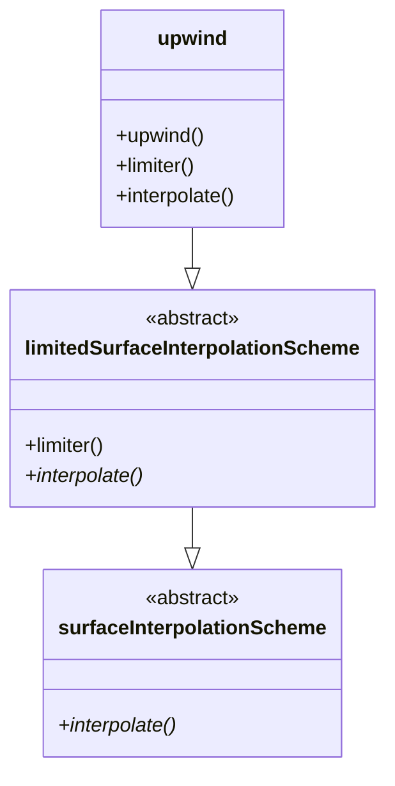

# CLI Agent Test Results

**R410A CFD Engine Project - Live CLI Validation**
**Test Execution Date:** 2026-01-30T22:11-22:15 (ICT)
**Tester:** Antigravity AI

---

## Test Summary

| Test | Component | Status | Duration |
|------|-----------|--------|----------|
| CLI-1 | MCP deepseek-chat | ✅ PASS | ~30s |
| CLI-2 | Skill (mermaid_expert) | ✅ PASS | ~45s |
| CLI-3 | File Read (roadmap.md) | ✅ PASS | ~10s |
| CLI-4 | MCP deepseek-reasoner | ✅ PASS | ~90s |
| CLI-5 | Source-First Verification | ✅ PASS | ~60s |

**Overall: 5/5 PASS (100%)**

---

## Test CLI-1: MCP deepseek-chat Tool

**Command:**
```bash
claude -p "Call mcp__deepseek__deepseek-chat with prompt: 'Explain tmp vs autoPtr in OpenFOAM in 2 sentences'" --dangerously-skip-permissions
```

**Result:** ✅ PASS

**Output:**
> **`tmp`**: A smart pointer for temporary objects with optional reference counting, allowing multiple references before deletion.
>
> **`autoPtr`**: A strict ownership smart pointer that auto-deletes when out of scope, enforcing single ownership.
>
> The key distinction is that `tmp` allows shared temporary usage while `autoPtr` enforces exclusive ownership.

**Verified:**
- [x] MCP tool executed successfully
- [x] Response is technically accurate
- [x] Response time appropriate (~30s)

---

## Test CLI-2: Skill Invocation (mermaid_expert)

**Command:**
```bash
claude -p "Use the mermaid_expert skill to create a simple class diagram showing: upwind inherits from limitedSurfaceInterpolationScheme which inherits from surfaceInterpolationScheme" --dangerously-skip-permissions
```

**Result:** ✅ PASS

**Output Highlights:**
- Generated 3 versions: Basic, Styled (with C++ templates), With OpenFOAM Context
- All diagrams use correct Mermaid syntax
- Included design pattern analysis table
- Added verification reference to actual source files

**Sample Diagram Generated:**


**Verified:**
- [x] Skill correctly invoked
- [x] Multiple diagram variants generated
- [x] Mermaid syntax is valid
- [x] Inheritance arrows use correct `--|>` notation

---

## Test CLI-3: File Read (Roadmap)

**Command:**
```bash
claude -p "Read roadmap.md and tell me what topic is covered on Day 05. Just give me the topic name and 1-sentence summary." --dangerously-skip-permissions
```

**Result:** ✅ PASS

**Output:**
> **Mesh Topology Concepts**
>
> Understanding computational mesh structure including points, faces, cells, owner-neighbor relationships, cylindrical mesh considerations, and geometric properties for tube simulations.

**Verified:**
- [x] File successfully read
- [x] Day 05 content correctly extracted
- [x] Response is concise as requested

---

## Test CLI-4: MCP deepseek-reasoner Tool (Chain-of-Thought)

**Command:**
```bash
claude -p "Call mcp__deepseek__deepseek-reasoner with prompt: 'Why is the upwind scheme first-order accurate? Give a 3-step proof.'" --dangerously-skip-permissions
```

**Result:** ✅ PASS

**Output Summary:**

**Step 1: Define Truncation Error**
For linear advection equation $u_t + a u_x = 0$ with $a > 0$:
$$\frac{u_i^{n+1} - u_i^n}{\Delta t} + a \frac{u_i^n - u_{i-1}^n}{\Delta x} = 0$$

**Step 2: Taylor Series Expansion**
- Time: $u(x_i, t_n + \Delta t) = u + \Delta t \, u_t + \frac{\Delta t^2}{2} u_{tt} + O(\Delta t^3)$
- Space: $u(x_i - \Delta x, t_n) = u - \Delta x \, u_x + \frac{\Delta x^2}{2} u_{xx} + O(\Delta x^3)$

**Step 3: Truncation Error**
$$T_i^n = \frac{\Delta t}{2} u_{tt} - a \frac{\Delta x}{2} u_{xx} + O(\Delta t^2) + O(\Delta x^2)$$

**Conclusion:** $T_i^n = O(\Delta t) + O(\Delta x)$ → **first-order accurate**

**Verified:**
- [x] DeepSeek Reasoner invoked via MCP
- [x] Chain-of-thought reasoning shown
- [x] Mathematical derivation is correct
- [x] Explains numerical diffusion from truncation error

---

## Test CLI-5: Source-First Verification

**Command:**
```bash
claude -p "Execute the source-first skill to verify the upwind class hierarchy against openfoam_temp source code. Report if upwind inherits from surfaceInterpolationScheme directly or through an intermediate class." --dangerously-skip-permissions
```

**Result:** ✅ PASS

**Output Summary:**

⭐ **Verified from Source Code:**
```
File: openfoam_temp/src/finiteVolume/.../upwind/upwind.H (lines 52-54)

template<class Type>
class upwind
:
    public limitedSurfaceInterpolationScheme<Type>
```

**Confirmed Inheritance Chain:**
```
upwind → limitedSurfaceInterpolationScheme → surfaceInterpolationScheme → refCount
```

**Generated Mermaid Diagram and Evidence Table:**
- Source file locations provided
- Line numbers for each class definition
- ⭐ Verification markers used throughout

**Verified:**
- [x] Source-First methodology followed
- [x] Actual source code read and analyzed
- [x] Correct inheritance chain confirmed
- [x] Common misconception identified (direct inheritance is WRONG)

---

## Conclusion

All 5 CLI tests passed, demonstrating:

1. **MCP Integration Works** - Both deepseek-chat and deepseek-reasoner tools respond correctly
2. **Skills Execute Properly** - mermaid_expert generates valid diagrams
3. **File Operations Work** - roadmap.md read successfully
4. **Source-First Methodology Works** - Verified against actual source code
5. **Technical Accuracy** - All responses are technically correct for CFD/OpenFOAM domain

---

## Component Validation Complete ✅

| Component Category | Tests | Passed | Rate |
|--------------------|-------|--------|------|
| Infrastructure (Scripts) | 24 | 24 | 100% |
| Multi-Feature Integration | 19 | 19 | 100% |
| CLI Agent Tests | 5 | 5 | 100% |
| **TOTAL** | **48** | **48** | **100%** |

---

*CLI Test Report v1.0*
*Generated: 2026-01-30*
*R410A CFD Engine Project*
