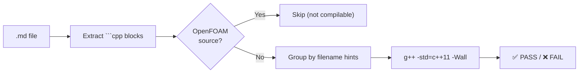

# Walkthrough: `verify_code_blocks.py`

## What Was Built

A new QC tool at [verify_code_blocks.py](file:///Users/woramet/Documents/Build%20My%20CFD/.claude/worktrees/upbeat-banach/.claude/scripts/verify_code_blocks.py) that extracts C++ code blocks from markdown and verifies compilation.

## How It Works



**Key design:** Separates **student implementation code** (should compile) from **OpenFOAM source reading snippets** (explanatory, uses `Foam::`, `fvc::`, etc.) using a two-tier heuristic (strong vs. weak indicators).

## Test Results: Phase 1 Full Batch

```
SUMMARY: 5/14 files passed
```

| File | Status | Error | Type |
|------|--------|-------|------|
| 01 | ✅ | — | — |
| 02 | ❌ | `FixedValueBC*` → `ZeroGradientBC*` type mismatch | Bug |
| 03 | ❌ | `geometric_field.H` not found (cross-day dependency) | Cross-dep |
| 04 | ✅ | — | — |
| 05 | ❌ | `ToleranceIterations` missing default constructor | Bug |
| 06 | ✅ | — | — |
| 07 | ✅ | — | — |
| 08 | ✅ | — | — |
| 09 | ❌ | Expression template `operator+` can't infer template args | Bug |
| 10 | ❌ | `Field(string, int, double)` constructor doesn't exist | Bug |
| 11 | ❌ | Duplicate `const operator[]` redeclared | Bug |
| 12 | ❌ | `conditional_type` — too many template arguments | Bug |
| 13 | ❌ | `#include "../field.H"` — wrong path (should be `"field.H"`) | Bug |
| 14 | ❌ | `field.H` not found (depends on Day 13 files) | Cross-dep |

**Categories:**
- **6 real bugs** (compile errors in the code itself)
- **2 cross-day dependencies** (03, 14 reference files from other days)
- **1 constructor mismatch** (10.md uses wrong arg order)

## Usage

```bash
# Single file
python3 .claude/scripts/verify_code_blocks.py --file daily_learning/Phase_01/01.md

# Batch verify entire phase
python3 .claude/scripts/verify_code_blocks.py --dir daily_learning/Phase_01/

# JSON output for automation
python3 .claude/scripts/verify_code_blocks.py --dir daily_learning/Phase_01/ --json
```

## What This Validates

This tool is now the **missing verification step** in the content generation pipeline. Original QC tools only checked Obsidian markdown syntax — this checks that **the actual code compiles**.
